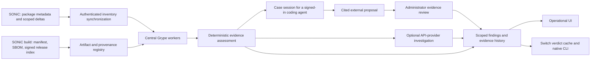

# SONiC Smart Patch Intelligence 3.0

Start with the illustrated user guide: [HTML](docs/USER_GUIDE.html),
[PDF](docs/USER_GUIDE.pdf), or [Markdown](docs/USER_GUIDE.md). It covers SONiC
enrollment and CLI commands, web input examples, evidence review and troubleshooting.

The consolidated detailed design covers architecture, module interactions, protocol
and cache contracts, AI evidence, maintenance and design tradeoffs:
[HTML](docs/DETAILED_DESIGN.html), [PDF](docs/DETAILED_DESIGN.pdf),
[Markdown](docs/DETAILED_DESIGN.md), and [editable diagrams](docs/design/diagrams).

Separate Markdown designs cover the [community SONiC changes](docs/COMMUNITY_SONIC_DESIGN.md)
and [intelligence service changes](docs/INTELLIGENCE_SERVICE_DESIGN.md).
See the [documentation index](docs/README.md) for the full document set.

Smart Patch moves vulnerability matching off the switch. Community SONiC publishes
compact, scoped inventory changes and selected runtime facts; this service runs
central Grype workers, correlates evidence, records applicability decisions, and
returns bounded results to the switch and its native CLI.

A scanner match is a candidate. Build identity, patch evidence, and deployment
conditions determine whether it becomes an affected, fixed, not-affected, or
under-investigation finding. Unavailable evidence stays visible.



## Implemented paths

- Durable device inventory with checkpoints, sequence acknowledgements, removals,
  replay protection, host/container scope, and collection failure reporting.
- Central scanning, queued jobs, advisory updates, recorded scanner/database
  revisions, package-level incremental matching within eligible Debian scopes,
  and durable retry work. Complete baselines and exact metadata fingerprints
  retain unchanged package matches, including verified zero-match results.
- Post-install reassessment waits for inventory containing the exact target
  version. Job progress exposes matching/reuse counts and assessment/save phases;
  a completed workflow is separate from an accepted CVE resolution.
- CycloneDX/SPDX import using bundled schemas, original-byte SBOM hashes, signed
  release-index verification, and baseline pedigree preservation. A reported
  manifest matching a signed baseline is an inventory association, not runtime
  or TPM attestation.
- Bounded source tools: exact-revision source excerpts, symbol search, patch and
  ancestry evidence, build/runtime facts, and Debian version comparison.
- External-agent sessions let an already signed-in coding agent investigate a bounded,
  snapshot-bound case through approved tools without configuring an AI-provider API
  key in Smart Patch. Submitted analysis remains a proposal for administrator review.
- Optional OpenAI-compatible/Anthropic provider calls with context, token, call,
  tool, and timeout limits. Missing credentials produce an unavailable state;
  the service does not manufacture a model response.
- Authenticated administrator/operator/device roles, revocable hashed tokens,
  encrypted provider settings, audit records, and Prometheus metrics.
- An operational UI with fleet/finding evidence, coverage, recorded trends,
  repository/release information, source tools, and staged maintenance review.

These are implemented code paths with automated tests. This repository does not
claim that every original specification criterion, platform, or hardware
acceptance gate has passed. See [implementation status](IMPLEMENTATION_SUMMARY.md).

## Deploy on the management server

New Smart Patch deployments use their own package, configuration, database and
enrollment names, without older-product compatibility aliases. Enroll new switches
with newly issued device tokens. Preserve existing Smart Patch 3.0 enrollment and
state when upgrading to this maintenance update; do not reset a running installation.

The primary deployment is a Linux Python 3.10+ virtual environment with TLS.
Preparation installs pinned dependencies and a checksum-pinned Grype binary,
creates private state/TLS files, and does not start a listener:

```bash
./scripts/prepare-local.sh
./scripts/start-local.sh
```

The default workspace is **https://<server-ip>:8000/ui/**. Configure client trust
for the service CA. On first startup, an administrator token is generated in the
mode-0600 `.state/bootstrap-token` file. Read it locally and use the UI connection
dialog; issue a separate `agent` token bound to each switch's device ID. No default
password or token is committed.

[Deployment documentation](docs/DEPLOYMENT.md) covers environment variables, local
CA trust, source roots, signing keys, persistence, backup, systemd, and optional
Docker deployment. Run one service process per state directory; worker concurrency
is configured separately and defaults to one.

## Review, stage, and execute separately

A maintenance plan targets one package/version and host/container scope on one
switch. Its workflow is:

1. Review advisory candidates and signature-verified repository evidence. A higher
   repository candidate requires a central target recheck where applicable.
2. Approve the exact reviewed plan. Changing/rechecking the target clears approval.
3. Request staging. The collector prepares the exact target artifacts, attempts to
   retain rollback packages and reports the active maintenance-check policy.
   Optional checks default to disabled; unavailable rollback artifacts remain visible.
4. Only a successfully staged, eligible plan can be explicitly executed after
   confirming the target device identity.
5. Collect the resulting inventory and reassess centrally. A completed package
   action alone is not a fixed-vulnerability verdict.

Failed or unknown staging does not enable execution. Resource-intensive analysis
runs centrally. Actual package-manager failures, authentication and explicit
installation approval remain enforced regardless of the optional check policy.

For multiple switches, select findings and choose **Remediate selected switches**.
Review each target, approve staging together, then explicitly confirm the staged
switches for execution. A durable batch retains independent plans and results;
it defaults to one switch at a time and pauses new dispatch after a failure.
Queued work may still finish when paused or stopped. Automatic rollout supports
one eligible host or supported container package per switch. Container updates require
explicit local maintenance mode and restart only the captured container. Protected
core packages and image changes retain their manual workflow. See the [user guide](docs/USER_GUIDE.md#remediate-selected-switches-together).

## Container maintenance and visible CVE outcomes

On a supported SONiC switch, `sudo config security smart-patch maintenance-mode enable`
permits reviewed package installation inside a compatible running Debian container
and restart of that exact container. It does not drain traffic or authorize a plan.
Protected
core packages, unsupported execution setups and image rebuilds remain manual.
Cgroup v2 uses Docker exec with the original security profile and a verified
Python resource gate; older cgroup v1 uses the unconfined namespace fallback. Writable-layer updates disappear when the container is recreated.

Use **Remediation status** in the UI or `show security remediation` / `show security cves`
on the switch to follow plans, downloads, staging, installation, restart and central
reassessment. CLI-created attempts are uploaded as read-only history. A fresh complete
scan and changed exact-target inventory are required before a CVE is `resolved`.

Missing exact previous Debian packages can be retrieved from the official snapshot
archive using isolated signed APT metadata; the fallback defaults on and preserves
package/version/architecture and source evidence. Unavailable custom versions remain
unavailable. SBOM uploads accept **50 MiB** independently of the usual 16 MiB request
budget. See the [user guide](docs/USER_GUIDE.md#install-an-eligible-package-inside-a-container)
for commands, limitations and examples.

## API entry points

Operational endpoints use `/api/v1` and Bearer authentication. `/health` is a minimal
public service/database check; authenticated `/api/v1/readiness` reports scanner
and AI readiness separately. `/metrics` requires operator/admin access.

| Area | Main endpoints |
|---|---|
| Inventory | `POST /agents/sync`, `GET /devices`, `GET /devices/{id}` |
| Scanning/evidence | `POST /devices/{id}/scan`, `POST /devices/{id}/evidence`, `GET /operations` |
| Findings | `GET /findings`, `POST /findings/{id}/investigate`, `POST /findings/{id}/review` |
| Build registry | `POST /sbom-upload`, `/releases`, `POST /artifacts/verify`, `DELETE /artifacts/bindings/{build_id}` |
| Remediation status | `POST /agents/remediation` (device token), `GET /remediation-status` (operator), including CLI-origin history |
| Maintenance | `/plans`, `POST /plans/{id}/validate-target`, `/approve`, `/stage`, `/execute` |
| Multiple switches | `/remediation-batches`, `/{id}/refresh`, `/{id}/approve-and-stage`, `/{id}/execute`, `/{id}/pause`, `/{id}/resume`, `/{id}/stop` |
| External agent | `POST /findings/{id}/agent-session`, `/agent-sessions/{id}/tools/{name}`, `/agent-sessions/{id}/analysis` |
| Tools/admin | `/tools`, `/settings`, `/tokens`, `/analytics` |
| Export | `GET /devices/{id}/vex` |

Use the running service's OpenAPI schema for request fields and current route
contracts. [UI documentation](UI_DOCUMENTATION.md) explains views and actions.

## Verify the implementation

```bash
python -m pip install -r requirements-dev.txt
python -m pytest tests/unit tests/integration -q
python -m playwright install chromium
python tests/browser/workspace_smoke.py --mock --output /tmp/smart-patch-ui-test
```

Service integration tests use temporary databases/keys and distinguish real
signature/API behavior from substituted external-scanner boundaries. Browser mock
tests use explicitly synthetic fixtures and never establish real switch CVEs.

Actual two-switch SSH/SpyTest acceptance lives in the companion community checkout:
[Smart Patch live acceptance guide](../sonic-buildimage/src/sonic-smart-patch/tests/integration/README.md).
It is opt-in, records real measurements, and uses separately labelled harmless
package fixtures for mutation tests. Unit/API/browser results must not be relabelled
hardware acceptance. The API-provider lane requires configured credentials and separately recorded
validation. The external-agent lane uses the coding agent’s existing sign-in;
Smart Patch itself does not provide a web SSO login.
