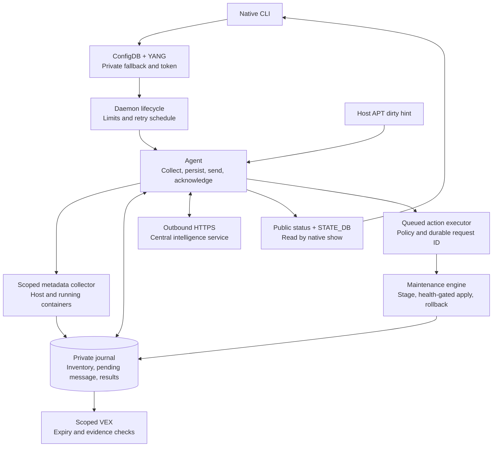
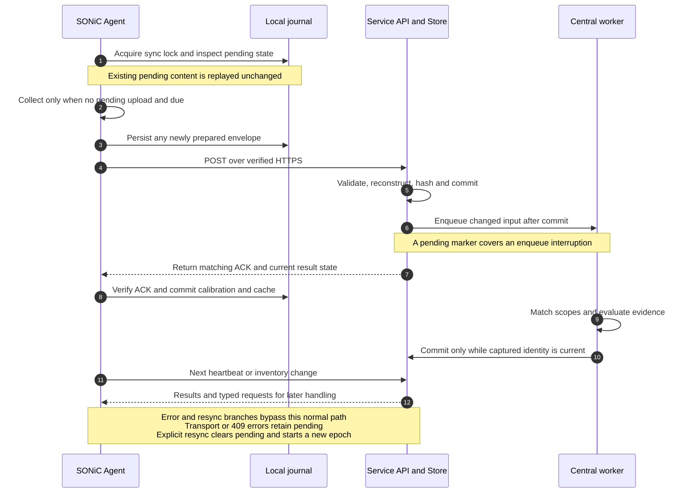
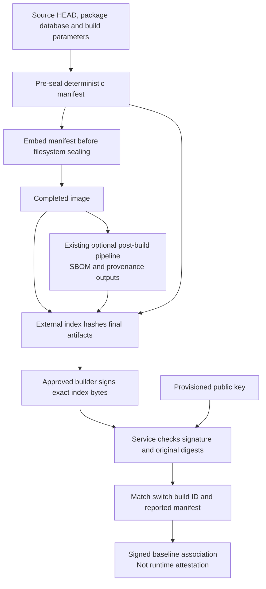
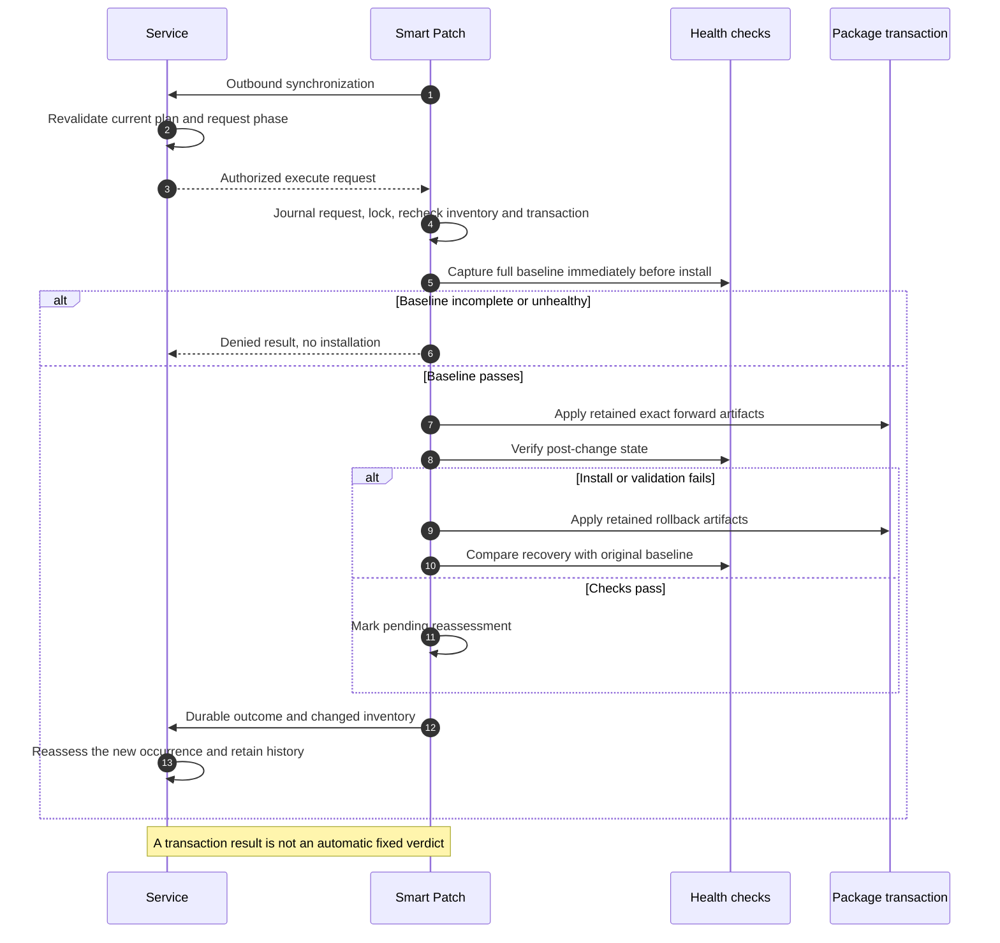
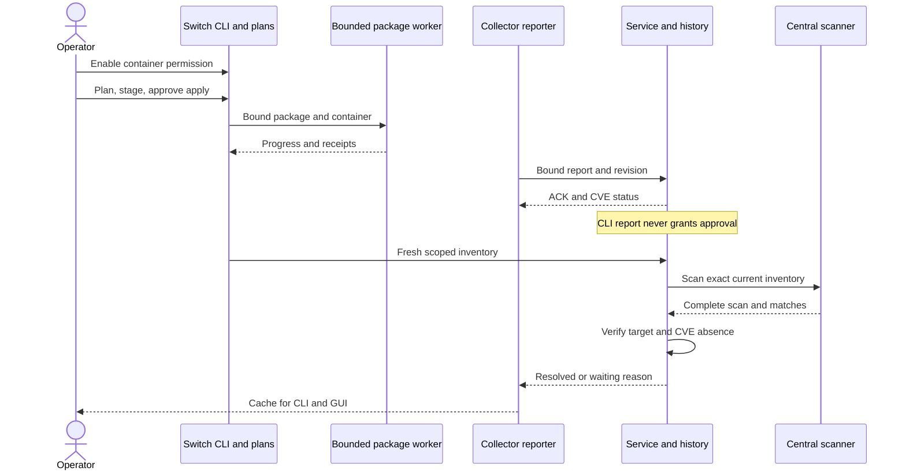

# Community SONiC Smart Patch Design

This document describes the implemented **sonic-buildimage changes**: a lightweight switch collector, reliable inventory synchronization, native SONiC configuration/status, build identity, and guarded local maintenance. Read the [overall design](DETAILED_DESIGN.md) for the complete system and the [intelligence-service design](INTELLIGENCE_SERVICE_DESIGN.md) for central matching, analysis, storage and UI behavior. Operator commands are covered in the [user guide](USER_GUIDE.md).

**Edition:** Smart Patch 3.0, 1 October 2026. Package and source naming follow the clean installation interfaces. Consult the latest native test run and package build report for current validation. Historical measurements below describe their recorded source snapshot; they do not establish current two-DUT/SpyTest or full image build/boot qualification. [Documentation command checks](user-guide/verification/command-evidence.json) verify the renamed CLI and archive metadata without installing a package.

All repository paths below are portable, relative references. `smart_patch/`, `plugins/`, `config/`, `scripts/` and unqualified `tests/` refer to `sonic-buildimage/src/sonic-smart-patch/`. Standard installed paths such as `/etc/sonic/smart-patch` are intentional. Example hostnames and identifiers must be replaced for a real deployment.

## Contents

1. [Scope and before/after changes](#1-scope-and-beforeafter-changes)
2. [Modules and interactions](#2-modules-and-interactions)
3. [Native lifecycle, configuration and status](#3-native-lifecycle-configuration-and-status)
4. [Inventory, package changes and the two baselines](#4-inventory-package-changes-and-the-two-baselines)
5. [Synchronization and recovery contract](#5-synchronization-and-recovery-contract)
6. [Evidence, clocks and resource bounds](#6-evidence-clocks-and-resource-bounds)
7. [Build identity and signing boundary](#7-build-identity-and-signing-boundary)
8. [On-target maintenance and rollback](#8-on-target-maintenance-and-rollback)
9. [Implemented limits and future qualification workflow](#9-implemented-limits-and-future-qualification-workflow)
10. [Source and test map](#10-source-and-test-map)

## 1. Scope and before/after changes

The switch owns collection, durable delivery, local visibility and final actuator checks. Grype, its advisory database, source investigation and model execution belong on the management server. There is no inbound Smart Patch HTTP listener on the switch: requests and results arrive in responses to authenticated outbound polls.

The comparison is against committed community HEAD `66ebbf8a0`, whose initial Smart Patch implementation originated in `e6f3fe456`. Package differences, CLI, VEX and remediation were already concepts in that code. The contribution is the concrete redesign and completion described below.

| Area | Original implementation | Current change |
| --- | --- | --- |
| Vulnerability matching | Merged a baseline SBOM with package deltas, then ran Grype locally | Sends lightweight scoped package metadata for central matching; removes scanner/database demand from the switch |
| Package differences | Name-based delta metadata and hook handlers existed | Adds host/container occurrence identity, removals, hashes, sequence/epoch acknowledgements and durable replay |
| SONiC integration | Click commands existed; native registration only reported that integration loaded; ConfigManager needed an injected DB | Adds working native plugins, automatic ConfigDB access, YANG schema, persistent fallback and service lifecycle handling |
| Resource use | Scanner timeouts and service units existed | Adds cgroup ceilings, memory-headroom checks, bounded collection/output, backoff and fewer flash writes |
| Findings and VEX | Original VEX generation defaulted entries to not affected; offline client manufactured confidence-based recommendations | Preserves uncertainty, scoped evidence, partial/last-known results and decision expiry; no safe fallback verdict |
| Maintenance | APT update/health/rollback code existed, including a `previous` version placeholder | Uses exact-version plans, retained forward/rollback artifacts, approval, dependency checks and baseline-relative health validation |
| Build/package delivery | Initial build and Debian rules existed | Corrects Debian/installer integration and adds deterministic pre-seal manifest plus an external final-artifact index |

This is not a custom-patch build factory. **Existing staging prepares package files on the target switch; it does not test them in a separate staging VM.** Section 9 defines that missing workflow explicitly.

## 2. Modules and interactions



[Rendered SVG alternative](design/diagrams/02-switch-internals.svg) · [Editable diagram source](design/diagrams/02-switch-internals.mmd)

Arrows show logical data flow; the Agent owns journal writes for collector results. The native show commands read the public projection, while standalone maintenance commands can also invoke the local plan engine directly.

| Module / file | Responsibility |
| --- | --- |
| [smart_patch/main.py](../../sonic-buildimage/src/sonic-smart-patch/smart_patch/main.py) | Refresh configuration, publish disabled state or synchronize, run eligible autonomous policy, handle shutdown and retry scheduling |
| [smart_patch/config.py](../../sonic-buildimage/src/sonic-smart-patch/smart_patch/config.py) | ConfigDB authority, defaults, private file fallback and token storage |
| [smart_patch/lifecycle.py](../../sonic-buildimage/src/sonic-smart-patch/smart_patch/lifecycle.py) | Start/enable or stop/disable only `sonic-smart-patch.service`; preserve standalone/test isolation |
| [smart_patch/cli.py](../../sonic-buildimage/src/sonic-smart-patch/smart_patch/cli.py), [config plugin](../../sonic-buildimage/src/sonic-smart-patch/plugins/config.py), [show plugin](../../sonic-buildimage/src/sonic-smart-patch/plugins/show.py) | Native configuration/show registration plus standalone collection, synchronization, maintenance and VEX commands |
| [smart_patch/collector.py](../../sonic-buildimage/src/sonic-smart-patch/smart_patch/collector.py) | Installed package metadata, Docker scopes, enrollment identity, manifest reporting and named bounded evidence collectors |
| [smart_patch/agent.py](../../sonic-buildimage/src/sonic-smart-patch/smart_patch/agent.py) | Reconciliation policy, pending-message durability, deltas, HTTPS/ACK processing, compact results and deferred requests |
| [smart_patch/storage.py](../../sonic-buildimage/src/sonic-smart-patch/smart_patch/storage.py) | Atomic JSON replacement and locks; unchanged/read-only operations avoid state rewrites; public-state sanitization |
| [smart_patch/timebase.py](../../sonic-buildimage/src/sonic-smart-patch/smart_patch/timebase.py), [smart_patch/decision.py](../../sonic-buildimage/src/sonic-smart-patch/smart_patch/decision.py) | Authenticated evidence-time alignment and optional decision-expiry enforcement |
| [smart_patch/actions.py](../../sonic-buildimage/src/sonic-smart-patch/smart_patch/actions.py) | Validate and journal service actions; map remote plans to local UUIDs; evaluate exact autonomous allowlists |
| [smart_patch/remediation.py](../../sonic-buildimage/src/sonic-smart-patch/smart_patch/remediation.py), [smart_patch/validation.py](../../sonic-buildimage/src/sonic-smart-patch/smart_patch/validation.py) | Exact package transactions, artifact retention, health gates and rollback outcomes |
| [smart_patch/vex.py](../../sonic-buildimage/src/sonic-smart-patch/smart_patch/vex.py) | Scoped CycloneDX 1.5 VEX from the bounded local finding cache |
| [smart_patch/hooks.py](../../sonic-buildimage/src/sonic-smart-patch/smart_patch/hooks.py), [APT hook configuration](../../sonic-buildimage/src/sonic-smart-patch/config/50sonic-smart-patch-hooks) | Mark inventory dirty after APT-driven package transactions; no network or scan inside the hook |
| [smart_patch/maintenance_resources.py](../../sonic-buildimage/src/sonic-smart-patch/smart_patch/maintenance_resources.py) | Execute native maintenance commands in separate bounded systemd transient services; configurable CPU quota, independent memory/task limits and per-command deadlines |
| [plugin installer](../../sonic-buildimage/src/sonic-smart-patch/scripts/install-plugins.py), [YANG installer](../../sonic-buildimage/src/sonic-smart-patch/scripts/install-yang.py) | Register owned links without replacing an image-owned schema or another plugin |
| [manifest/index helper](../../sonic-buildimage/src/sonic-smart-patch/scripts/smart-patch-manifest.py) | Produce build identity and final-artifact index; does not sign them |

The old `metadata.py`/`models.py` are not the active v2 journal. Compatibility `scanner.py` delegates to remote synchronization, `intelligence.py` keeps an explicit HTTPS assessment interface without invented fallback decisions, and `rollback.py` requires a retained plan rather than a version placeholder. This is not complete command/data compatibility with the original prototype.

## 3. Native lifecycle, configuration and status

### Entry points and lifecycle

The package installs `security` and `sonic-smart-patch-daemon`; the systemd unit runs `/usr/bin/python3 -m smart_patch.main`. There is no top-level `smart-patch` executable.

| Interface | Examples |
| --- | --- |
| Native configuration | `sudo config security smart-patch enable`; `sudo config security smart-patch mode advisory` |
| Native cached reads, without sudo | `show security status --json`; `show security findings`; `show security inventory-drift` |
| Standalone equivalents | `sudo security config …`; `security show …` |
| Standalone operations | `sudo security sync --force`; `sudo security collect`; `sudo security maintenance …`; `sudo security export-vex` |

A fresh installation does not start or enable the unit. An upgrade can preserve an existing enabled unit. Native enable saves configuration, publishes status and calls `systemctl enable --now sonic-smart-patch.service`. Disable publishes disabled state before stopping/disabling that unit. Mode changes do not trigger collection. Explicit standalone configuration/test directories suppress host systemctl actions.

The daemon refreshes configuration each step. Disabled operation publishes status without scanning or contacting the service. Enabled operation syncs and then evaluates autonomous policy. Explicit CLI sync bypasses the daemon's enabled gate, but still requires credentials, permitted transport and the synchronization lock.

### ConfigDB and YANG

Configuration is in **ConfigDB table `SONIC_SMART_PATCH`, entry `GLOBAL`**, represented as `SONIC_SMART_PATCH|GLOBAL`. An available ConfigDB is authoritative even when the entry has been removed: defaults apply rather than resurrecting old disk settings. The private JSON file is used only for standalone operation or DB unavailability. `refresh()` mirrors authoritative DB state into that fallback.

The [YANG model](../../sonic-buildimage/src/sonic-yang-models/yang-models/sonic-smart-patch.yang) declares enabled/mode, service URL/TLS, intervals, inventory limits, autonomous allowlist, maintenance resource settings and validation policy. `maintenance_checks_enabled` is a boolean defaulting to `false`; `true` enables local preflight and health gates. It is exposed in the sanitized public configuration and `show security status --json`. `maintenance_cpu_quota_percent` defaults to `0` (disabled), accepts 0–100 and expresses a percentage of one CPU. `maintenance_min_free_mib` defaults to `500` and accepts 1–65536 MiB; it is enforced when checks are enabled. All are available through `config security setting NAME VALUE`; they are switch policy, not service-webpage settings. The standalone package installs a private copy beneath `/usr/share/sonic-smart-patch/yang` and links it into the native model directory when absent. It preserves an existing image-owned model. Native plugin paths are discovered from the installed Python config/show packages rather than hard-coded to a Python minor version.

Running ConfigDB persistence still uses the normal SONiC `config save` process. That command saves the complete running SONiC configuration. Editing an enabled flag directly does not start a stopped unit; native Smart Patch enable handles that lifecycle.

### Identity, private state and public status

| Installed path/table | Purpose |
| --- | --- |
| `/etc/sonic/smart-patch/config.json` | Private outage/standalone fallback |
| `/etc/sonic/smart-patch/credentials.json` | Device token, mode 0600; excluded from ConfigDB and public output |
| `/etc/sonic/smart-patch/device-id` | Stable per-installation identity, mode 0600 |
| `/etc/sonic/smart-patch/manifest.json` | Optional build-generated identity manifest |
| `/etc/sonic/smart-patch/public-config.json` | Readable enabled/mode/sync-interval projection, mode 0644 |
| `/var/lib/sonic-smart-patch/state.json` | Inventory, ACK fingerprints, pending envelope, findings, requests and action history, mode 0600 |
| `/var/lib/sonic-smart-patch/state.lock` | Shared read/exclusive transaction lock |
| `/var/lib/sonic-smart-patch/sync.lock` | Nonblocking synchronization ownership across processes |
| `/var/lib/sonic-smart-patch/public.json` | Sanitized native-show snapshot, mode 0644 |
| `/var/lib/sonic-smart-patch/dirty` | Recollection hint |
| `/var/lib/sonic-smart-patch/plans/UUID/` | Plan JSON and retained package artifacts |
| `/var/lib/sonic-smart-patch/vex/` | Local VEX exports |
| STATE_DB `SONIC_SMART_PATCH_STATUS|GLOBAL` | Small operational status projection |

Enrollment generates a UUID once, under a dedicated lock with exclusive file creation and fsync; a provisioned existing ID is preserved. Hostname and `/etc/machine-id` are not used as unique device identity because cloned images may share them. Identity rotation clears queued context/authorization before a new stream begins. This is enrollment identity, not hardware attestation.

State changes use a temporary file, file fsync, atomic replacement and directory fsync. Reads and unchanged transactions do not rewrite the inventory file. Show commands read atomic public snapshots without a writable lock. Public state contains counts, scopes, compact findings and evidence IDs; it excludes credentials, raw facts and action authorization. STATE_DB publication includes sync/assessment status, last sync, counts, RSS, enabled and mode; a publication failure does not destroy local durable state.

## 4. Inventory, package changes and the two baselines

**The collector does not directly diff installed packages against the build SBOM.** Its transmission baseline is the last runtime inventory acknowledged by the service. A verified build SBOM is a separate central reference.

| Baseline | Where used | What it establishes |
| --- | --- | --- |
| Last acknowledged runtime inventory | Switch delta calculation and server reconstruction | Which observed package records changed since the last accepted inventory |
| Registered build SBOM plus signed index/manifest | Central provenance and scoped baseline association | Whether reported occurrences can be associated with an approved build baseline; not remote measurement of all executing bytes |

Package names/versions come from `dpkg-query` on the host and inside running Docker containers. The collector also reads distribution metadata, architecture, source package/version, container image config identity and installed status. It does not ask AI to invent a package list or scan the filesystem for vulnerabilities.

An occurrence is scoped as `host` or `container:NAME`. Its component ID is the first 32 hex characters of SHA256 over canonical JSON `[scope, package_name_without_arch_suffix, architecture]`. Consequently, the same package in different containers is not conflated. A replaced image under the same container name can retain occurrence IDs while generating metadata upserts.

Reconciliation is triggered by first use, explicit force, changed dirty marker, changed Docker topology or expiry of the inventory interval. The host APT hook only touches the dirty marker. **Direct `dpkg` and in-container package transactions are not intercepted by that host hook**; reconciliation or a forced collection detects their resulting state.

Stopped/unreadable scopes are reported as unknown. Their previous components are retained so that a failed read does not invent package removals. A successfully observed removal produces removed component IDs. Inventory coverage facts distinguish retained metadata from a current complete observation.

There is one pending message, not an unbounded queue of all package events. While it awaits ACK, retries preserve that message. Subsequent reconciliation finds the latest installed state; intermediate install/remove transitions can go unobserved. Version-preserving modified files and manually copied/unowned binaries are outside package-metadata detection.

## 5. Synchronization and recovery contract



[Rendered SVG alternative](design/diagrams/03-inventory-sync.svg) · [Editable diagram source](design/diagrams/03-inventory-sync.mmd)

The agent sends `POST /api/v1/agents/sync` to its configured origin, for example `https://smart-patch.example.net:8000`. A URL ending in `/api/v1` is also accepted. A device-specific Bearer token and verified TLS are the normal transport. Redirects are rejected; connect/read timeouts are 5/30 seconds; streamed responses are capped at 16 MiB. Explicit `allow_http=true` is a lab exception and cannot establish authenticated time calibration.

### Request and response fields

| Request fields | Meaning |
| --- | --- |
| `schema_version=1`, `device_id` | Protocol version and stable enrollment identity |
| `hostname`, `platform`, `sonic_version`, `build_id` | Descriptive/build identity; absent manifest produces an explicit `unverified:` build ID |
| `manifest`, `manifest_digest`, `artifact_verified` | Parsed manifest, hash of its exact raw bytes, and a client claim that is always false in this collector |
| `epoch`, `sequence`, `kind` | Inventory-stream identity and checkpoint/delta/heartbeat state |
| `baseline_digest` | Last acknowledged runtime inventory digest, not an SBOM digest |
| `inventory_digest`, `collected_at` | Complete reconstructed inventory hash and observation time |
| `components`, `removed` | Full checkpoint or delta upserts and removed IDs |
| `facts`, `resources`, `clock_alignment` | Coverage/runtime observations, action receipts, measured usage and time-calibration metadata |

Component records carry `component_id`, `scope`, `name`, `version`, `architecture`, `source_name`, `source_version`, `distro`, `image_digest` and `purl`. The canonical inventory hash is:

```python
hashlib.sha256(json.dumps(
    sorted(components, key=lambda component: component["component_id"]),
    sort_keys=True, separators=(",", ":")
).encode()).hexdigest()
```

Both sides preserve supplied component fields rather than adding schema defaults before hashing. Ordinary responses include ACK/resync status, inventory digest, assessment revision/status, compact findings and totals/truncation, coverage, service time and bounded evidence/action requests. `operation_id` may identify newly queued work. A resync response can be smaller.

### Normal flow

1. Acquire the synchronization lock. Preserve and reuse an existing pending envelope; do not recollect or retimestamp it.
2. Without pending work, process eligible previously received actions, then reconcile if due and collect queued named facts. A new device/build identity starts a new epoch.
3. The first checkpoint sends all components with sequence **1**. Later component changes produce upserts/removals and increment sequence. No component change produces a heartbeat at the **same** sequence; its facts/resources may change.
4. Persist the pending envelope before HTTP. The server validates token/device ownership, reconstructs inventory and verifies the full hash within a transaction. It commits before an ACK can be returned.
5. The agent accepts only the expected sequence and matching returned inventory digest, commits ACK fingerprints/cache/time state and clears pending. Public/STATE_DB status is then published.

The service does not independently compare `baseline_digest`; the enforced chain is sequence plus reconstructed inventory hash. State-changing messages have a full-envelope digest stored under device/epoch/sequence. Heartbeats are intentionally mutable and are not exact-replay journal entries.

### Recovery matrix

| Situation | Outcome |
| --- | --- |
| Lost reply/timeout/TLS failure | Keep the exact pending envelope and last-known findings; retry with backoff |
| Exact committed checkpoint/delta replay | No duplicate inventory mutation; server returns its current sequence |
| Same sequence with different checkpoint/delta content | HTTP 409; pending is retained, not silently reset |
| Reconstructed inventory hash mismatch | HTTP 409; no accepted inventory mutation |
| Delta gap, unknown/different epoch, retired-epoch replay or mismatched heartbeat | Successful protocol response with `resync_required=true`; agent clears pending/ACK fingerprints, rotates epoch and emits a new checkpoint next cycle |
| Invalid/mismatched ACK | Retain pending and report stale/error |
| Unknown/unreadable scope | Preserve prior components and report incomplete coverage |
| Assessment pending/failed | Preserve prior findings; no fabricated safe result |

The stock agent uses sequence 1 for a new checkpoint, although the server schema/handler accepts a broader set of checkpoint sequence values. An exact old replay after another writer has advanced the same device returns a newer sequence that the stock agent rejects. Single-writer operation and unique enrollment are required; concurrent cloned senders are not seamlessly supported.

An explicit resync resets the protocol but does not itself force a new package read; normal collection triggers still apply. Its intermediate reset can precede the next public-status publication. A successful ACK means inventory acceptance, not completed central scanning. Evidence/action requests normally arrive in one response and are handled on a later sync. The service rechecks their current authority before delivery; the switch applies its own local guards.

Source boundary: [wire schema](../app/api/models.py), [transactional receiver](../app/db/store.py), [sync HTTP handler](../app/main.py). Central scheduling and assessment are detailed in the [service design](INTELLIGENCE_SERVICE_DESIGN.md).


The progress reporter has its own ConfigDB connection in its own thread. It reads a small root-only identity record published after an acknowledged inventory exchange and writes a separate progress cache. It does not repeatedly parse, fingerprint or lock the complete inventory; idle reporting also avoids duplicate unplanned-finding payloads. Enrollment/build/epoch changes invalidate the identity record until a fresh acknowledgement.

## 6. Evidence, clocks and resource bounds

### Named observations

| Collector | Implementation |
| --- | --- |
| `listeners`, `kernel`, `processes`, `interfaces` | Bounded `ss`, `uname`, process-name and JSON interface reads in the selected scope |
| `bgp` / `routing` | BGP summary JSON; routing is an alias, normally used in the actual BGP container |
| `features` | Host ConfigDB FEATURE projection with a small field allowlist |
| `services` | Host systemctl Id/ActiveState; container supervisor status or process names |
| `resources` | Selected meminfo fields and load averages, not container cgroup attestation |
| `inventory` | Existing scope/count/digest/time metadata; does not force recollection |
| `package_versions` | `apt-cache policy` for 1–10 validated Debian package names; no install or APT refresh |

There is no arbitrary shell collector. Facts carry ID, collector, scope, observation time, value/status and current inventory digest. Unsupported/failed observations become `unknown`. The agent handles up to eight evidence requests per preparation and retains at most 32 ordinary facts; action receipts remain separate until acknowledged. Service-side request limits and exact scope checks are separate controls.

### Time and result freshness

After a valid HTTPS response, calibration estimates `service_time - local_request_midpoint`, with RTT/2 uncertainty. It rejects malformed/untrusted time and inconsistent wall/monotonic timing. Calibration is usable for 900 seconds. Each fact retains its original `device_collected_at`; an aligned fact is not made newer by later calibration. First-ACK alignment affects the next envelope, never rewrites the one already transmitted. The OS clock is unchanged.

The service separately controls whether build evidence is required for applicability through `build_evidence_policy` (`required` by default, `optional` by administrator choice). This is a central assessment setting, not a ConfigDB option or a change to the inventory delta baseline. Optional mode can mark exact distribution matches `affected` on reported package metadata while retaining `artifact_binding=unverified` and `decision_basis=inventory_advisory_match`; known custom/patch-bearing packages and Debian cross-release candidates still need evidence. It does not turn a reported package list into a verified build or prove running binary contents. Inventory-only results defer remediation and need a scoped operator review before plan approval. Local mode, allowlist, identity, freshness, staging and health safeguards still apply. A policy change marks current assessments stale and schedules reassessment when workers are enabled; queue a fresh device scan to request it explicitly. Prior native package/DUT measurements are separate from validation of this assessment policy.

Optional decision deadlines use the aligned service-time estimate plus uncertainty. Expired/invalid/unverifiable deadlines downgrade local views to under investigation/last known. Partial assessments merge new results with retained old observations; local findings are capped at 1,000 with truncation/omission indicators. A fresh connection is not proof of complete or conclusive assessment.

VEX export uses scoped component identity, recorded evidence/justification and decision-expiry checks. It produces CycloneDX 1.5 beneath `/var/lib/sonic-smart-patch/vex`; `--output` accepts a basename. The `last_known` flag alone is not an independent VEX downgrade guard, and a bounded local export is not a complete fleet report.

### Defaults and constraints

| Control | Current default/bound |
| --- | --- |
| Enabled / mode | false / advisory |
| Sync interval | 60 seconds plus jitter; accepted setting 10–86400 |
| Inventory reconciliation | 900 seconds; accepted setting 10–86400 |
| Memory headroom | Defer Agent collection below 256 MiB MemAvailable; configurable 64–65536 |
| Freshly collected components / enumerated containers | 20,000 / 64; before retaining prior unknown-scope records |
| Collection deadline | Nominal 120 seconds, checked between scopes |
| Generic subprocess | 15-second default timeout and 4 MiB output cap; terminate process group on overflow/timeout |
| Most named facts | 8 seconds / 64 KiB; package-policy reads 5 seconds / 16 KiB per package |
| Daemon cgroup | MemoryHigh 80M, MemoryMax 128M, CPUQuota 10% of one CPU, TasksMax 32 |
| Native maintenance command cgroup | Separate transient systemd service per command; MemoryMax 512 MiB, TasksMax 128, no default CPU quota; configurable 0–100% of one CPU, with 0 disabled; command-specific RuntimeMaxSec |
| Maintenance free space | Configurable 1–65536 MiB, default 500; checked before stage and forward installation only when `maintenance_checks_enabled=true` |
| Scheduling | Nice 15, idle I/O, restart-on-failure after 15 seconds |
| Backoff | Exponential failure multiplier capped at five steps; sleep capped at 900 seconds plus jitter |
| Private manifest / response | 256 KiB / 16 MiB |
| Maintenance metadata capacities | 128 imported findings, 1,024 action journal entries, 128 autonomous attempt keys |
| Default health policy | ssh/database/swss/syncd/bgp active; CPU≤80%, memory≤90%, disk≤85%; zero prefix loss tolerance, required prefix counts |

The daemon's 900-second sleep cap also applies without failure, so an unusually large configured sync interval is capped. The collection deadline is not one hard whole-process watchdog: a bounded command can extend a scope beyond the next deadline check.

Unknown-scope preservation adds retained records after fresh collection. Consequently, the fresh-component budget is not an independent hard ceiling on the final merged journal. The daemon cgroup remains a separate bound; large retained inventories still require resource qualification.

State keeps current inventory plus acknowledged fingerprints; a pending checkpoint still duplicates component content. Changed transactions serialize the full state JSON, while reads/no-op transactions do not rewrite it. Manual CLI processes do not inherit the daemon cgroup. Native maintenance subprocesses launched from either the daemon or manual CLI use their own transient service bounds. Direct `security collect` also bypasses Agent's memory-headroom and configured-component guard; `security sync` retains those Agent checks. ConfigDB `max_components` is read on Agent creation and is not exposed by the generic `setting` CLI.

## 7. Build identity and signing boundary



[Rendered SVG alternative](design/diagrams/08-build-provenance.svg) · [Editable diagram source](design/diagrams/08-build-provenance.mmd)

**The signing box is an external approved-builder/CI responsibility, not an automatic action performed by the manifest helper.**

`INCLUDE_SONIC_SMART_PATCH` defaults to `n`. When enabled, [rules/sonic-smart-patch.mk](../../sonic-buildimage/rules/sonic-smart-patch.mk) registers the architecture-independent Debian package with `SONIC_DPKG_DEBS` and `SONIC_INSTALLER_EXTRA_DEBS`. [slave.mk](../../sonic-buildimage/slave.mk) includes it in installer dependencies, installed packages and SBOM inputs.

Before filesystem sealing, [build_debian.sh](../../sonic-buildimage/build_debian.sh) invokes the manifest helper with source HEAD, platform/architecture/version, host dpkg-status SHA256, explicit build parameters and sorted container identities. Container identities hash Docker config JSON from installer archives, not overlay/recipe paths. There is no random nonce, token or enrollment UUID in the build identity.

The canonical inputs produce `build_id`. The manifest is written into the build output and `/etc/sonic/smart-patch/manifest.json` before `mksquashfs`. After image and optional SBOM/provenance generation, a second helper invocation writes `<image>.smart-patch.json`, containing the raw manifest hash and final image/SBOM/provenance hashes and sizes. Missing optional outputs are not fabricated. The final image hash stays outside the image, avoiding self-reference.

The service verifies a detached signature over the exact external index, approved public key, exact manifest bytes and original registered SBOM digest. The switch stores no signing private key and cannot grant itself verified status. Its runtime report contains the raw manifest digest so the server can check the association.

A signed baseline is not runtime attestation. An image without the matching embedded manifest remains unverified. HEAD/package-database inputs do not detect every dirty-tree or same-version binary modification; final artifact hashes and trusted build practice remain necessary. The helper does not enforce a clean source tree or implement TPM measurements.

## 8. On-target maintenance and rollback

### Plan and stage

Local plan creation resolves an exact cached affected finding and an advisory-supported newer exact version. It records a local UUID, scope/package, previous/target version, current journal inventory digest, evidence and optional decision deadline. Protected prefixes such as `linux-`, `frr`, `libssl`, `openssl`, `libc6`, `systemd`, `docker`, `sonic-`, `swss` and `syncd` require image maintenance. Automatic native stage/apply/rollback supports eligible host packages and supported running container packages under explicit switch maintenance mode. The bounded container worker described below constrains the actual package command; a cgroup around only a `docker exec` client is insufficient.

Stage is allowed in assisted/autonomous mode for a planned eligible host or permitted container package transaction. `maintenance_checks_enabled=false` is the default and disables local operational preflight/health gates: inventory/version/freshness, decision validity, free space, dependency restrictions, unchanged transaction, artifact hashes and required rollback availability. Authentication, exact device/package/target authorization, mode, explicit approval/expiry, idempotence, supported scope and mandatory container maintenance-mode/identity checks remain enforced. Service-side plan binding remains distinct from these local checks. Actual APT resolution, target download and installation must still succeed; its configured repository trust is unchanged.

With checks enabled, stage verifies current version/inventory/decision validity, requires configured free space (`maintenance_min_free_mib`, default 500 MiB), simulates `apt-get -s --no-remove` and rejects removals, new dependencies without rollback versions and protected dependency changes. Exact forward/previous packages, recorded hashes and any supplied catalog SHA must verify. With checks disabled, unavailable exact previous packages do not prevent staging: the plan records `rollback_available=false` and the missing recovery artifacts. It never claims that an incomplete recovery set offers automatic rollback.

`MaintenanceCommandRunner` runs each native package-maintenance subprocess, including APT downloads, dpkg verification and health commands, in a separate systemd transient service. The collector remains in its 128 MiB/10% CPU cgroup while each command receives its own 512 MiB hard memory limit, 128-task cap and original command timeout enforced by `RuntimeMaxSec`. There is no maintenance `MemoryHigh` throttle. `maintenance_cpu_quota_percent=0` disables the maintenance CPU quota; values 1–100 cap a command at that percentage of one CPU. The wrapper allows small additional time for service startup/cleanup. Host resource samples remain host measurements. Explicitly injected test runners retain their test behavior; standalone environments without native systemd do not establish this production cgroup guarantee.

```bash
sudo config security setting maintenance_checks_enabled false
# Enable preflight/health/rollback-availability checks when required:
sudo config security setting maintenance_checks_enabled true
sudo config security setting maintenance_min_free_mib 500
sudo config security setting maintenance_cpu_quota_percent 0
```

Changing these settings does not replay denied requests or grant execution approval. CPU quota zero removes Smart Patch's maintenance quota; platform or ancestor-slice limits still apply. Without a trusted root systemd manager, a configured nonzero quota or inability to escape the collector cgroup denies maintenance rather than claiming unenforced limits. The free-space threshold is a gate, not reserved capacity or package-size estimation.

**Stage does not install packages, capture the full health baseline, create a staging VM or automatically refresh APT.** It uses configured APT trust and records artifact hashes; it does not independently verify detached signatures on every `.deb`.

### Apply and recovery



[Rendered SVG alternative](design/diagrams/11-apply-and-rollback.svg) · [Editable diagram source](design/diagrams/11-apply-and-rollback.mmd)

The apply/rollback diagram above depicts the **checks-enabled** path. Apply always takes the maintenance lock and requires mode/approval and exact authorized target. With checks enabled it also rechecks inventory/version/deadline, free space, transaction and hashes, then captures critical services, CPU/memory/disk, containers, baseline-UP interfaces, Established BGP peers and prefix/route counts. An unhealthy/incomplete initial baseline denies installation without rollback. Default health thresholds are CPU≤80%, memory≤90% and disk≤85%; these remain separate from the free-byte minimum. With checks disabled, pre/post health is explicitly skipped, not passed. Command memory/CPU/task/deadline budgets continue to apply in both modes.

With checks enabled, installed versions and health are compared against the baseline: previously operational interfaces/containers/peers must remain and counts must respect tolerances. These are control-plane observations, not data-plane traffic-loss proof. Installation failure (or enabled post-health failure) triggers rollback only when the complete recovery set is available. With missing artifacts, no partial automatic rollback is attempted and the failed result requires manual recovery. Results preserve skipped checks and recovery availability; successful installation is `pending_reassessment`, never automatically a fixed-CVE verdict. Successful change/rollback marks inventory dirty for central reassessment.

### Authority and mode boundaries

| Mode | Implemented behavior |
| --- | --- |
| advisory | Collection/evidence and local plan creation; staging/apply denied |
| assisted | Staging permitted; apply requires explicit approval |
| autonomous | Requires an exact nonempty `scope/package` allowlist, connected complete current assessment and scope coverage; at most one eligible transaction per cycle |

Service action requests are returned through sync and contain a request ID plus an approved, scoped plan. The switch validates device/inventory/scope, approval/expiry, mode and immutable plan fields, then journals execution before actuator work. Completed replays return the stored receipt. Interrupted actions require operator recovery rather than automatic reinstallation. This is not an exactly-once guarantee for external package-manager effects.

Service IDs map to distinct local UUIDs. The service explicitly gates approve→stage→stage receipt→execute; the agent retains a compatibility path that can stage a planned local transaction before applying an approved execute request. Local CLI plan creation has weaker cached-assessment currentness checks than service delivery and autonomous eligibility. Remote plan expiry currently uses device wall time; optional finding deadlines use aligned service time. Local plans do not inherit the service's blanket 24-hour expiry.

The allowlist covers the requested target, not every installed non-core dependency in its validated transaction. Protected prefixes are a defined policy list, not exhaustive platform-criticality knowledge. Journal capacities deny new work when full; automatic on-switch plan/artifact archival and a complete recovery UI are not implemented.

### Explicit container permission and bounded execution

`sudo config security smart-patch maintenance-mode enable` sets `maintenance_mode=true`; `disable` clears it. The standalone equivalent is `sudo security config smart-patch maintenance-mode enable`. This is permission for the reviewed container transaction and its restart, not traffic draining or a routing-protocol maintenance command. It defaults to false and remains mandatory during staging, installation, restart and rollback even when optional checks are disabled.

The collector reports a bounded map of running container identities and its container-update capability. Plans capture the full Docker ID, image ID and name; a replacement with the same name fails identity checks. A running Debian SONiC container must satisfy one of the execution paths below. Cgroup v2 supports Docker-created exec processes with the existing seccomp/LSM/capability profile; the cgroup v1 namespace fallback is limited to unconfined, non-remapped compatible containers. Missing trusted tools/systemd, unsupported process controls, user remapping and stopped/replaced containers fail closed. Protected core/kernel/FRR/OpenSSL/libc targets remain manual in every scope.

`MaintenanceCommandRunner` selects two bounded container execution paths. Both constrain the actual package process, recheck the captured container identity and keep the worker's memory/task/CPU/deadline limits. Neither path recreates a container or disables its security profile.

| Path | Execution and resource boundary | Required support |
| --- | --- | --- |
| Docker-secured exec on unified cgroup v2 | Docker Engine creates an exec with `Privileged=false`, preserving the container's existing namespace, seccomp, LSM and capability context. A small Python gate blocks before the package command. Through a private Unix socket, the host checks `SO_PEERCRED` against the exact running Docker Exec PID and verifies its command/namespaces. It passes only the current worker unit's `cgroup.procs` descriptor. The gate writes `0` to attach itself; the host verifies membership before sending `GO`. The gate then executes the package command. | Target `/usr/bin/python3`; supported Docker Engine API (1.41 or newer); host pidfd support; unified cgroup v2 with established worker limits; trusted root-owned Docker/systemd tools and socket. |
| Namespace fallback on cgroup v1 | The worker pins namespace/root descriptors while container identity and process start time remain stable, checks compatible security settings, and starts the command inside those namespaces without leaving the bounded host worker cgroup. | Unconfined, non-remapped compatible containers; trusted native namespace/systemd support. Confined targets fail closed because entering namespaces alone cannot reproduce their security filters. |

The cgroup v2 gate receives no arbitrary cgroup-directory access: only the current unit's process-attachment descriptor. It moves itself with PID `0`, avoiding a host write to a recyclable numeric PID. A temporary private helper directory/socket under the container's temporary area is removed during cleanup. A failed handshake or unverifiable membership never sends `GO`. This makes the resource claim apply to the package process, not merely the Docker client. [Docker exec gate](../../sonic-buildimage/src/sonic-smart-patch/smart_patch/docker_maintenance.py).

Forward/rollback artifacts and transaction evidence remain per-plan. In collector 3.1.1, archive transfers use a bounded host helper that pins the running container's root and directory descriptors. This includes runtime tmpfs mounts such as `/var/tmp`, which Docker's archive/copy view may not expose. Export streams downloaded regular `.deb` files into the host plan directory; import restores verified staged archives into the running container before installation or rollback. The helper rejects symlink traversal, checks hashes and rechecks container process identity before publishing files. It streams 128 KiB chunks, caps each export at 64 package files and 512 MiB in total, and caps each imported package at 512 MiB; the existing worker memory/task/deadline limits also apply. A container restart can clear tmpfs; import repopulates the cache from retained host artifacts.

After install, the engine restarts only the captured container, observes the same immutable identity, verifies its running state/package version and reports the outcome. PID changes are expected across that restart. A writable-layer patch can disappear when the container is recreated; persistent remediation still requires a rebuilt and qualified image.

### Independent progress reporting and local CVE state

`smart_patch/remediation_status.py` publishes sanitized local plan snapshots and sends changed revisions through device-token `POST /api/v1/agents/remediation` independently of long package commands in ordinary sync. The durable report/acknowledgement cache supports retry without replaying package operations. A reporting failure does not erase the local plan. Public CLI projections merge newer local phases and the existing current-findings cache with bounded central plan rows. Idle status reports do not download a second copy of all findings; credentials, private paths and approval material are excluded from public status.

Use `show security remediation` or its alias `show security cves`, with `--cve`, `--scope`, `--status` and `--json`. Standalone equivalents start with `security show`. States cover no-plan/planned/approved, staging/downloading/downloaded/staged, installing/installed/restarting, pending reassessment, resolved/reopened and failure/rollback outcomes. Connection and cache-truncation indicators remain visible. Local CLI approval stays distinct from service authorization; uploading a local plan makes its history readable without creating a service-approved plan.



[Rendered interaction diagram](design/diagrams/12-cli-remediation-status.svg) · [Editable Mermaid source](design/diagrams/12-cli-remediation-status.mmd)

Only the service can establish central closure: it requires original scoped selection evidence, changed exact-target inventory and a complete current scan accepted after the CLI installation report. Container identity/image must still match. A successful APT or restart receipt alone remains pending. The same CVE in another scope is unaffected, and a later rollback or returning match is not hidden behind an earlier resolution.

### Official Debian snapshot recovery

`rollback_snapshot_enabled=true` is the default. If configured APT sources cannot supply an exact previous version, `smart_patch/rollback_snapshot.py` queries the [official Debian snapshot archive](https://snapshot.debian.org/) and its machine-readable binary/version index. Candidate lookup is bounded and keeps the target scope's Debian release and architecture; a container's distro is not assumed to equal the host's. `rollback_snapshot_timestamp` optionally selects a reviewed `YYYYMMDDThhmmssZ` timestamp; empty means bounded automatic discovery.

Snapshot APT runs with private configuration, sources, status, lists and cache. Inherited hooks/preferences/credentials and global trust paths are not used. The explicitly selected Debian archive keyring verifies repository metadata; historical validity-date expiry is relaxed only for this private operation. Downloads must match exact package/version/architecture and the snapshot file identity; retained artifacts record SHA-256 and archive/suite/timestamp provenance. There is no global sources-list rewrite or substitution of the latest version. Vendor/private/custom versions may not exist in Debian snapshots. Missing recovery artifacts preserve the existing optional-check policy and never imply rollback protection.

```bash
sudo config security setting rollback_snapshot_enabled true
# Optional reviewed date; replace the placeholder before use:
# sudo config security setting rollback_snapshot_timestamp '<snapshot-timestamp>'
show security remediation --scope container:pmon --json
```

Source/tests: [native progress projection](../../sonic-buildimage/src/sonic-smart-patch/smart_patch/remediation_status.py), [snapshot downloader](../../sonic-buildimage/src/sonic-smart-patch/smart_patch/rollback_snapshot.py), [container maintenance tests](../../sonic-buildimage/src/sonic-smart-patch/tests/test_container_maintenance.py). These bounded synthetic tests do not replace deployment and rollback qualification on representative SONiC platforms.

## 9. Implemented limits and future qualification workflow

The implemented switch contribution is useful independently of the service UI: native lifecycle/status, low-cost inventory, reliable delivery, bounded observations, build reporting and guarded local actions. Its limits must remain visible:

- Metadata collection does not prove arbitrary file contents, stopped-container contents, firmware, language-package coverage or truthful reporting by a compromised switch.
- Dirty hints and periodic reconciliation do not capture every transient package event. Unknown scopes retain prior records rather than asserting removal.
- `baseline_digest` is not independently checked; HTTP 409 preserves pending state and can require operator diagnosis. Shared enrollment identities/multiple writers are unsupported.
- Manual CLI parent processes are outside daemon cgroup limits; native maintenance subprocesses use their separate command cgroups. Configured sleep and whole-collection deadline behavior have the bounds described above.
- Local cached finding/VEX currentness is weaker than the full service context model; optional decision expiry is not a complete runtime attestation.
- Existing image/core maintenance runbooks do not automatically rebuild images, activate them, reboot a switch or restart routing.
- Package/download retention lacks a comprehensive automatic disk quota/archival workflow. Rollback can fail and must remain an explicit operational state.

### Custom patches, package rebuilds and a separate staging VM

| Workflow step | Current capability | Missing integration |
| --- | --- | --- |
| Investigate a vulnerable custom patch | Central tools read exact source, diffs and evidence; an external agent can return a proposal | Smart Patch has no patch-writing/reviewed-change job |
| Rebuild the affected package/image | Normal SONiC build infrastructure exists; Smart Patch adds its own package/build identity hooks | No vulnerability-triggered general package builder or CI orchestration |
| Qualify the rebuilt bytes in isolation | Prepared acceptance helpers exercise approved targets and harmless fixtures | No separate-VM provisioner, clone/snapshot lifecycle, custom-package regression/traffic campaign or automated qualification runner |
| Promote a qualified artifact | Existing hashes, repository metadata and approval-bound plans provide building blocks | No promotion record tying exact rebuilt artifact hash to isolated test results and production eligibility |
| Deploy an eligible existing fix | On-target stage/apply/health/rollback mechanisms are implemented | Latest-package hardware acceptance is still pending; arbitrary/same-version rebuilt binaries are not automatically eligible |

The future chain is **reviewed patch → isolated reproducible build → immutable artifact/SBOM/provenance → separate environment qualification → signed test result and promotion approval → eligible production plan**. That chain is a design extension, not an already supported end-to-end workflow. VM success alone would also need hardware/platform qualification where ASIC or forwarding behavior matters.

## 10. Source and test map

| Concern | Representative tests |
| --- | --- |
| Scoped collection, delta/heartbeat/replay, partial results and memory guard | [test_agent.py](../../sonic-buildimage/src/sonic-smart-patch/tests/test_agent.py) |
| Native plugins, deterministic build inputs, final artifact index and VEX | [test_integration.py](../../sonic-buildimage/src/sonic-smart-patch/tests/test_integration.py) |
| Enrollment cloning/concurrency and sanitized reads | [test_identity_public.py](../../sonic-buildimage/src/sonic-smart-patch/tests/test_identity_public.py) |
| ConfigDB authority and disabled publication | [test_config_reload.py](../../sonic-buildimage/src/sonic-smart-patch/tests/test_config_reload.py) |
| Native lifecycle and standalone isolation | [test_lifecycle.py](../../sonic-buildimage/src/sonic-smart-patch/tests/test_lifecycle.py) |
| Read-only/no-op state handling | [test_storage_reads.py](../../sonic-buildimage/src/sonic-smart-patch/tests/test_storage_reads.py) |
| Clock alignment and preserved observation age | [test_timebase.py](../../sonic-buildimage/src/sonic-smart-patch/tests/test_timebase.py) |
| Approval, identity, replay and autonomous eligibility | [test_actions.py](../../sonic-buildimage/src/sonic-smart-patch/tests/test_actions.py) |
| Health resources, interfaces, BGP prefixes/routes and failure rollback | [test_health_policy.py](../../sonic-buildimage/src/sonic-smart-patch/tests/test_health_policy.py), [test_rollback_transition.py](../../sonic-buildimage/src/sonic-smart-patch/tests/test_rollback_transition.py) |
| Catalog hash and YANG ownership checks | [test_catalog_hash.py](../../sonic-buildimage/src/sonic-smart-patch/tests/test_catalog_hash.py), [test_yang_packaging.py](../../sonic-buildimage/src/sonic-smart-patch/tests/test_yang_packaging.py) |
| Receiver ACK/trust and staged service interactions | [service invariants](../tests/unit/test_control_plane_invariants.py), [staged maintenance API](../tests/integration/test_staged_maintenance_api.py) |
| Prepared direct and genuine SpyTest acceptance | [live acceptance helper](../../sonic-buildimage/src/sonic-smart-patch/tests/integration/live_acceptance.py), [SpyTest wrapper](../../sonic-buildimage/src/sonic-smart-patch/tests/spytest/run_smart_patch_spytest.py) |

The historical 84-test native package report validates only its recorded source/package snapshot. Consult the current build/test run for Smart Patch 3.0. Prepared acceptance code, synthetic file-only packages and simulated provider/actuator tests are not live DUT passes or real vulnerability-accuracy evidence. Required next gates are latest-package two-DUT/SpyTest execution, real workload/resource measurements, full-image build/boot/provenance verification and representative security/rollback qualification.


Container package workers allow only the basic character devices needed for noninteractive package tools. Hardware device access and device creation remain denied. The Docker path verifies the original basic-device permissions and rejects additional cgroup security policies it cannot preserve; SONiC additive device rules do not grant those devices to the package worker.
