# SONiC Smart Patch Detailed Design

This is the **overall design in Markdown** for the implemented changes across community **sonic-buildimage** and **sonic-smart-patch-intel-svc-hackathon-2026**: module responsibilities, interactions, data contracts, resource choices, trust boundaries, failure recovery and validation evidence. It is the engineering companion to the [illustrated user guide](USER_GUIDE.md).

For separate implementation reviews, use the [community SONiC design](COMMUNITY_SONIC_DESIGN.md) and [intelligence service design](INTELLIGENCE_SERVICE_DESIGN.md). Each is a standalone Markdown document with its own responsibilities, changes, diagrams, interfaces and limitations. The [document index](README.md) explains their scope.

**Edition:** Smart Patch 3.0 · 1 October 2026, India Standard Time. The implementation is a working-tree enhancement of community baseline `66ebbf8a0` / original Smart Patch `e6f3fe456`, service baseline `74a531c`, and specifications baseline `a39964c`. It is not a claim of upstream merge or production qualification.

The service has been exercised over HTTPS; use the configured address for your installation, such as `https://<server-ip>:8000`. The latest native collector package is built but its two-switch deployment/SpyTest acceptance remains pending. Diagrams describe implemented logical interactions, including workflows that have local tests but have not run end to end on the latest DUT package. No implementation or deployment was changed to produce this document.

## 1 Design goals and decisions

The user reported Grype OOM on a comparable 8 GB switch. The original collector already combined an SBOM with package differences, but still loaded Grype and its vulnerability database on the switch. Reducing package input alone does not remove that scanner/database working set. The primary decision is to move matching and AI to the management server, leaving scoped metadata collection, durable reporting and local policy enforcement in community SONiC.

The design must preserve uncertainty. An installed package, a scanner candidate, a source patch, a signed image baseline, a runtime observation and an authorized change are different facts. Their relationships must be recorded rather than inferred from severity, an AI confidence number or a successful HTTP response.

| Decision | Approach used | Why this approach and what it costs |
| --- | --- | --- |
| Matching location | Central Grype; no on-switch advisory database | Removes scanner memory demand from the switch. New assessments depend on central connectivity; offline results remain last known. |
| Change reporting | Checkpoints plus scoped deltas and periodic reconciliation | Avoids resending unchanged package records. Facts/build context can still travel on heartbeats; this is not a promise of constant tiny payloads. |
| Runtime collection | Package-manager metadata and named bounded observations | Avoids repeated filesystem crawling. Manually copied binaries, stopped-container contents and firmware need separate coverage. |
| Build identity | Pre-seal manifest plus external final-artifact index | Avoids embedding an image's own final hash inside itself. Verification associates a reported baseline; it does not remotely measure all running bytes. |
| Assessment | Deterministic evidence rules before optional AI | Debian version/backport handling and trusted identity are reproducible. Incomplete evidence intentionally produces unknown. |
| AI context | Small cited evidence packets and typed tools | Avoids sending whole repositories or complete scanner output. Tool/character/token budgets limit work; live-provider accuracy/cost remains to be measured. |
| Reuse | Separate matching, assessment and response caches | Shares expensive matching where inputs match, without sharing a deployment-specific safe verdict across unequal contexts. |
| Synchronization | Outbound authenticated polling | No central SSH fleet credential or inbound Smart Patch HTTP listener is required. Evidence/action delivery waits for a later collector exchange. |
| Maintenance | Explicit target, approval, staging, apply and rollback phases | A high CVSS score cannot authorize installation. Additional checks reduce eligible automatic changes and add latency. |
| Deployment | One service process, SQL-backed durable jobs, bounded threads | Fits the hackathon deployment and is inspectable. Horizontal scaling and HA need separate coordination and qualification. |

The package-diff, CLI, VEX and remediation ideas existed originally. The contribution is the lighter transport architecture, working native integration, evidence/freshness discipline, durable central execution and practical operator workflow. Simulated assessment values and sample-on-error inventory paths were replaced with real records and explicit failures/unknowns.

## 2 System overlay and ownership

The build environment produces identity artifacts. Community SONiC owns collection, reliable delivery, local status and final actuator policy. The intelligence service owns vulnerability matching, evidence analysis, current/history records and operator-facing decisions. An API provider or external coding agent supplies proposals; neither owns maintenance authorization.



*Figure 1 — System overlay and communication boundaries. [Editable Mermaid source](design/diagrams/01-system-overlay.mmd).*


The service-to-switch arrows are **responses to switch-initiated polls**, not unsolicited connections. The operator-led external-agent path uses the user's existing signed-in product plus Smart Patch API authorization; the service does not log in to that product on the user's behalf.

Paths below are repository-relative where linked. Community module names such as `smart_patch/agent.py` are under `sonic-buildimage/src/sonic-smart-patch`; service `app/...` paths are under the intelligence-service repository.

## 3 Community SONiC modules and lifecycle



*Figure 2 — Community SONiC module interactions. [Editable Mermaid source](design/diagrams/02-switch-internals.mmd).*

In the module rows, `smart_patch/…`, `plugins/…`, `config/…` and `scripts/…` are relative to `<path-to-sonic-buildimage>/src/sonic-smart-patch`. Explicit build-system paths are relative to `sonic-buildimage`. Paths marked Service are relative to the intelligence-service repository.

| File/module | Responsibility and boundary |
| --- | --- |
| `src/sonic-smart-patch/smart_patch/main.py` | Daemon step refreshes configuration; disabled state is published without collection/network; enabled state syncs then evaluates autonomous policy. Handles stop signals, failures, exponential backoff and jitter; logs JSON to systemd journal. |
| `smart_patch/config.py` | Automatic `swsscommon.swsscommon.ConfigDBConnector`; live `SONIC_SMART_PATCH/GLOBAL` authority; string-valued defaults; outage/standalone JSON fallback; separate token file. |
| `smart_patch/lifecycle.py` | Native enable/start and disable/stop adapter, restricted to `sonic-smart-patch.service`; publish disabled/mode state before stopping. Standalone/test configuration does not run host systemctl. |
| `smart_patch/cli.py`, `plugins/config.py`, `plugins/show.py` | Operator command groups. Actual plugin `register(root_command)` adds `security` to native config/show roots. Separate standalone `security` exposes sync/collect/maintenance/export. |
| `smart_patch/collector.py` | Scoped dpkg metadata, Docker topology/image identities, per-install enrollment ID, manifest identity, bounded subprocess execution and named evidence collectors. No filesystem CVE scan. |
| `smart_patch/agent.py` | One-writer synchronization, collection policy, preservation of unknown scopes, fingerprint deltas, durable pending envelope, TLS POST/ACK validation, compact result cache, deferred evidence/action processing, public and STATE_DB status. |
| `smart_patch/storage.py` | Atomic JSON replacement, fsync and separate file locks; read-only shared-lock load; avoid writing unchanged transactions; sanitized public projection. |
| `smart_patch/timebase.py` | Authenticated service-time offset/uncertainty, preservation of raw observation time and one-time alignment. Never sets the operating-system clock. |
| `smart_patch/decision.py` | Optional decision deadline checked at display/export/remediation time; expired or unverifiable decisions become under investigation/last known. |
| `smart_patch/actions.py` | Server request validation, remote-to-local plan mapping and durable action receipts; separate narrowly allowlisted autonomous coordinator. |
| `smart_patch/remediation.py` | Local plan creation, exact-version staging, dependency transaction/hash checks, installation, validation and retained-artifact rollback. |
| `smart_patch/maintenance_resources.py` | Separate per-command native systemd transient services for package maintenance; configurable CPU quota, independent memory/task caps, command deadlines and cleanup. |
| `smart_patch/validation.py` | Critical service, resource, container, operational-interface, BGP-neighbor and prefix/route-count baseline comparison. Unknown required evidence fails validation. |
| `smart_patch/vex.py` | Scoped CycloneDX 1.5 VEX from bounded local cache; evidence/expiry/justification checks. |
| `smart_patch/hooks.py`, `config/50sonic-smart-patch-hooks` | APT's dpkg post-invoke hook touches a dirty marker only. No scanner/network work runs inside package installation. |
| `scripts/install-plugins.py`, `scripts/install-yang.py` | Install/remove only owned registration links; preserve foreign/image-owned YANG model. |
| `scripts/smart-patch-manifest.py` | Reproducible input manifest before image seal; final image/SBOM/provenance digest index afterwards. It does not sign the index. |
| `rules/sonic-smart-patch.mk`, `rules/config`, `slave.mk`, `build_debian.sh` | Optional package build/inclusion, installer dependencies, SBOM membership and two-phase manifest/index generation. |
| Service `app/api/models.py`, `app/db/store.py`, `app/main.py` | Validate wire shape and device credentials; atomically reconstruct inventory and ACK; schedule central work; return compact findings and bounded typed requests. |
| Service `app/services/provenance.py` | Verify external signatures, exact manifest/SBOM bytes and approved build association. Switch claims do not confer trust. |

`setup.py` installs `security` and `sonic-smart-patch-daemon`. The unit runs `/usr/bin/python3 -m smart_patch.main`. There is no top-level `smart-patch` command. Native roots are `config security …` and `show security …`; the standalone equivalents are `security config …` and `security show …`. Sync, collect, maintenance and VEX export are standalone commands, not subcommands added to native config/show.

A fresh package installation does not start or enable the unit (`dh_installsystemd --no-start --no-enable`); an upgrade can preserve an already-enabled unit. On native SONiC/systemd, `config security smart-patch enable` persists enabled=true, publishes current status and invokes `systemctl enable --now sonic-smart-patch.service`. Disable writes/publishes disabled status before `systemctl disable --now`. Mode changes publish without a scan. The adapter identifies native operation from normal ConfigManager auto-connect plus SONiC version and systemd paths; explicit standalone directories/environment variables suppress host service management.

ConfigDB uses table `SONIC_SMART_PATCH`, key `GLOBAL`; Redis representation is `SONIC_SMART_PATCH|GLOBAL`. The YANG model is `src/sonic-yang-models/yang-models/sonic-smart-patch.yang`. An available DB is authoritative even if GLOBAL is absent: this resolves to defaults rather than resurrecting an old enabled flag from disk. `refresh()` mirrors the authoritative entry, including removal, into the fallback. If DB access is unavailable, configuration falls back to local JSON. This is not a replacement for the native SONiC startup-config lifecycle: `config save` persists running ConfigDB; direct ConfigDB edits cannot start a stopped daemon.

Maintenance settings are local ConfigDB/CLI policy: `maintenance_checks_enabled` is boolean and defaults to `false`; set it to `true` to enforce local preflight/health gates. `maintenance_cpu_quota_percent` accepts 0–100 and defaults to 0 (no maintenance quota), with nonzero values a percentage of one CPU. `maintenance_min_free_mib` accepts 1–65536 MiB and defaults to 500, enforced when checks are enabled. All use `sudo config security setting NAME VALUE`; there is no corresponding webpage input. Execution resource budgets remain independent of the optional health/free-space gates.

On vendor images without native plugin discovery, use `sudo security config setting maintenance_checks_enabled false` (default) or `sudo security config setting maintenance_checks_enabled true` to enable the checks. These standalone commands write the same configuration policy.

| Storage | Purpose / permissions |
| --- | --- |
| `/etc/sonic/smart-patch/config.json` | Outage/standalone configuration; atomic private file |
| `/etc/sonic/smart-patch/credentials.json` | Device token only, 0600; never put into ConfigDB or public output |
| `/etc/sonic/smart-patch/device-id` | Persisted enrollment UUID/approved pre-provisioned legacy ID, 0600; independent of cloned machine-id/hostname |
| `/etc/sonic/smart-patch/manifest.json` | Optional build-generated manifest, not a token/enrollment file |
| `/etc/sonic/smart-patch/public-config.json` | Only enabled/mode/sync_interval, 0644 |
| `/var/lib/sonic-smart-patch/state.json` | Full inventory, acknowledged fingerprints, pending request, findings, clock and action state, 0600 |
| `/var/lib/sonic-smart-patch/state.lock` | Shared reads/exclusive mutations; JSON writes use temporary file, fsync, atomic replace and directory fsync |
| `/var/lib/sonic-smart-patch/sync.lock` | Nonblocking one-process collect/send/ACK ownership; separate from state lock |
| `/var/lib/sonic-smart-patch/public.json` | Sanitized status, counts, compact findings/evidence references, resource measurements and pending summary, 0644 |
| `/var/lib/sonic-smart-patch/dirty` | Recollection hint |
| `/var/lib/sonic-smart-patch/plans/UUID/` | Private local plan, exact forward/rollback artifacts and validation results |
| `/var/lib/sonic-smart-patch/vex/` | Exported VEX documents, 0644 |

STATE_DB `SONIC_SMART_PATCH_STATUS|GLOBAL` publishes sync status, last sync, assessment status, component/finding counts, RSS, error, enabled and mode. Redis status publication is optional; local state remains durable if STATE_DB publication fails. Native show reads public snapshots without acquiring a writable state lock. Sensitive action authorization/raw fact/credential fields are excluded; finding evidence is represented by IDs, not raw proof payloads.

Enrollment ID creation uses a dedicated lock and `O_EXCL`/`O_NOFOLLOW`, then fsync. Existing IDs are preserved rather than regenerated at restart. When an ID changes, the agent drops old queued authorization/context, starts a new inventory epoch, and does not replay the previous device's pending message. This is operational identity, not hardware attestation.

Registration is dynamic: plugin links go into the active Python `config`/`show` package plugin directories, rather than hard-coding a Python minor version. The standalone package ships a private YANG model under `/usr/share/sonic-smart-patch/yang`; postinst links it into native `config_mgmt.YANG_DIR` (normally `/usr/local/yang-models`) only if absent. Removal only removes an owned symlink, never an image-owned model.


## 4 Inventory and synchronization protocol


Two baselines must be kept separate:

1. **Runtime delta baseline:** last server-acknowledged component set. This is what `acknowledged_fingerprints`, sequence and wire `baseline_digest` refer to.
2. **Build baseline:** registered original SBOM plus signed external release index and embedded manifest, verified centrally. Runtime delta ACKs do not establish build authenticity.

On first collection, the agent reads host `/etc/os-release` and `dpkg-query` fields: binary package name, version, architecture, source package name, source version and installed status. It then lists Docker containers, inspects their image config IDs and collects equivalent metadata inside running containers via `docker exec`. Stopped or unreadable containers are marked unknown. It does not inspect their stopped root filesystems.

An occurrence's component ID is the first 32 hex characters of SHA256 over canonical JSON `[scope, package_name_without_arch_suffix, architecture]`. Host scope is `host`; a Docker scope is `container:NAME`. The same package in two containers has two IDs. Replacing a container image under the same name preserves occurrence identity but changes image_digest and produces component upserts.

The component fields emitted by this collector are `component_id`, `scope`, `name`, `version`, `architecture`, `source_name`, `source_version`, `distro` (`id`, `version_id`, `codename`), `image_digest`, and `purl`. The inventory digest is SHA256 of `json.dumps(sorted(components, key=lambda c: c['component_id']), sort_keys=True, separators=(',', ':'))`. Both endpoints preserve supplied component fields for this contract; the service avoids inserting schema defaults into the hash input.

When a scope cannot be read, its previous components are retained. When the overall container query fails, previous container components are retained. A known removed container/package produces removals; an inaccessible/stopped scope does not. The agent also sends an `inventory-coverage` fact whose value lists each scope's completeness/unknown/partial state. Retained components plus failed coverage must not be interpreted as a fresh complete scan.

Recollection occurs on first collection, explicit force, dirty-marker change, changed Docker topology, or expiry of `inventory_interval`. The default APT hook only touches the dirty marker. **Direct `dpkg` operations and in-container package transactions are not automatically intercepted by this host APT hook**; they are found by reconciliation or forced collection. There is no guarantee of recording every transient intermediate package transition during an outage or between reconciliations.

Named inventory evidence requests expose current coverage/count metadata. They do not themselves force a new package collection. `security collect` directly prints a collector result without updating the durable protocol/cache or contacting the service.

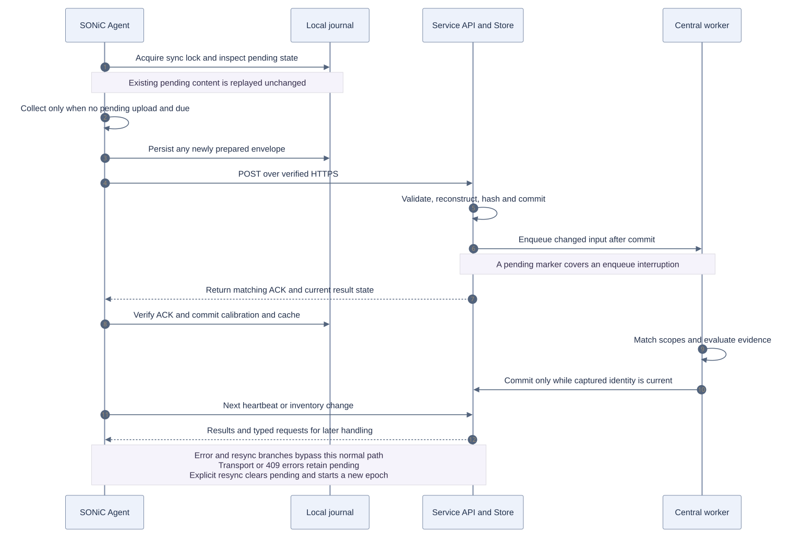

*Figure 3 — Normal synchronization and durable acknowledgement. [Editable Mermaid source](design/diagrams/03-inventory-sync.mmd).*

The switch initiates verified HTTPS `POST /api/v1/agents/sync`. No Smart Patch HTTP listener is exposed on the switch. URL may be an origin or end in `/api/v1`. A distinct device token is read from the private credential file and sent as Bearer authorization. HTTP is rejected unless an explicit lab-only `allow_http=true` is configured; even then the response cannot establish trusted clock alignment. Requests use connect/read timeouts `(5,30)`, reject redirects and bound the streamed response to 16 MiB.

### Request envelope

| Fields | Meaning |
| --- | --- |
| `schema_version: 1` | Versioned envelope; unknown top-level fields rejected by service model |
| `device_id`, `hostname`, `platform`, `sonic_version` | Enrollment identity and descriptive device fields |
| `build_id` | Embedded manifest build ID, or explicit `unverified:` identity derived from SONiC version metadata |
| `manifest`, `manifest_digest`, `artifact_verified` | Parsed manifest; SHA256 of exact raw manifest bytes (empty if absent); collector always sends false verification claim |
| `epoch`, `sequence`, `kind` | Inventory stream UUID, monotonic state-changing sequence, `checkpoint`/`delta`/`heartbeat` |
| `baseline_digest` | Previous ACK's runtime inventory digest; not an SBOM or signing assertion |
| `inventory_digest` | Hash of the complete reconstructed current scoped component set |
| `collected_at` | Inventory observation time; retains observation age rather than becoming every heartbeat's send time |
| `components`, `removed` | Full components for checkpoint; changed upserts and removed IDs for delta; normally empty for heartbeat |
| `facts` | Inventory coverage plus bounded requested facts and maintenance receipts |
| `resources` | Measured collection seconds, process peak RSS bytes and process CPU seconds |
| `clock_alignment` | Calibration status/offset/uncertainty plus raw inventory time and alignment basis |

The agent's default fresh-collection limit is 20,000 components. Retained records from unknown scopes are merged afterward, so this is not a hard ceiling on the final journal. The service schema independently permits up to 100,000 component/upsert entries and removals and 2,000 facts, with bounded identifier/string lengths; those larger schema ceilings do not mean the switch is intended to send that volume.

### State transition rules

1. Acquire the nonblocking sync lock. If an old `pending` request exists and enrollment identity has not changed, return that exact logical envelope before recollection or retimestamping. Pending state is stored before HTTP.
2. If no pending request exists, process previously received actions first, then prepare inventory/facts. A new device/build identity starts a new epoch and sequence zero. The first emitted checkpoint has sequence **1** and all current components.
3. Compare each current component's canonical hash with acknowledged fingerprints. Changed/additional components become upserts; acknowledged IDs no longer present become removals. A delta increments sequence by one. If neither set changed, emit a heartbeat with the **same** acknowledged sequence. Facts/resources may still change on a heartbeat.
4. The service authenticates role/device ownership inside its transaction. An unbound new agent token may enroll only with a checkpoint and is bound on success; it cannot take over an existing device. A pre-bound token must match the device ID.
5. Checkpoints reconstruct from an empty set. Deltas reconstruct from committed components, apply removals then upserts, sort and recompute the full inventory digest. The server compares the recomputed value; `baseline_digest` is carried/stored but is **not independently compared** by current Store.sync. Sequence and final reconstructed hash enforce the update chain.
6. Successful state-changing messages persist an InventoryMessage record containing a hash of the complete envelope, keyed by device/epoch/sequence. The DB transaction commits before the API can return its ACK. These records also prevent reuse of retired epochs.
7. After a valid reply, the agent requires ACK sequence equality with its pending request and, if present, equality of returned inventory digest. It commits new acknowledged fingerprints/digest, clears pending, records last_sync, caches results and stores bounded next-round requests. It then publishes local/STATE_DB status.

### Replay and recovery matrix

| Condition | Service response | Current agent behavior |
| --- | --- | --- |
| Exact replay of a committed checkpoint/delta in current epoch | No duplicate state/event commit; ACK current stored sequence | Accepts if it equals pending sequence; clears pending |
| Same device/epoch/sequence checkpoint/delta with different content | HTTP 409 | Preserves pending; records stale/error; retries do not automatically rotate epoch |
| Delta sequence gap | `resync_required=true` with stored sequence | Persists new epoch, sequence zero and empty acknowledged fingerprints; clears pending; next cycle emits checkpoint |
| Delta/heartbeat for unknown device or different epoch | Resync response | Same new-epoch/checkpoint path |
| Checkpoint using an already retired epoch | Resync response | Same recovery path; retired stream cannot roll state backwards |
| Heartbeat with wrong sequence or inventory digest | Resync response | Same recovery path |
| Reconstructed inventory hash mismatch | HTTP 409 | Retains pending/stale rather than pretending to ACK or silently accepting drift |
| Timeout, TLS failure, HTTP error, malformed/oversized response | No accepted ACK | Pending envelope and last-known findings retained; backoff/jitter |
| Authenticated valid heartbeat | Same sequence accepted; facts/resources/freshness may update | Polls results and sends new facts without a package delta |

Heartbeat contents are intentionally mutable at a fixed sequence and are not InventoryMessage exact-replay journal entries. The service currently accepts fresh checkpoints with a higher sequence in the same epoch and new-epoch checkpoints beyond sequence 1; the stock agent emits the stricter new-epoch sequence-1 convention. An exact **old** replay after another sender advanced the same device returns the server's newer sequence; the current agent's strict ACK equality rejects that. Normal single-writer stop-and-wait operation avoids it; concurrent cloned senders are unsupported and must not be advertised as seamlessly recovered.

The sync API maps sequence-content/hash conflicts to 409; do not depict every error as an automatic resync. The `resync_required` branch commits its reset but returns before the normal public publication call, so the sanitized display may not show that intermediate state until the next publication.

A new epoch/checkpoint is a protocol reset, not necessarily a new package read: the agent can reuse its retained inventory when no forced/dirty/topology/interval collection condition applies. Explicit CLI sync also bypasses the daemon's enabled/disabled gate, although it still checks credentials, TLS, the sync lock and Agent collection policy.

### Response and asynchronous work

A normal response contains `ack_sequence`, `resync_required`, optional newly queued `operation_id`, `inventory_digest`, `assessment_revision`, `assessment_status`, `findings`, `findings_total`, `findings_truncated`, `evidence_requests`, `action_requests`, `service_time`, and `coverage`. A resync response is smaller and need not contain a finding revision/digest.

The service returns at most 1,000 prioritized compact findings. Each includes ID/CVE/component/scope/package/version, severity/CVSS, fixed versions, applicability/exposure/rationale, assessed time/inventory digest, evidence IDs, action type, VEX justification and decision deadline. An ACK confirms transport/state commit, not central assessment completion. Worker scheduling follows the commit; service pending-scan recovery handles a crash between commit and scheduling.

Relevant runtime evidence or manifest changes on a heartbeat can schedule reassessment. Operational remediation receipts are excluded from applicability context; changing receipt timestamps must not invalidate the supporting finding or restage a plan. Inventory-quality/time-basis changes remain relevant to coverage.

The agent processes at most 8 queued evidence requests per preparation, retains at most 32 ordinary facts, and retains receipts separately until ACK. The service sends up to 10 evidence requests, but extras remain queued centrally for later retrieval. It sends at most 3 actions; agent accepts up to 4. Requests received in one response are normally executed/collected in a later sync, then returned as facts.


### Contract example

The following is an illustrative schema-valid checkpoint, not live inventory or an enrollment instruction. `baseline_digest` is the previous acknowledged runtime inventory hash; it is unrelated to the signed build SBOM. Component IDs are opaque to the API; the stock collector derives them from scope/name/architecture. The real inventory hash is computed over the complete canonical sorted component set, not over this prose.

```json
{
  "schema_version": 1,
  "device_id": "documentation-leaf1",
  "epoch": "documentation-epoch",
  "sequence": 1,
  "kind": "checkpoint",
  "inventory_digest": "d4b487b654bdae48b79d3480aceed88a00803d6fdd49eb389f51c71fdd5d4c7e",
  "collected_at": "2026-09-30T00:00:00Z",
  "components": [
    {
      "component_id": "documentation-host-example",
      "scope": "host",
      "name": "smart-patch-example",
      "version": "1.0-1",
      "architecture": "amd64"
    }
  ],
  "removed": [],
  "facts": []
}
```

The digest above is computed from the exact example components and validated against the service schema; the companion example file contains the same values. An ACK means the service accepted inventory state, not that central scanning or AI has completed. Ordinary heartbeats can carry refreshed facts with the same inventory sequence; the strict stored-envelope replay rules apply to checkpoints/deltas.

## 5 Time alignment and resource boundaries


The agent captures send/receive wall time and monotonic RTT for each successful HTTPS exchange. Calibration uses `offset = service_time - local_midpoint`, with uncertainty `RTT/2`. Missing/malformed times, unverified HTTP, negative timing or a wall/monotonic discrepancy over five seconds produce unknown calibration. A calibration is usable for at most 900 seconds of local elapsed wall time.

Each fact retains `device_collected_at`; once aligned it receives adjusted `collected_at`, `time_basis=server_aligned`, `clock_offset_seconds` and `clock_uncertainty_seconds`. Already aligned facts are not re-aged when a new response updates calibration. The first successful ACK aligns retained observations for the **next** heartbeat, never edits the message already sent. The operating-system clock is never changed. `last_sync` remains a local timestamp for transport-age display.

Optional `decision_valid_until` is enforced using the aligned current service estimate plus uncertainty. Expired/invalid/unverifiable deadlines downgrade the cached view to under investigation/last known; absence/null is not treated as an invented deadline. Clock alignment improves timestamp comparability; it does not prove facts were truthful or make old observations current.

Pending/failed assessments do not erase existing findings. Partial results place incoming findings first and retain absent prior observations as last known, capped at 1,000. Only completed/ready responses update the assessed inventory digest. Local output exposes truncation and omitted/retained counts. Public-state expiry checks also run at read time; VEX and maintenance use the same deadline logic.

| Collector | Scope/implementation |
| --- | --- |
| `listeners` | `ss -H -lntup` in selected scope |
| `kernel` | `uname -r` (container kernel is still the host kernel) |
| `processes` | `ps -eo comm=` |
| `interfaces` | `ip -j link show` |
| `bgp`, `routing` | `vtysh -c 'show bgp summary json'`; routing is an alias; use actual BGP container scope |
| `features` | Host ConfigDB FEATURE projection limited to state/auto_restart/scope fields |
| `services` | Host bounded systemctl Id/ActiveState; container supervisor status or process names |
| `resources` | Selected meminfo fields and load averages; not cgroup/container-limit attestation |
| `inventory` | Current stored scope/count/digest/time projection, not fresh package enumeration |
| `package_versions` | 1–10 validated Debian names, bounded `apt-cache policy`; no APT refresh/install |

Typed collector names and container names are allowlisted/validated; no arbitrary shell request exists. Successful facts contain `fact_id`, collector, scope, collected_at, status=observed and value; failures return status=unknown with a bounded error. The agent stamps current inventory digest. The generic fact schema can carry additional context fields, but it does not synthesize a ConfigDB revision for collectors that lack one.

| Control | Implemented value/default |
| --- | --- |
| Enabled/mode | false/advisory |
| Sync interval | 60 seconds plus jitter; accepted configuration 10–86400 |
| Inventory reconciliation | 900 seconds; accepted 10–86400 |
| Memory headroom | Agent collection defers below 256 MiB MemAvailable; configurable 64–65536 |
| Fresh collection/container limits | 20,000 components before unknown-scope retention; 64 containers |
| Collector deadline | Nominal 120 seconds checked between scopes; subprocess deadlines remain independent |
| Generic subprocess bounds | Default 15 seconds, 4 MiB output; process-group termination on timeout/overflow |
| Named fact bounds | Most named commands 8 seconds/64 KiB; package policy 5 seconds/16 KiB per package |
| Daemon cgroup | MemoryHigh 80M, MemoryMax 128M, CPUQuota 10% of one CPU, TasksMax 32 |
| Native maintenance command cgroup | Separate transient systemd service per command; MemoryMax 512 MiB, TasksMax 128; CPU quota disabled by default, configurable 0–100% of one CPU with 0 disabled; RuntimeMaxSec follows the command deadline |
| Maintenance free space | Default 500 MiB; configurable 1–65536 MiB, enforced before staging and forward installation when `maintenance_checks_enabled=true` |
| Scheduling | Nice 15, idle I/O, restart on failure after 15 seconds |
| Failed-sync retry | Exponential multiplier capped at five failure steps; sleep capped at 900 seconds plus jitter |
| Local result/work caches | 1,000 findings; 32 ordinary facts; 128 imported maintenance findings; 1,024 action journal entries; 128 autonomous-attempt keys |
| Manifest / HTTP response | Runtime manifest ≤256 KiB; sync response ≤16 MiB |
| Validation defaults | Services ssh/database/swss/syncd/bgp; CPU≤80%, memory≤90%, disk≤85%; prefix-loss tolerance 0%, required prefix counts true |

The 900-second sleep cap currently applies even without failures, so a configured sync_interval above 900 is not honored as a longer daemon sleep. The collector's nominal 120-second budget is not a hard whole-process wall-time watchdog; individual commands/scopes may carry it beyond that check. These are implementation limits, not hidden guarantees.

The state file keeps one current inventory plus acknowledged **fingerprints**, not two full acknowledged/current inventories. A pending checkpoint still duplicates component content until ACK. Reads/no-op transactions do not rewrite or fsync state; changed transactions still serialize full JSON. Manual `security collect` constructs its default collector directly, bypasses Agent's `min_available_mb` and configured `max_components`, and does not inherit the daemon cgroup. Manual sync has the Agent memory guard but likewise runs outside that cgroup.


The collector cgroup settings constrain the Smart Patch daemon. One-shot CLI parent processes do not inherit them; native maintenance subprocesses from either path use separate command cgroups. `MaintenanceCommandRunner` covers APT simulation/download/install, dpkg verification and maintenance health commands. Each command has its own 512 MiB hard memory limit without the collector's MemoryHigh throttle, preventing APT from sharing the collector's 128 MiB budget. RuntimeMaxSec enforces the original command deadline; the wrapper adds small startup/cleanup headroom. Host resource sampling remains a whole-host measurement. Explicit test runners and non-native standalone operation do not establish this systemd guarantee. Limits and sample observations must not be treated as a guarantee of zero forwarding impact: latest-package resource behavior under real traffic still needs DUT validation.

## 6 Build identity and signature verification



*Figure 4 — Pre-seal identity and post-build verification. [Editable Mermaid source](design/diagrams/08-build-provenance.mmd).*

`INCLUDE_SONIC_SMART_PATCH` defaults to `n`. When enabled, `rules/sonic-smart-patch.mk` appends the architecture-independent Debian artifact to `SONIC_DPKG_DEBS` and `SONIC_INSTALLER_EXTRA_DEBS`. `slave.mk` includes that list in installer dependencies, installed packages and SBOM inputs.

Before `mksquashfs`, `build_debian.sh` calls `scripts/smart-patch-manifest.py --rootfs …`. Inputs are source HEAD revision, platform, architecture, SONiC version, SHA256 of host `/var/lib/dpkg/status`, explicit build parameters and sorted container image identities. Docker identities are hashes of config JSON bytes read from installer image archives; recipe/overlay paths are not hashed as image identities. Build parameters include image type, machine, Debian distribution, debug/image-reduction and SBOM flags. No random build nonce, timestamp, token or enrollment UUID is embedded.

The build ID is SHA256 of canonical manifest inputs before adding build_id. The formatted manifest is written both to the target build directory and `/etc/sonic/smart-patch/manifest.json` inside the image. Later, after image/SBOM/provenance generation, a second invocation writes `<image>.smart-patch.json` containing build ID, **raw manifest byte** SHA256, final image SHA256/size and available SBOM/provenance SHA256/size entries. Missing optional SBOM/provenance is recorded as unavailable, not fabricated. The completed image hash is not embedded inside the same image, avoiding self-reference.

Signing is outside this helper, in the approved builder/CI environment. The service verifies a detached signature with a separately provisioned approved public key, exact index/manifest bytes and registered SBOM digest. The switch holds no signing private key. Its `artifact_verified=false` is a claim field, not an authority: the service determines whether a current reported manifest matches an approved signed association.

A signed baseline is **not runtime attestation**. Existing images without an embedded matching manifest remain explicitly unverified. The deterministic build ID is an input identity, not a full filesystem hash: same-version modified binaries or uncommitted source changes may not change source HEAD/package status inputs. Final external artifact hashes and trustworthy clean build/signing practice are essential; stronger content measurement/TPM attestation is future work.


The existing SONiC SBOM pipeline emits after the final image when enabled; the new pre-seal Smart Patch hook emits the manifest. The external index records missing optional SBOM/provenance honestly. The verifier needs the original registered SBOM and approved signing material for a verified association; generating an unsigned index by itself does not grant trust.

## 7 Intelligence service modules


The service accepts scoped package inventories from enrolled SONiC collectors and runs Grype, advisory storage, source investigation, release analysis and durable assessment history centrally. The switch sends checkpoints, package deltas and heartbeats over outbound authenticated HTTPS; it does not need the Grype database or a model client. A central scan is an analysis of reported evidence, not proof that every byte executing on a switch has been measured.

The implemented deployment is one FastAPI/Uvicorn process with a SQLAlchemy Store, default SQLite WAL database, a configurable 1–4 background worker threads (default one), and one scheduler thread. This is not a distributed broker or a proven multi-process HA design. `Store.lock`, request singleflight locks and lifecycle coordination are process-local; run one service process per state directory. SQLite transactions and durable operation records provide recovery within that deployment boundary. The Docker option packages the same application as a non-root user; the venv/TLS path is the primary lab deployment.

Sources: [main.py: create_app/lifespan](../app/main.py), [Runtime.start/_worker](../app/runtime.py), [Store.__init__](../app/db/store.py), [config.py](../app/config.py), [DEPLOYMENT.md](DEPLOYMENT.md), [Dockerfile](../Dockerfile).


*Figure 5 — Service orchestration and durable storage. [Editable Mermaid source](design/diagrams/04-service-internals.mmd).*

| Module | Responsibility | Important boundary |
| --- | --- | --- |
| [app/main.py](../app/main.py), [api/models.py](../app/api/models.py) | HTTP validation, role checks, versioned routes, UI mounting, sync/result delivery and operator actions. | Request fields are not evidence of artifact verification or successful remediation. Blocking paths use a threadpool where implemented. |
| [runtime.py](../app/runtime.py) | Configuration, encrypted secrets, Store/pipeline construction, durable enqueue, workers, scheduling, central scan orchestration and summary composition. | A queued operation and an accepted assessment are separate outcomes. |
| [db/store.py](../app/db/store.py) | Transactions, inventory sequence/digest checking, credentials, operation state, finding projections and current device state. | Inventory changes are acknowledged only after successful reconstruction and commit. |
| [sbom_parser.py](../app/services/sbom_parser.py), [json_source.py](../app/services/json_source.py) | Bounded CycloneDX/SPDX validation, rooted scope containment, package metadata, raw-byte digest and source error locations. | A flat aggregate package list cannot silently replace host/container occurrence identity. |
| [baseline.py](../app/services/baseline.py), [provenance.py](../app/services/provenance.py) | Merge trusted baseline pedigree into observed inventory; verify approved-key signatures and exact artifact digests. | A signed baseline association is not TPM/runtime attestation. |
| [scanner.py](../app/services/scanner.py), [process.py](../app/services/process.py) | Central Grype scope matching; bounded subprocess time/output; locked disk match cache. | Scanner evidence is a candidate match, not a reviewed applicability verdict. |
| [pipeline.py](../app/services/pipeline.py), [assessment.py](../app/services/assessment.py), [applicability_context.py](../app/services/applicability_context.py) | Scope normalization, coverage accounting, candidate merging, deterministic policy, optional investigation and context selection. | Processing state, applicability and runtime exposure remain separate. |
| [analysis_lifecycle.py](../app/services/analysis_lifecycle.py) | Durable per-CVE processing audit and fair bounded continuation from accepted saved evidence. | Only work bound to current identity/revision can update authoritative findings; deep lifecycle detail appears in the AI chapter. |
| [release_service.py](../app/services/release_service.py), [release_history.py](../app/services/release_history.py), [package_metadata.py](../app/services/package_metadata.py) | Release source/SBOM jobs, package projections, atomic current release assessments and immutable revisions. | Per-case AI revisions do not masquerade as new release scans. |
| [repository_catalog.py](../app/services/repository_catalog.py), [github_sync.py](../app/services/github_sync.py) | Signature/checksum-verified configured APT metadata and pinned official/community source preparation. | Available package versions and source commits are not proof of installed binaries or SONiC compatibility. |
| [request_assessment.py](../app/services/request_assessment.py), [request_lifecycle.py](../app/services/request_lifecycle.py) | Legacy batch API lookup against registered evidence; request dedup/cache and durable asynchronous completion. | Release-label-only, ambiguous or stale queries remain unknown. |
| [ai_client.py](../app/services/ai_client.py), [source_tools.py](../app/services/source_tools.py), [external_agent.py](../app/services/external_agent.py) | Provider tool loop, bounded typed evidence access, or a frozen case for an already signed-in external coding agent. | A cited proposal is separate from administrator adoption. |
| [maintenance_policy.py](../app/services/maintenance_policy.py), [maintenance_jobs.py](../app/services/maintenance_jobs.py) | Exact scoped target selection and central target recheck. | Agent staging and execution remain distinct, explicitly authorized phases. |
| [maintenance_reassessment.py](../app/services/maintenance_reassessment.py) | Reconcile successful execution receipts with changed target inventory and committed complete scan evidence. | Completion means selected CVEs are no longer reported for the exact occurrence; it does not assert global vulnerability resolution or healthy operation. |
| [analytics.py](../app/analytics.py), [observability/state.py](../app/observability/state.py) | Recorded snapshots, discoveries, package changes, bounded observed windows and local alerts. | Empty samples/history are not fabricated healthy measurements. |
| [retention.py](../app/services/retention.py) | Archive cold records before guarded deletion; protect live references and replay tombstones. | Failure to durably archive means no deletion. |
| [ui/routes.py](../app/ui/routes.py), [ui/static/js/app.js](../app/ui/static/js/app.js) | Public shell/static assets; protected operational views, evidence inspection and explicit actions. | The UI displays recorded service state; it has no built-in provider SSO login. |


## 8 Data model and identity hierarchy



*Figure 6 — SQL tables and logical record relationships. [Editable Mermaid source](design/diagrams/09-data-and-history.mmd).*

The Store has five SQLAlchemy tables, rather than one table per feature: `smart-patch_devices`, `smart-patch_inventory_messages`, `smart-patch_tokens`, `smart-patch_operations`, and the generic `smart-patch_records`. The latter has composite primary key `(kind, id)`, indexed owner and timestamps, and a JSON payload. Compact finding summaries support SQL filtering/counts without loading every evidence body.

`stable_hash` is SHA-256 over sorted, compact canonical JSON. `inventory_hash` sorts component records by `component_id` before hashing. These application hashes have different purposes from the SHA-256 of original SBOM/manifest bytes.

| Entity / record kind | Identity and contents | Lifecycle constraint |
| --- | --- | --- |
| `Device` | Stable device ID; current epoch, last sequence, inventory digest, components, facts, build/binding and assessment metadata. | Client-supplied `artifact_verified` is recorded as a claim, not trusted. |
| `InventoryMessage` | UUID row with unique `(device_id, epoch, sequence)` and digest of the accepted envelope. | Retained as replay/retired-epoch evidence; not ordinary disposable logs. |
| `Token` | UUID, SHA-256 bearer digest, role, optional device binding, description, use/revocation timestamps. | Raw credentials are not listed; revocation is checked on each authentication. |
| `Operation` | UUID, type, queued/in-progress/completed/failed state, active-work dedup key, arguments, attempts, progress, bounded logs, result/error. | Dedup shares active work, not every historical operation with the same key. |
| `artifact` | Canonical document digest plus the original `source_sha256`, validated SBOM and import source. | Different original bytes can share a canonical document ID; raw digest changes invalidate old signature bindings. |
| `build_binding` | Build ID with signed index digest, manifest/image/SBOM digests, approved key ID, verified manifest and status. | Revoked/source-changed bindings cannot continue to confer artifact trust. |
| `release`, `package` | Configured release ID; package ID includes release, artifact and component. | Same artifact registered in two releases retains separate catalog scope. |
| `finding` / `finding_summary` | `H(device_id, component_id, scope, cve_id)`; current verdict/evidence and identity snapshot. | Stable occurrence identity does not make a stale verdict current. Complete-scan absence is distinct from fixed. |
| `release_finding` / `package_cve` | `H(release_id, artifact_id, scope, component_id, cve_id)` with source, scanner, scan and assessment revisions. | Exact release/artifact/scan freshness gates catalog reuse. |
| `assessment_history` | `H(assessment_revision, finding_id)`; immutable observation metadata and evidence digests. | AI subset continuation appends only selected cases; it does not refresh `last_scan_at`. |
| `release_assessment_history` | Hash of release scope, assessment revision and finding ID. | Conflicting writes to an immutable revision are rejected atomically. |
| `evidence_snapshot` | Content digest of evidence JSON. | Shared snapshots remain while retained current/history/work records need them. |
| `cache`, `assessment_response` | Different identity-bound cached result cores, described below. | Cache TTL never overrides decision/evidence expiry. |
| `request` | Unique request ID with canonical query/input fingerprint, selected operations, timing/cache outcome and terminal timeline. | Reconciliation does not rewrite terminal request history. |
| `analysis_backlog`, `analysis_work`, `analysis_lifecycle` | Target/analysis identity and occurrence/version/scanner evidence; separate scheduling, saved work and state audit. | Old provider/source/advisory/review identities are superseded rather than relabelled. |
| `reviewed_assessment`, `external_agent_*` | Scoped reviews or frozen-session proposals and cited evidence. | Proposal submission does not promote applicability; review validity is bounded by identity and evidence freshness. |
| `plan`, `evidence_request`, `action_request` | Plan/request UUID and exact device/scope/input identity. | Old stage receipts cannot re-enable an executing or newer plan. |
| `maintenance_scan` | Latest accepted full-scan identity, scanner revision, coverage and hashed scope/component/CVE matches for one device. | Analysis-only updates cannot replace this proof; stale or incomplete proof cannot complete a maintenance plan. |
| `scheduler_cadence` / `status` | UTC due times, last job/status/error and persisted advisory generation/ruleset state. | Startup does not reset cadence or restore revoked credentials. |
| `snapshot`, `cve_discovery`, `event`, `alert` | Actual hourly observations, earliest fleet CVE sightings, committed changes and alert transitions. | Discovery identity survives disappearance and archival. |

Sources: [Store models, sync and store_findings](../app/db/store.py); [release_history](../app/services/release_history.py); [analysis lifecycle keys](../app/services/analysis_lifecycle.py). Tests: [control-plane invariants](../tests/unit/test_control_plane_invariants.py), [release history](../tests/unit/test_release_history.py), [discovery analytics](../tests/unit/test_cve_discovery_analytics.py).


The diagram's record-family arrows are application references inside typed JSON, not invented SQL foreign-key constraints. Stable finding identity, mutable assessment revision, actual scan revision and evidence content hash answer different questions. Their separation allows a small AI continuation to append its own history without pretending that every package was rescanned.

## 9 Matching and cache behavior



*Figure 7 — Analysis reuse and current-input commit gate. [Editable Mermaid source](design/diagrams/05-analysis-and-cache.mmd).*

`Runtime._job_scan` captures the device, inventory digest, build/manifest/baseline/binding, relevant facts, policy/review context and advisory generation. It resolves available source at the device's reported/verified revision, derives a scoped inventory and evaluates collector coverage freshness. Missing scope metadata, collector errors or stale coverage remain explicit; a successful Grype subprocess cannot upgrade failed collection into complete coverage.

On an eligible assessment-cache miss, `AnalysisPipeline.analyze` creates bounded per-run `SourceTools` and visits every host/container distro scope. A complete Debian matching baseline allows one scoped CycloneDX document containing only changed/new packages to be sent to Grype. The scanner merges that result with validated unchanged-package matches, including explicit zero-match coverage, and omits removed components. Missing or incompatible baselines require a full scope scan. The pipeline then merges duplicate advisory matches for the same scope/component/CVE and runs deterministic policy against current context. Optional provider work uses evidence records; pipeline hooks bracket central analysis. Full Grype output stays centrally bounded and recorded, not pushed into switch memory or pasted wholesale into prompts.

Before authoritative commit, the Runtime rechecks advisory generation and full analysis identity, and `Store.store_findings` checks device epoch/build/inventory, artifact/binding/review, baseline/manifest and fact digests. Changed identities reject the result as superseded. Central scanners atomically update findings, compact summaries, discovery identity, evidence snapshots/history, device assessment/scan metadata and change events. Freshness-aware reads downgrade expired reviewed or exposure conclusions rather than silently extending their lifetime.

Only an accepted current assessment revision seeds continuation work. The seeding guard closes the commit-to-seed race; rows retained from a prior partial scan are not relabelled with the new revision. A cache hit restores matching completed analysis progress so an older cached pending tail cannot overwrite finished processing. Continuation commits are scoped subsets: they preserve unselected findings and scanner timestamps. The following AI chapter gives the retry/fairness transitions.

Sources: [Runtime._job_scan](../app/runtime.py), [pipeline.py](../app/services/pipeline.py), [baseline.py](../app/services/baseline.py), [Store.store_findings](../app/db/store.py). Tests: [analysis lifecycle backlog](../tests/unit/test_analysis_lifecycle_backlog.py), [decision expiry](../tests/unit/test_decision_expiry.py), [baseline binding](../tests/unit/test_baseline_binding.py), [analysis services](../tests/unit/test_analysis_services.py).

| Layer | Key / validity | Work avoided; limits |
| --- | --- | --- |
| Grype match baseline | Scope/distro/image context, exact package and generated-SBOM fingerprints, scanner version, advisory identity and effective scanner-configuration digest. Inputs checked before and after reuse/matching. | Eligible Debian packages support incremental matching; unchanged positive and explicit zero-match results retain coverage. Removed components are omitted. Other safe complete inputs retain exact whole-scope reuse. Default 256 entries / 256 MiB, bounded lock stripes and atomic writes. Incomplete, inconsistent or changing-DB results cannot establish reusable coverage. |
| Runtime assessment cache (`cache`) | Inventory/build/baseline/manifest/artifact trust, scanner version/database identity/effective configuration, relevant context, source revision, ruleset/reviews, selected findings and applicable provider configuration. | Avoids complete repeated analysis when coverage/facts/decision bounds remain fresh. Default maximum 24 hours. Explicit investigate bypasses normal reuse. Completed processing is reconciled from matching durable work. |
| Legacy batch response cache (`assessment_response`) | Canonical requested CVE/package/version/scope/component, principal/role/device, release/artifact/binding, security metadata revisions, source roots/revision, policy, advisory DB/generation and provider identity. | Avoids lookup/projection work for exact repeated authenticated queries; 64 singleflight stripes. Result core is cached, while each request still receives its own request ID and durable audit. Final identity checks apply to hits too. |
| Saved analysis work (`analysis_work`) | Exact target/analysis identity, occurrence/version and initial scanner evidence. | Continues eligible unresolved cases and preserves completed processing without rerunning Grype. This is durable work state, not a general cross-device safety-verdict cache. |

An advisory revision/generation change, binding revocation, reviewed-policy update, source/context change, decision expiry or incomplete inventory can force fresh analysis or an unknown result. A database timeout is not a cache success, and a release label alone cannot make cached artifact assessments trustworthy.

The format-2 matching baseline requires one initial full scan. Incrementality is
restricted to package-local Debian matching; unsafe external suppression inputs
disable reuse, and unsupported inputs fall back conservatively. Coverage retains
the total current component count separately from `components_matched`,
`components_reused` and `components_removed`. A logically complete assessment can
combine fresh changed-package matching with valid retained evidence, while current
policy, exposure and build evidence are still evaluated. Matching-input reduction
does not imply an equivalent end-to-end latency or CPU reduction.

Post-install scan demand is recorded durably per execution and current context.
It becomes eligible only after inventory contains the exact target occurrence,
version and required container identity. Report replay and restart recovery share
the same attempt; not-yet-started ordinary scans for a device can coalesce to its
latest input. Running work is not cancelled and still passes the normal current-
identity commit guard. The UI reports throttled per-phase scope/package/finding
counters and a weighted workflow percentage, with a saving phase before expensive
persistence. Failed work retains its last progress; superseded work is distinct
from accepted current assessment.

Sources: [scanner.scan_scope](../app/services/scanner.py), [Runtime._job_scan](../app/runtime.py), [assess_request](../app/services/request_assessment.py), [assessment.result_cache_fresh](../app/services/assessment.py). Tests: [scanner cache](../tests/unit/test_scanner_cache.py), [request assessment](../tests/unit/test_request_assessment.py), [decision expiry](../tests/unit/test_decision_expiry.py).

`POST /api/v1/assess-vulnerabilities` remains available for existing clients. It accepts 1–1000 bounded vulnerability queries and optional scope/component/device/artifact selectors. It primarily answers from registered current device evidence or a verified exact artifact catalog. Caller trust flags, version labels and supplied severity do not create authoritative identity. Ambiguous/stale/unbound inputs produce `under_investigation` with rationale and explicit unknown confidence/downtime, rather than a fabricated calibrated result.

Duplicate query items share canonical work but retain the requested output ordering and independent rows. Optional `request_ai` queues targeted central work when configured/eligible; it does not turn the HTTP lookup into synchronous model completion. Request records bind operation references and are reconciled into queued/in-progress/terminal outcomes; missing/superseded/failed operations remain inspectable. Terminal request records are not rewritten by later device scans.

Timing distinguishes middleware-observed response readiness from worker-side request processing. The API passes a server-owned monotonic entry time, so recorded request processing includes pre-worker/auth/queue wait through audit preparation; it is not a claim to include the final audit write and response serialization. Middleware timing covers response construction through the response-header boundary, not client-observed full body/network delivery. The separate HTTP benchmark records its own client elapsed time.

Sources: [request_assessment.py](../app/services/request_assessment.py), [request_lifecycle.py](../app/services/request_lifecycle.py), [main.assess/observe](../app/main.py). Tests: [request assessment](../tests/unit/test_request_assessment.py), [request lifecycle](../tests/unit/test_request_lifecycle.py).


## 10 Release and source workflows


Release registration stores the release ID, pinned source URL/revision, optional SBOM source, primary flag and explicit repositories. Source preparation and inventory ingestion are separate jobs. The source helper verifies public HTTPS origin, disables inherited Git credential configuration/hooks, uses no-checkout cloning, resolves the requested commit and reads immutable Git objects through bounded tools. A source repository is not the release SBOM.

Raw SBOM upload validates locally bundled schemas, records both canonical document identity and exact original-byte SHA-256, then queues `release_sync`. Error reporting maps syntax/schema/semantic paths back to original JSON line/column; a dict input cannot supply original source positions. Containment preserves repeated/shared packages across scopes rather than flattening them away.

`release_sync` reconstructs scopes, loads configured APT catalogs through public key/signature and index checks, records package metadata, centrally scans and atomically commits accepted release findings/projections/history. Fields such as package type and source repository come from explicit metadata; unknowns carry reasons. `applicability_confidence` stays null without calibration. Candidate fixed versions and repository availability are not `cves_fixed` for an installed component.

The release commit guard includes artifact/SBOM source, source revision/resolved commit, repositories and assessment revision, plus Runtime advisory/analysis guards. Occurrence IDs include the release to prevent collisions when several releases reference one artifact. Complete disappearance is recorded as no longer reported, never converted into an invented fixed verdict. Partial scans retain prior rows as last-known evidence without presenting old scan results as new. `scan_revision` changes on matching; subset AI revisions change `assessment_revision` without making untouched rows incorrectly stale.

The build-binding API verifies the approved builder signature over exact external release-index bytes and binds build ID, original manifest digest, registered original SBOM digest and image digest. Approved public keys come only from the service's trusted-key directory. The parsed signed manifest remains server-owned. Different raw SBOM bytes invalidate old bindings; a build ID colliding with another image is rejected. A matching collector report establishes association with a signed baseline, explicitly `runtime_attestation=not_available`.

Sources: [release_service.py](../app/services/release_service.py), [release_history.py](../app/services/release_history.py), [package_metadata.py](../app/services/package_metadata.py), [repository_catalog.py](../app/services/repository_catalog.py), [provenance.py](../app/services/provenance.py). Tests: [release history](../tests/unit/test_release_history.py), [repository catalog](../tests/unit/test_repository_catalog.py), [SBOM source locations](../tests/unit/test_sbom_source_locations.py), [provenance API](../tests/integration/test_provenance_api.py).


Package metadata fields explicitly distinguish installed binary version, source version, advisory fix floor and repository-available candidate. Unknown `package_type`, source repository or calibrated confidence is retained with a reason. An empty `cves_fixed` is not a declaration that no advisory fixes exist; candidate updates do not prove an installed fix.

A central target recheck and release scan are separate from on-switch installation. Source clone success proves retrieval of the pinned Git object, not that a running image was built from it. The build-ID helper records HEAD and build inputs but does not enforce a clean working tree; CI must separately establish trustworthy source/material provenance.

## 11 Evidence rules and bounded AI


| Dimension | Fields and values | Meaning in this implementation |
|---|---|---|
| Software applicability | `applicability`: `affected`, `fixed`, `not_affected`, `under_investigation`; `decision_basis`, `decision_valid_until`, `review_record_id`, `ruleset_version` | Whether the installed occurrence is affected, based on deterministic matching and accepted reviewed/artifact proof. |
| Deployment exposure | `exposure`: `reachable`, `constrained`, `unknown`; `exposure_valid_until` | A separate, scoped runtime observation. It does not change software applicability by itself. |
| Processing | `assessment_state`: `pending_analysis`, `analyzing`, `analyzed`, `retry_needed`; `analysis_success`, `analysis_attempts`, `analysis_last_attempt_at`, `analysis_next_attempt_at`, `analysis_retry_exhausted`, `analysis_error` | Whether analysis ran, succeeded, awaits evidence, or needs another attempt. A successful answer can remain `under_investigation`. |

`AssessmentEngine.evaluate()` starts conservatively with unknown applicability/exposure. With the default `build_evidence_policy=required`, an exact distribution advisory match becomes `affected` only with a verified artifact association and no known custom-build/patch or Debian cross-release-lineage signal. With the administrator-selected `optional` policy, an otherwise eligible exact match can become `affected` from reported installed-package metadata without a verified build. It records `decision_basis=inventory_advisory_match`, the policy used and `artifact_binding=unverified`; it does not prove the installed binary contents or verify a signature. Known custom/patch-bearing and cross-release candidates stay under investigation unless a matching accepted review supplies a verdict. Inventory-only affected results defer remediation (`action_type=defer`, `remediation_eligible=false`) pending a scoped operator review. Runtime exposure requires an observed fact with matching scope, component, inventory digest, timestamp, and bounded TTL. Action receipts are excluded from applicability context; inventory/resource observations still participate in the broader assessment-freshness guard. [Rules](../app/services/assessment.py), [fact projections](../app/services/applicability_context.py)

The UI exposes **Settings & providers → Build evidence for applicability** and labels inventory-only affected rows separately from build provenance. Changing policy marks existing assessments stale and schedules reassessment when workers are enabled; current views remain under investigation until reassessed. Queue fresh device scans to request this explicitly. Historical records retain the policy under which they were assessed. Optional mode does not generate fixed/not-affected conclusions or bypass maintenance approval, target validation, staging and health checks. This source change is pending deployment, and prior live results and exported HTML/PDF documents predate it.

Neither `ai_proposed_applicability` nor an external proposal is copied directly into authoritative `applicability`. API-provider proposals for `fixed`/`not_affected` set `review_required`; all external proposals remain proposals. `risk_score` initially derives from reported CVSS, and confidence may remain null; these values are not independent proof of exploitability. [Provider result handling](../app/services/pipeline.py)

The central scanner receives one scoped SBOM with an explicit distribution override. Every artifact must bind uniquely to the declared component. Raw Grype `matches` and `ignoredMatches` are retained as `scanner_match` evidence with scope, component, advisory namespace, `matchDetails`, fix ranges, and the original match body. Multiple matches for the same occurrence/CVE are merged without discarding their evidence or advisory-source list. Scanner success and collection completeness remain distinct; stale or failed inventory collection cannot become complete coverage merely because Grype exited successfully. [Scanner binding/raw evidence](../app/services/scanner.py), [merge policy](../app/services/pipeline.py)

The recorded LLDP corpus concerns `lldpd`, `CVE-2023-41910`, and version `1.0.16-1+deb12u1`. Its three synthetic metadata cases compare the Debian 12 original version, Debian 12 security revision, and that security revision placed in a Debian 13 scope. The fixture records a Debian tracker fetch and content digest; this document uses that saved provenance rather than claiming a new advisory lookup. The cross-release case remains `under_investigation` even with a synthetic verified-baseline flag. `release_lineage.signals` identifies the binary/source revision suffix and selected scope release; it does not prove a patch is present. A package-specific, current reviewed proof can resolve the uncertainty. [Recorded corpus](../tests/fixtures/lldpd_cve_2023_41910.json), [lineage rule](../app/services/assessment.py), [lineage tests](../tests/unit/test_debian_lineage.py)

This example is not a declaration that any DUT is vulnerable or fixed. One package/CVE and three metadata cases cannot measure general false-positive/false-negative rates. A clean selected-CVE match result also does not establish runtime reachability or a complete fix.


*Figure 8 — Optional AI paths and independent review. [Editable Mermaid source](design/diagrams/06-ai-evidence.mmd).*

`SourceTools` exposes named functions, not arbitrary shell execution. Approved repository roots map to fixed local repositories; source calls require a full 40/64-character commit hash. Paths must remain repository-relative, exclude traversal and `.git`, and source blobs must be regular files. Git commands use bounded execution with hooks, optional locks, pager, and interactive credential prompts disabled for these reads. Each successful tool returns `{id,type,provenance,data,complete}`; output beyond its limit is explicitly partial. [Repository/path enforcement](../app/services/source_tools.py)

| Tool | Actual evidence and bounds |
|---|---|
| `get_source` | At most 160 lines and 16,000 output characters from a pinned regular-file blob. |
| `search_symbol` | Literal identifier; bounded Git grep; at most 50 returned matches. |
| `get_patch` | One pinned commit/path diff, bounded preview; explicitly source evidence, not proof of a shipped fix. |
| `check_commit` | Fix ancestry boolean. Reverts, backports, build selection, and shipped bytes remain separate questions. |
| `get_component` / `get_advisory` | Exact scoped component/source metadata and already stored scanner advisory evidence; the ordinary advisory tool does not browse the web. |
| `get_build_facts` / `get_runtime_facts` | Registered observations with explicit missing/unknown data and original timestamps; up to 20 requested names. |
| `compare_versions` | Native `dpkg --compare-versions`; version ordering is not a vulnerability verdict. |
| `request_runtime_facts` | Only named `services`, `listeners`, `features`, `interfaces`, `routing`, `resources`, or `inventory` collectors for an existing scope. No arbitrary arguments or shell. Returns fresh evidence, explicit unknown, or a queued request. |

Runtime requests are deduplicated by inventory/scope/collector, carry associated component/finding IDs, expire after ten minutes, and default to four requests per analysis. They are delivered through Smart Patch's outbound sync, not through a service-initiated SSH session. Fresh collection failures are returned as unknown rather than retried continuously. The service namespaces request IDs to the authenticated device; collector facts remain bounded. A new relevant observation changes context and requires current reassessment. [Tool bounds](../app/services/source_tools.py), [runtime request path](../app/services/source_tools.py)

The configured API lane is disabled by default. A model plus supported endpoint/credential configuration is required; zero `AI_MAX_CALLS` or `AI_MAX_FINDINGS` pauses provider work. Defaults are ten CVEs per batch, four model requests per investigation, six tool calls, 24,000 cumulative input characters, 1,200 output tokens per request, and a 30-second investigation budget. The client additionally clamps a nonzero request count to at most ten and tool calls to at most twenty, even though the configuration schema accepts higher limits. The loop has a 30-second deadline by default; individual tools also have subprocess bounds, so this is not a demonstrated hard real-time completion guarantee. Five consecutive provider failures open a 300-second breaker; these client counters are process-local, while per-CVE attempt accounting and queue records are durable. No provider call is made when disabled/unconfigured or by backlog scheduling itself. [Settings](../app/config.py), [client limits/breaker](../app/services/ai_client.py)

The model receives compact scanner summaries and schemas for bounded tools. Advisory/source/tool text is explicitly untrusted data. Responses must match CVE/component/scope and cite known evidence IDs; unsupported citations, malformed output, exhausted budgets, and timeouts do not become safe verdicts. [Prompt and validation](../app/services/ai_client.py)

The durable records have distinct jobs:

- `analysis_lifecycle`: per-CVE processing observations, target identity, operation ID, and the most recent 32 transitions; full transition events and operation messages also enter the audit path.
- `analysis_work`: accepted per-CVE evidence snapshot, exact input identity, progress, retry deadline, and success/exhaustion tombstone. Added tool evidence does not change the original scanner-input key.
- `analysis_backlog`: target/context dispatch record and current operation ID. It is separate from the per-CVE applicability verdict.

For unresolved initial candidates, pending records are written before the first provider call. Before provider I/O, an attempt is reserved durably and the state becomes `analyzing`. A response records `analyzed` with a success flag; failure then becomes `retry_needed` with exponential backoff capped at 900 seconds. Each exact input has at most five provider investigations, including the initial one. Cases awaiting requested facts are held; successful unknown answers are completed rather than retried forever. Deterministic decisions may finish directly as `analyzed` without a model call. [Transitions](../app/services/pipeline.py), [durable reservation](../app/services/analysis_lifecycle.py)

The scheduler queries eligible work in SQL, orders least-attempted cases first, hydrates only the bounded batch, and enqueues at most eight target jobs per tick. Continuations reuse exact saved matching evidence and do not rerun Grype. They commit only selected findings/history rows; actual scan timestamps and scan coverage remain unchanged. This avoids both tail starvation and writing every finding's history for each small AI batch. Matching cache hits restore completed progress and do not recount old provider usage. [Bounded scheduling](../app/services/analysis_lifecycle.py), [scoped continuation](../app/services/analysis_lifecycle.py)

Identity guards include inventory epoch/digest, build/artifact/binding, review state, assessment facts, source context, advisory revision, provider configuration, and ruleset. Initial scan and continuation commits reject changed context. Crucially, `seed_backlog(..., expected_identity=..., assessment_revision=...)` checks the captured accepted identity and revision under lock; it cannot relabel old findings under settings changed between commit and seeding. Only findings written in that accepted revision are seeded, so retained rows after partial scans are not promoted to a new context. Restart recovery requeues durable operations; reserved attempts survive interruption. Current successful/exhausted work remains retained to prevent budget resets. [Seed guard](../app/services/analysis_lifecycle.py)

There are two distinct durable checkpoints. Analysis work reserves an attempt before provider I/O and recovers a committed successful result if a crash occurs before its work checkpoint is updated. Smart Patch separately persists its sequence/epoch/digest-bound pending checkpoint or delta before transmission; it retries that envelope until the matching sequence acknowledgment, and action receipts remain durable until acknowledged. A failed network retry must not reset an AI attempt or execute a maintenance request twice. [Collector acknowledgment path](../../sonic-buildimage/src/sonic-smart-patch/smart_patch/agent.py)

After provider settings change, an operator explicitly starts device Scan/Investigate or release Sync to create fresh-context work; settings save does not launch a fleet-wide refresh. Relevant APIs are `GET /api/v1/analysis-lifecycle?target_kind=device|release&target_id=...`, finding detail/history, and operation detail/logs. [Regression suite](../tests/unit/test_analysis_lifecycle_backlog.py)


The three processing records are not an alternative security authority. A lifecycle row saying `analyzed` can describe a successful unknown answer, and an obsolete lifecycle remains historical. Before a current finding or queued action relies on a decision, current identity and proof expiry are checked again.

## 12 Signed-in external agent and reviewed decisions


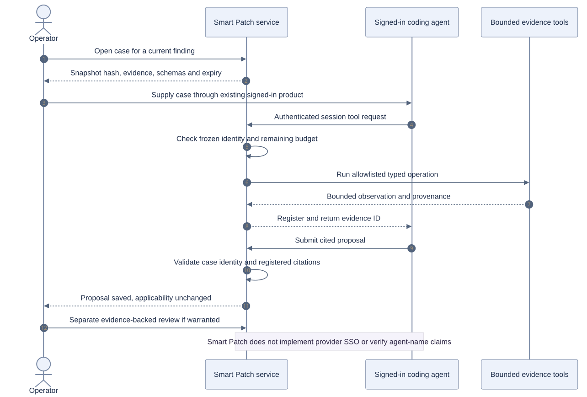

*Figure 9 — Operator-led case and cited proposal interaction. [Editable Mermaid source](design/diagrams/10-external-agent-sequence.mmd).*

This lane uses the user's already signed-in coding agent outside the service. The service does not embed enterprise SSO, acquire an API key from a browser login, or prove the external agent's identity. Bundles explicitly report `agent_identity_verified=false`, `agent_name_origin=self_reported`, and operator-API authentication as the trust basis. No provider call is triggered by case creation. [Case contract](../app/services/external_agent.py)

1. An operator/admin calls `POST /api/v1/findings/{finding_id}/agent-session` for a current finding with recorded evidence. The returned session lasts 20 minutes and binds device, epoch, inventory, build/artifact/binding, source, advisory revision/generation, context, occurrence, evidence, and assessment revision to `snapshot_hash`.
2. The UI downloads/copies the case for the signed-in agent. Initial context is at most 16,000 characters, the full bundle at most 32,000, with up to eight compact starting evidence records. Secrets are filtered; truncation is explicit and `original_digest` preserves linkage.
3. The agent/operator bridge uses `POST /api/v1/agent-sessions/{session_id}/tools/{tool_name}` with `{"arguments": ...}`. There are at most 12 tool calls, 48,000 evidence-response characters, and four runtime requests. Owner/admin access, expiry, current snapshot, schema, source revision, scope, component, and CVE are rechecked. Tool budget is charged before execution, and context is rechecked before recording its result.
4. An additional `fetch_official_advisory` tool only fetches the selected CVE from the Debian security tracker: fixed HTTPS host/path, no redirects, 15-second timeout, 256-KiB input cap, and bounded extracted text with SHA-256 provenance. Arbitrary supplied URLs remain references; they are not fetched or trusted as evidence.
5. `POST /api/v1/agent-sessions/{session_id}/analysis` validates `snapshot_hash`, `cve_id`, `component_id`, `scope_id`, `proposed_applicability`, a 20–6000-character rationale, 1–30 distinct registered evidence IDs, bounded `unknowns`, and the allowlisted `recommended_action`. Pending/unknown-only citations cannot support a definitive proposal. The service stores an `external_agent_analysis`, updates the latest-proposal pointer, attaches cited evidence, and closes the session as `submitted`; applicability/VEX/remediation authorization do not change.
6. An administrator separately reviews the proposal/evidence through the finding review endpoint. An archived proposal remains visible after a rescan with explicit stale reasons when its context no longer matches; it is not silently reapplied.

The exact route prefix is confirmed in main.py; a reference patch can be fetched at another approved commit and is labeled `source_role=reference_patch`, while ordinary source/search/ancestry reads must use the frozen build revision. [Routes](../app/main.py), [tool checks](../app/services/external_agent.py), [submission](../app/services/external_agent.py)

`POST /api/v1/findings/{id}/review` requires admin authorization, a current finding, 20–4000 characters of justification, and evidence already attached to that finding. `fixed`/`not_affected` require an HTTPS build/patch reference; `not_affected` additionally requires a recognized OpenVEX justification. The stored review binds the exact device/inventory/context, build, scope, component, CVE, and installed version. The review record expires in 30 days, while the currently effective decision expires at the earliest supporting runtime-fact deadline if sooner. Recording a review advances the device's `review_revision`, invalidating older action/analysis contexts. [Review endpoint](../app/main.py)

This is an explicit administrator attestation backed by recorded citations; the service does not automatically prove patch semantics merely because a reference URL exists. Freshness guards apply on cache/read/VEX/action paths. Smart Patch independently downgrades an expired or unverifiable decision to `under_investigation`/`last_known` using authenticated server-clock calibration and uncertainty; it does not change the switch clock. The service exports OpenVEX; Smart Patch exports scoped CycloneDX VEX. Unknown or unsupported suppression evidence cannot manufacture a safe verdict. [Expiry policy](../app/services/assessment.py), [switch decision guard](../../sonic-buildimage/src/sonic-smart-patch/smart_patch/decision.py)


The saved LLDP investigation demonstrates this lane with seven typed tool calls and eight citations. It remained under investigation. This is evidence that a real signed-in-agent workflow returned an audited proposal, not a benchmark for autonomous model latency or a provider-verified identity claim.

## 13 Maintenance and recovery interactions


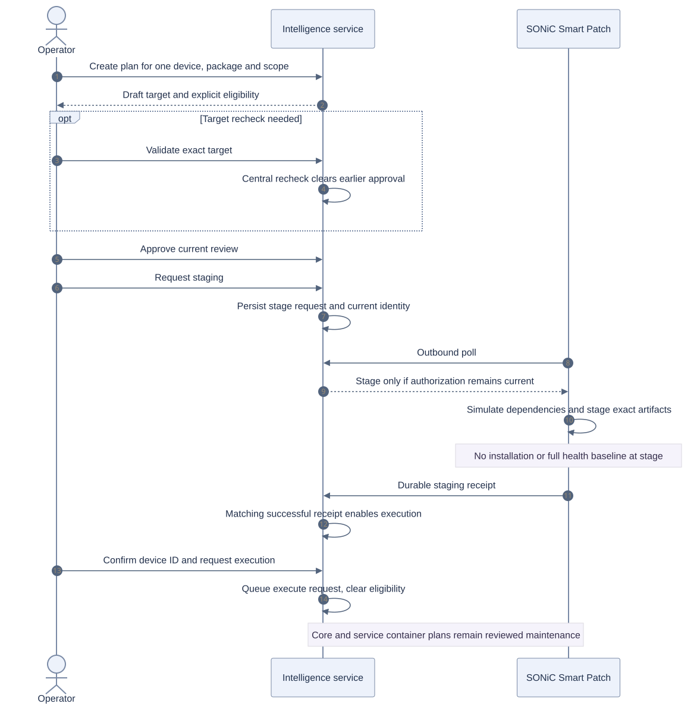

*Figure 10 — Review and staging before execution eligibility. [Editable Mermaid source](design/diagrams/07-maintenance.mmd).*

Creating an analysis proposal never creates an approval. `POST /api/v1/plans` selects 1–100 findings for the same device/package/version/scope and captures `inventory_digest`, `inventory_epoch`, build/artifact/binding, `review_revision`, `assessment_revision`, `ruleset_version`, exact target version, and a 24-hour `expires_at`. It starts `draft`, `approved=false`, `execution_eligible=false`; `staging_eligible` is a separate field. The service classifies all container scopes and named core/routing/kernel/crypto packages as reviewed image maintenance, with an operator runbook rather than an automated image activation/reboot. [Plan creation](../app/main.py)

The target resolver uses Debian version ordering, source/binary fix floors, architecture, and signature-verified repository metadata with SHA-256 provenance. An exact advisory-supported candidate can exist without a complete catalog; that is not proof of repository availability. Optional `POST .../validate-target` queues a bounded central target scan. Its acceptance requires the exact target identity, complete coverage, one current advisory DB revision, and absence of selected CVEs and their aliases; other CVEs remain visible. Success returns to `draft` and clears approval. This is a target match recheck, not installation-safety validation. [Target policy](../app/services/maintenance_policy.py), [target worker](../app/services/maintenance_jobs.py)

The API-driven phases are:

**Optional local checks:** `maintenance_checks_enabled` defaults to `false` on the switch. This disables local inventory/version/freshness, decision-validity, free-space, dependency-policy, unchanged-transaction/hash and pre/post health gates. Set `sudo config security setting maintenance_checks_enabled true` to enable them. Authentication, exact authorized device/package/target, mode, explicit approval/expiry, idempotence, supported scope, explicit container-maintenance permission and service plan binding remain mandatory. APT simulation/download/install must still work and retains configured repository trust. The phase table below describes the checks-enabled path; with checks disabled skipped validation is recorded as skipped, never as passed.

The disabled policy attempts rollback downloads but permits missing exact previous packages, records `rollback_available=false` and the missing recovery set, and performs no partial automatic rollback. Failed installation without complete retained recovery artifacts requires manual recovery. The option does not authorize protected core/image changes or remove the separate container-maintenance mode and identity gates.

`rollback_available=true` records retention of the complete staged recovery artifact set; it is not a guarantee of restoration. In particular, disabled dependency/transaction checks allow the installed dependency transaction to differ from the staged recovery set.

| Phase | Service state and checks | Community SONiC work |
|---|---|---|
| Approve | Admin `POST .../approve`; current plan identity/expiry; records `approved_at`/`approved_by`. Repeated approval does not reset an already-approved phase. | None. |
| Stage request | Admin `POST .../stage`; approved + staging-eligible + current; stores `stage_plan`, `stage_request_id`, `staging_queued`, execution ineligible. | Received on outbound sync; exact request/device/scope/inventory/approval/mode checks and durable journal. |
| Stage implementation | No installation permission is inferred from queueing alone. | Require eligible host scope or a supported running container with explicit maintenance mode and captured identity; verify installed version/digest/decision validity; require configured free staging space (default 500 MiB); simulate `apt-get -s --no-remove`; reject removals, new dependencies, or protected core dependencies; download exact forward **and rollback** packages, verify identities/hashes, save transaction digest; local `staged`. |
| Stage receipt | Consume once; only the current stage request in `staging_queued` may make the service plan `staged` and `execution_eligible=true`. | Durable result fact is sent on the next sync and retained until acknowledgment. |
| Execute request | Admin `POST .../execute` with `confirmed_device_id`; approved + staged + eligible + current; queue a new `execute_plan`, set `queued` and clear eligibility. | Obtain request through sync; revalidate and journal before executing. |
| Apply | Result remains pending while the actual transaction runs. | Acquire maintenance lock; recheck authorized scope, container identity where applicable, mode/approval, inventory/version/decision, configured free space and exact simulated transaction; **then capture and require a complete healthy SONiC baseline immediately before installation**. Install retained forward artifacts, verify installed versions, compare post-health. |
| Success/failure | Record receipt and reassess subsequent changed inventory. | Success is `pending_reassessment` and marks inventory dirty. Install/health failure triggers retained-artifact rollback; report `rolled_back` or `rollback_failed`, with validation details. |

**Stage does not collect the health baseline and does not automatically run `apt-get update`.** With checks enabled, the baseline belongs to `apply()` after repeated current-state checks; disabled checks record health as skipped. Dependency resolution and downloads use configured APT state; deployment owners must supply appropriate signed repository configuration. The service's staged-before-execute API gate is explicit; the low-level agent executor also retains a compatibility path that stages a locally `planned` transaction before applying an authenticated execute request. Do not describe that compatibility path as a separate public service shortcut. [Agent stage](../../sonic-buildimage/src/sonic-smart-patch/smart_patch/remediation.py), [apply/rollback](../../sonic-buildimage/src/sonic-smart-patch/smart_patch/remediation.py), [executor](../../sonic-buildimage/src/sonic-smart-patch/smart_patch/actions.py)

Health observations cover configured critical systemd services, running containers, baseline-up interfaces, established BGP peers, received-prefix/route counts, and CPU/memory/disk thresholds. Defaults are CPU 80%, memory 90%, disk 85%, and zero tolerated route/prefix loss; required missing measurements fail the baseline. These are control-plane observations, not a data-plane traffic-loss proof. [Health implementation](../../sonic-buildimage/src/sonic-smart-patch/smart_patch/validation.py)

When local checks are enabled, these health percentages remain independent of the maintenance execution quota and free-space minimum. A filesystem at 95% used can have more than 500 MiB free but still fail the 85% disk-health baseline. The minimum-free-space check does not reserve capacity or estimate expanded package size. When local checks are disabled, both health and free-space gates are skipped, while command memory/task/deadline bounds and configured CPU quota remain. Native stage/apply/rollback also supports compatible running SONiC Debian containers under explicit maintenance mode. On cgroup v2, Docker-created exec preserves the container's original security profile and a Python gate attaches itself to the bounded maintenance unit before the host permits the package command. On cgroup v1, the namespace-pinned fallback requires an unconfined, non-remapped compatible container. Both paths bound the actual package process; limiting a Docker client alone is insufficient. Protected core/image changes and unsupported isolation remain manual. Updating configuration does not replay denied action IDs or grant approval.

Before delivering any queued action, the service rechecks current affected findings, complete plan identity, matching request ID, and permitted phase. Changed or expired support makes the action `superseded`; the current invalid plan becomes `requires_revalidation`. Duplicate/late stage receipts are retained without regressing an executing plan. Smart Patch journals request IDs; a completed request returns its existing receipt, and an interrupted request requires operator recovery instead of blindly reinstalling. Receipt facts are operational observations excluded from applicability context, so a stage acknowledgment alone does not invalidate its supporting assessment. [Delivery/receipt guards](../app/main.py), [local idempotence](../../sonic-buildimage/src/sonic-smart-patch/smart_patch/actions.py)

A successful transaction is not a fixed verdict. Dirty inventory produces a durable delta/checkpoint, central reassessment evaluates the new occurrence, and VEX depends on the resulting current evidence. The service closes a `pending_reassessment` plan as `completed` only after a successful receipt matches the executed authorization, changed inventory reports the exact target occurrence, and an accepted complete scan of that inventory and context no longer matches its selected CVEs or their aliases. It records observed version, inventory identity, assessment revision and scanner revision as scoped completion evidence. Missing, partial, failed, stale or still-matching evidence leaves an explicit waiting reason. Receipt-before-scan and scan-before-receipt are supported; legacy pending plans without a committed scan snapshot request a fresh scan. Skipped health checks and original receipts remain unchanged. [Completion reconciliation](../app/services/maintenance_reassessment.py)

The intelligence service sends the approved plan; the collector downloads package archives directly from the switch's configured APT repositories during staging. DNS resolves repository names and HTTP(S) transfers the data. Installation uses the staged archive cache with `--no-download`; the service does not relay a `.deb` in this workflow.

Remote rollback is supported by the agent executor, but there is no corresponding public service rollback endpoint in the inspected route set; automatic failure rollback and the local maintenance CLI are distinct mechanisms. Autonomous mode is separately restricted to an explicit exact `scope/package` allowlist, current complete connected assessment, and one transaction per cycle; its default allowlist is empty. [Durable action facts](../../sonic-buildimage/src/sonic-smart-patch/smart_patch/agent.py), [autonomous coordinator](../../sonic-buildimage/src/sonic-smart-patch/smart_patch/actions.py)

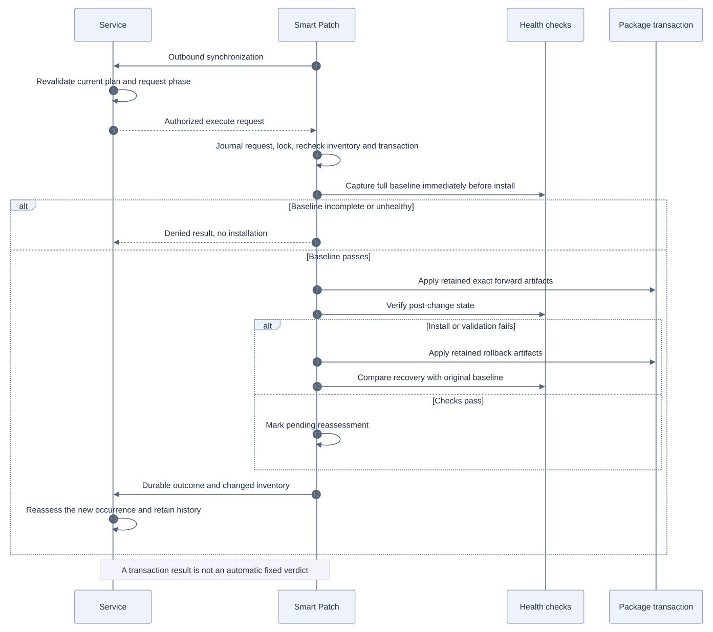

*Figure 11 — Checks-enabled apply-time health gate and retained-artifact rollback. With `maintenance_checks_enabled=false`, health gates are skipped and automatic recovery requires the complete retained rollback set. [Editable Mermaid source](design/diagrams/11-apply-and-rollback.mmd).*


### Local interface boundaries

Service plan IDs map to distinct local plan UUIDs. Local CLI plan creation reads a cached affected finding and does not reproduce every server-side inventory/cache-currentness guard. With local checks enabled, stage/apply check recorded version, inventory and optional decision deadline; service delivery and autonomous eligibility retain their stronger current-evidence authorization. The design must not claim these entry points have identical assurance.

The stock service uses a 24-hour plan expiry. Local plans have no automatic equivalent lifetime unless supplied through their governing context. Remote approval/plan expiry currently uses device wall time; finding decision expiry uses calibrated service time. Clock alignment therefore does not yet cover every maintenance timestamp.

Protected package prefixes are a defined policy list, not complete knowledge of every platform-critical dependency. The exact autonomous allowlist covers the requested target; a permitted transaction can also update already installed non-core dependencies after simulation. Empty allowlist is the default. There is no complete on-switch artifact archival/recovery UI for exhausted journals; capacity exhaustion denies new work and requires operator handling.

### Selected-switch remediation batches

The web workspace can group selected findings across switches into a durable
batch with independent child plans. Each entry shows its exact target and
eligibility; blocked and manual entries remain visible. Administrators approve
staging for an explicit eligible subset, then separately confirm the exact staged
plans and device identities for execution. Default concurrency is one switch and
pause-after-failure is enabled. Execution occupies its slot until the child has
fresh inventory and complete scoped reassessment. Unknown outcomes retain the
device reservation; automatic retry of failed installation is not performed.

The batch coordinator uses shared per-plan authorization and device-busy guards
for both standalone and batch actions. Child status, action outbox and batch
dispatch are committed together under the single service process Store lock.
Startup, receipt and scheduler reconciliation resume durable work without
duplicating request IDs. Pause/stop affect new dispatch only: queued requests may
finish. Active batches protect child plans and action evidence from retention.
The first workflow supports one eligible host or supported container package occurrence per switch,
up to 50 switches and 200 findings; subsequent package changes require fresh
plans after reassessment. Supported container entries require their own switch maintenance-mode/identity gates; protected core/image maintenance remains manual.

See the [service interaction diagram and API contract](INTELLIGENCE_SERVICE_DESIGN.md#multi-switch-remediation-coordinator)
and [operator workflow](USER_GUIDE.md#remediate-selected-switches-together).
Batch authorization retains the plan/action protocol; the maintenance update adds collector progress reports and native CVE-status commands. This is independent
per-switch maintenance with bounded concurrency, not an atomic fleet transaction
or fleet-wide rollback. Multi-process API coordination remains unsupported.

### Container maintenance, CLI history and recovery archives

Container package workers allow only the basic character devices needed for noninteractive package tools. Hardware device access and device creation remain denied. The Docker path verifies the original basic-device permissions and rejects additional cgroup security policies it cannot preserve; SONiC additive device rules do not grant those devices to the package worker.

The implemented maintenance update has four connected changes:

1. Ordinary packages inside compatible running Debian SONiC containers can be staged and installed with explicit switch `maintenance_mode=true`. Approval captures full container ID/image/name, and the worker restarts only that container. On unified cgroup v2, Docker preserves the original security profile and a Python gate receives only the worker's `cgroup.procs` descriptor, attaches itself with PID `0`, and waits for verified membership plus `GO` before package execution. This supports eligible seccomp-filtered containers without disabling their profile. Older cgroup v1 uses a pinned-namespace fallback for unconfined, non-remapped compatible containers. Unsupported setups, user remapping and protected kernel/routing/core targets fail closed or remain manual. The permission flag does not drain traffic; writable-layer fixes can disappear on recreation.
2. A separate authenticated progress reporter publishes durable local CLI and service-origin phases while ordinary sync may be waiting on APT. `/api/v1/remediation-status`, **Remediation status**, and `show security remediation` / `show security cves` present per-CVE, per-occurrence history. CLI records are read-only observations, not fabricated central approvals. Closure requires changed target inventory and a complete current scan after the local installation report. Subsequent rollback/failure or recurrence invalidates a current resolved display while preserving its historical proof.
3. Missing exact rollback packages can use the official Debian snapshot archive. Discovery retains package/version, scope distro and architecture; a private signed APT configuration avoids changing host sources or executing inherited hooks. The optional date override never permits substituting another version. Custom/vendor archives may remain unavailable, and incomplete recovery sets remain explicit.
4. SBOM uploads accept 50 MiB of file bytes plus a bounded 64 KiB multipart envelope on the two upload routes. Other request limits remain 16 MiB. Content-Length, streamed accounting and bounded parser reads enforce the budget; the UI exposes effective limits and excess files receive HTTP 413.

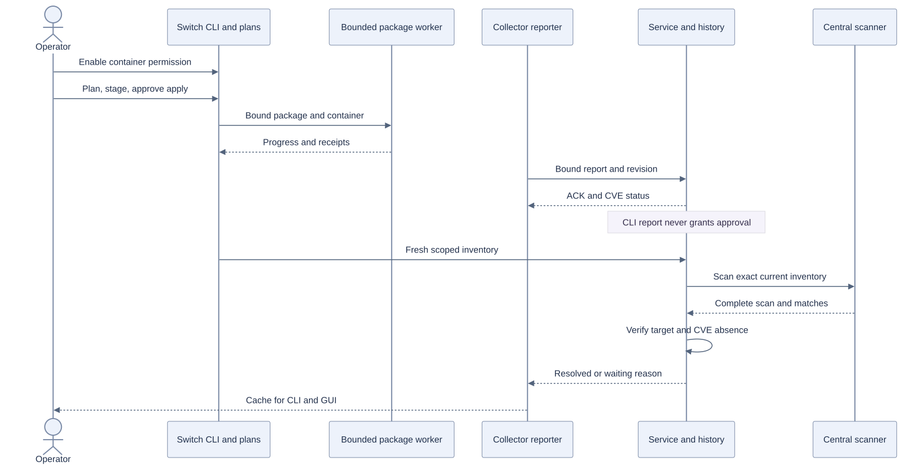

*Figure 12 — Scoped CLI progress, independent central verification and shared history. [Editable Mermaid source](design/diagrams/12-cli-remediation-status.mmd).*

The [community design](COMMUNITY_SONIC_DESIGN.md#explicit-container-permission-and-bounded-execution) details switch permissions, namespace execution and snapshot retrieval. The [service design](INTELLIGENCE_SERVICE_DESIGN.md#container-eligibility-and-independently-reported-progress) defines report authorization, immutable revision binding, lifecycle projection and full-scan closure. Operator commands and synthetic screenshots are in the [user guide](USER_GUIDE.md#install-an-eligible-package-inside-a-container).

## 14 Durable scheduling and reference retention


Operations are claimed oldest-first and handler results/errors are persisted. Work types include `scan`, `investigate`, `advisory_update`, `release_sync`, `source_clone`, `analysis_backlog`, legacy retry handlers and `plan_validate`. Active dedup keys prevent competing identical queued/in-progress jobs. Worker exceptions record failed status, error/logs and device failure metadata where applicable. A superseded device scan can enqueue current reassessment instead of accepting stale output.

On startup, in-progress operations are requeued. With `jobs_enabled=false`, recovery still runs but workers/scheduler/policy rescan startup do not; this supports isolated API fixtures. With jobs enabled, a ruleset change marks current inventories pending, workers start, and the scheduler executes approximately every ten seconds. There is no claim that a blocked/slow tick is a hard real-time deadline.

| Scheduled work | Persisted cadence |
| --- | --- |
| Advisory refresh | Daily; unavailable local DB requests repair; successful refresh persists generation and schedules current inventories. |
| Release synchronization | Daily for configured artifact/SBOM releases; primary releases are enqueued first among newly due release jobs. This does not preempt an existing running job. |
| Periodic device scan | Configured interval, normally six hours; seeded from last successful scan. |
| Actual snapshot | Hourly; resumed observations do not synthesize missed hours. |
| Retention | Daily bounded archival attempt. |
| Pending inventories, saved-evidence work, legacy retry, request reconciliation, local alerts | Checked on scheduler ticks with their own eligibility/budget/state guards. |

`scheduler_cadence` stores next due time, operation ID, attempts/success/failure times and error/status. Completion advances the regular deadline from the actual operation completion time. Failures use a one-minute retry interval, including across restarts; active operations keep the same ID. Existing successful advisory/release/scan timestamps seed migration, while mere imported-SBOM timestamps do not count as successful release analysis. Snapshot/retention callbacks are isolated so their own failures do not reset another cadence. Advisory generation is read from durable status, not reset to zero at every startup.

Sources: [Runtime.start/_run_cadence/_scheduler/_worker](../app/runtime.py), [Store.enqueue/claim/recover_jobs](../app/db/store.py). Tests: [persisted scheduler](../tests/unit/test_persisted_scheduler.py), [control-plane invariants](../tests/unit/test_control_plane_invariants.py), [analysis lifecycle backlog](../tests/unit/test_analysis_lifecycle_backlog.py).

Current-state projections and historical evidence answer different questions. Immutable device/release revisions keep evidence digests so a later correction does not erase what supported an earlier result. Raw history is not necessarily the current safe verdict; current projections apply identity and expiry checks.

The discovery ledger normalizes strict CVE IDs and records the earliest retained observation across device findings, regardless of device/scope or later applicability. It is transactionally updated when findings commit and survives removal/reappearance and retention. Release-catalog-only findings do not enter fleet discovery. One-time migration reads compact CVE/first-seen projections from finding summaries and assessment history; older deleted/archived evidence is not reconstructed, so coverage remains explicitly partial.

Hourly snapshots are written by scheduling, not by dashboard reads. For up to seven days, charts return hourly observations; longer windows return the last actual observation in each UTC day with count/first/last observation and observed peak affected metadata. The 366-day window produces at most 366 observed daily points. Missing days stay missing. Discovery series are counts per first-seen bucket, not stock averages or CVE publication dates. Package-update rankings use committed scoped version transitions and expose truncated/legacy event coverage.

Default retention is 365 days. A call selects bounded cold records/terminal jobs (default at most 1000 rows and 16 MiB), writes a private immutable gzip JSONL archive with per-record hashes and fsync, then rechecks identity/references in a transaction before compare-and-delete. Modified/newly referenced records stay in the database. Cursors and alternating record/operation streams avoid repeatedly scanning the same protected prefix; oversized rows remain for explicit archival. Live credentials/devices and inventory replay tombstones are not expired. Current findings, required evidence/history references, active requests/plans/sessions, applicable lifecycle/work records and the permanent discovery ledger are protected.

This is bounded archival, not a promise that all eligible history disappears on one daily tick. Database and archive capacity, backlog growth and restore procedures still need deployment monitoring and operational qualification.

Sources: [analytics.py](../app/analytics.py), [Store.cve_discovery_trends](../app/db/store.py), [retention.py](../app/services/retention.py). Tests: [analytics observations](../tests/unit/test_analytics_observations.py), [discovery analytics](../tests/unit/test_cve_discovery_analytics.py), [retention archive](../tests/unit/test_retention_archive.py).


### Failure outcomes

| Failure or race | Required observable outcome |
| --- | --- |
| Collector cannot read a scope | Preserve previous components and mark coverage unknown/partial; do not invent removals |
| Server committed but ACK was lost | Retry the same durable state-changing envelope; do not duplicate the inventory change |
| Inventory commit completed but enqueue did not | Scheduler recovers the persisted pending-scan marker |
| Source, review, provider or advisory changes during work | Reject the old result; do not assign it the new identity |
| Context changes after commit but before backlog seed | Expected-identity and accepted-revision guard rejects seeding |
| Worker stops during provider request | Reserved attempt persists; successful committed progress is recovered when possible |
| Matching cache predates finished AI work | Restore matching durable progress; do not regress the tail to pending |
| Stage or execute request is replayed | Use journaled request identity/outcome; interrupted actuator work requires operator recovery |
| Archive write or reference recheck fails | Keep database records; never delete first and hope archival worked |
| Installation or enabled post-install health validation fails | Attempt rollback only with complete retained recovery artifacts; otherwise report manual recovery required. Never assume recovery. An unhealthy enabled pre-install baseline denies installation without rollback. |

These are bounded recovery mechanisms, not an exactly-once guarantee for every external package-manager side effect or a high-availability database design.

## 15 Security and operational presentation


All operational APIs require the appropriate role. Agent credentials are device-bound for sync/assessment; operator credentials read operational data, request scans/evidence and create review plans/cases; administrator credentials manage settings/tokens/releases and reviewed verdicts or maintenance authorization. The public UI shell/static files, minimal `/health`, root redirect and framework API-documentation surface are deliberate exceptions to literal “authenticate every HTTP request.” `/metrics` and `/api/v1/readiness` are protected.

Tokens are high-entropy bearer values with only SHA-256 digests in the token table. Raw values are returned at issuance, not in listings. Last-used timestamp writes are coalesced for one minute, but revocation is checked each request. Bootstrap token and Fernet settings key are created with mode 0600 in the private state directory; an already revoked bootstrap credential is not silently re-enabled. Provider keys saved through settings are encrypted, never returned by public configuration. The browser keeps the Smart Patch service token in tab-scoped `sessionStorage`; provider login and Smart Patch API authentication are distinct.

`scripts/start-local.sh` requires configured certificate/key unless plaintext is explicitly enabled on loopback for tests. The preparation script supports a separate local CA and certificate; older lab TLS used its existing self-signed certificate. Certificate/private-key lifecycle is an operator responsibility, not a claim of automatic rotation. The UI uses same-origin local assets and CSP; data is rendered with text-safe DOM creation, with no CDN or arbitrary remote HTML execution.

Approved build keys are public PEM files under the designated trusted directory with path, symlink and permission checks. Signing private keys remain in the builder. Source tools use approved roots/exact commit objects and typed read-only functions; they do not grant arbitrary shell execution. External-agent submissions preserve source/evidence identity and self-reported attribution, not verified provider SSO identity.

Sources: [main.principal/operator/admin](../app/main.py), [Store.authenticate](../app/db/store.py), [Runtime._prepare_secrets](../app/runtime.py), [UI CSP](../app/ui/routes.py), [start-local.sh](../scripts/start-local.sh), [provenance.py](../app/services/provenance.py). Tests: [workspace API](../tests/integration/test_workspace_api.py), [API/auth](../tests/unit/test_api.py), [provenance](../tests/unit/test_provenance.py), [external agent](../tests/unit/test_external_agent.py), [UI workspace](../tests/unit/test_ui_workspace.py).

The public shell has 14 views; browser operational requests use `/api/v1`. Main overview/fleet pages use compact summaries. Finding lists paginate at 50 in the UI, while full evidence is fetched for a specific finding; large evidence payloads are not needed to calculate dashboard totals. Settings/API errors and unknown/unavailable states are displayed rather than replaced with seeded metrics.

| Endpoint family | Principal output consumed by the UI |
| --- | --- |
| `/overview` | Summary counts, severity/applicability distributions, recent events, scanner state, provider state/usage and observed resources. |
| `/devices`, `/devices/{id}` | Heartbeat/inventory freshness, scope/component counts, binding, resource facts and drill-down inventory. |
| `/findings`, `/findings/{id}` | Scoped verdict/exposure, evidence, processing state/attempts/retry and external proposal projection. `/history` and `/analysis-lifecycle` expose audit detail. |
| `/analytics` | Actual inventory observations, first-seen CVE series/coverage, package families/version updates, severity/package grid and assessment-request performance. |
| `/operations`, `/{id}/logs` | Durable job status, progress, result/error and timestamped logs. |
| `/events`, `/changes`, `/observability` | Recorded state changes and current observed-window alert state. |
| `/tools`, `/settings`, `/tokens`, `/releases` | Actual schemas/configuration/credential metadata and registered source/artifact state. |
| `/plans` and action endpoints | Review/target/staging/execution eligibility from recorded server/collector state, not optimistic client success. |

`ObservationWindow` retains at most 8192 samples for each request/cache stream over five minutes. API p95, server-error rate, assessment cache hit rate and sample counts are measured, with nulls where no sample exists. Provider configured, health-known, actual last request outcome/time and circuit-open states remain distinct. Queue depth comes from durable operations. Metrics use an application-owned Prometheus registry, so test app creation does not duplicate global collectors.

Alert policies evaluate every scheduler tick with configurable sample/latency/error/cache/queue thresholds. State transitions create local persisted alerts and audit/UI events, not email/pager delivery. The scheduler's ten-second evaluation interval is implementation intent; an end-to-end deployed two-minute alert SLA has not been qualified under load. Middleware timing ends at response readiness, while assessment audit timings end at audit preparation; neither is a full client-network delivery measurement.

Sources: [main.create_app/observe/metrics](../app/main.py), [observability/state.py](../app/observability/state.py), [analytics.py](../app/analytics.py), [UI JavaScript](../app/ui/static/js/app.js). Tests: [dashboard observability](../tests/unit/test_dashboard_observability.py), [UI browser smoke](../tests/browser/workspace_smoke.py).


The primary trust assumptions are a protected service host/state directory, approved builder keys, authorized administrators and a collector credential held by the intended switch. A fully compromised switch can lie about its observations; this design has no hardware-backed attestation to remove that assumption. Source/advisory/model text remains untrusted data. Typed tools, restricted paths/URLs, budgets and citation checks constrain it, but do not establish a general proof against all prompt-injection techniques.

The UI's separate applicability, exposure, freshness, provenance and processing labels are part of the design. Online is a heartbeat observation; zero affected plus unresolved findings is not a clean bill of health. First-seen discovery is an earliest retained fleet observation, not a vulnerability publication timestamp. These distinctions keep an attractive dashboard from hiding missing evidence.

## 16 Validation and remaining gates


These are recorded workloads and source snapshots. They do not establish production capacity or expand automatically to later source changes, cold scans, model latency or different devices.

| Recorded experiment | Exact result | Scope / limitation |
| --- | --- | --- |
| Latest local service suite | 425 passed, zero failures/errors/skips; 101.73 s; `SMART_PATCH_TEST_REAL_GRYPE=1`. | Local unit/integration coverage; [JUnit](../test-results/service-completion-junit.xml). Final wheel/sdist builds and mocked 14-view browser checks also passed; this is not latest-package hardware acceptance. |
| Warm sequential batch lookup | 30 requests, each 100 CVEs; p95 **55.323 ms**, response-cache hits **100%**. | Synthetic registered findings, not fresh scanner/provider work. |
| Dashboard API sample | 12 samples/route: overview **220.493 ms** p95; devices **203.196**; 50-row findings **111.785**; 366-day analytics **533.654**; operations **8.443**; metrics **227.807**. | Synthetic two-device/3616-candidate/366-day history fixture. Operations response was 17 bytes; this is not a heavily populated job-queue benchmark. |
| Annual analytics response | **257,511 bytes**, p95 **533.654 ms** after daily observation aggregation. | Last actual values and missing days preserved; API timing, not complete browser-render latency. |
| 1000 simultaneous batch requests | 1000 succeeded with unique IDs and persistence; zero failures; SQLite integrity `ok`; wall **43.459 s**, p95 **41,943.487 ms**. | Warm synthetic workload. The two-second latency target is **not met for this burst**. No 1000-model-call or live-fleet inference claim. |
| Official source preparation | Total **35.038 s**, clone/pin **34.976 s**, source read **0.020 s**. | Fresh official `sonic-net/sonic-buildimage` no-checkout clone; exact `b7f8ed799a94244427817dfe91716e208326d705`; complete `rules/lldpd.mk` Git-object read. One actual network run, no service DB/switch mutation. |
| Real central release sample | Workflow **18.396 s**, total harness **21.969 s**; **250 unique package names**, **66 candidate findings/history rows**, **238** repository-available packages. | Reported-host subset, not full signed release SBOM. Grype **0.112.0**, DB **2026-09-29T06:32:31Z**, actual signed Debian Trixie metadata; provider AI disabled. |
| Release sample process maxima | Parent peak RSS **430.32 MiB**; child peak RSS **104.445 MiB**. | Separate process maxima, not simultaneous aggregate memory and not switch collector RSS. |

Performance report: [service-performance-acceptance-final.json](../test-results/service-performance-acceptance-final.json). Source run: [source-clone-acceptance/result.json](../test-results/source-clone-acceptance/result.json). Release sample: [release-acceptance/result.json](../test-results/release-acceptance/result.json). The LLDP corpus report covers one selected CVE across three metadata cases; it does not establish broad detection precision/recall or live exploitability.


Additional recorded checks:

| Evidence | Recorded result | What remains outside that evidence |
| --- | --- | --- |
| Native Debian build | `dpkg-buildpackage`, 84 tests, artifact SHA256 `9e4081fb869edb9aaf949b8dc55725f48d8914533865be3a0e5280532f6e3292` | Full SONiC image build, boot and latest-package operation on both DUTs |
| Live UI | 14 views, zero JavaScript errors | Broad real-fleet UI scaling or vulnerability correctness |
| Controlled live alert drill | Firing after 7.480 s, resolved after 10.171 s; original thresholds restored | Universal delivery SLA under arbitrary load or external paging |
| Signed-in agent investigation | Seven typed tools and eight citations, saved proposal | Definitive shipped-binary proof, exploitability or broad model accuracy |

Reports: [native build](../test-results/native-package-build.json), [live UI](../test-results/ui-completion-live/result.json), [alert drill](../test-results/live-alert-acceptance.json), [recorded agent proposal](../test-results/lldp-external-agent-analysis-current.json).

### Known implementation limits

- `baseline_digest` is emitted but not independently checked; the current service enforces sequence plus reconstructed full inventory hash.
- HTTP409 conflicts preserve the pending envelope and do not automatically reset its epoch. Multiple writers sharing one enrollment identity are unsupported.
- Direct dpkg/container transactions rely on reconciliation; the host APT hook does not capture every possible package-change path.
- Collector deadlines are checked between bounded operations, not enforced by a single whole-collection watchdog. The daemon sleep cap of 900 seconds also caps unusually long configured sync intervals.
- Manual collection runs outside the daemon cgroup and bypasses the Agent memory-headroom/configured-component guard.
- Build identity is not a filesystem hash or runtime attestation; same-version file changes and dirty-tree builds need stronger provenance/integrity controls.
- Local CLI maintenance has weaker cached-assessment currentness checks than the service action path; maintenance wall-clock checks are not all aligned. Local VEX applies expiry/evidence checks, but `last_known` alone is not an independent downgrade trigger; consumers must inspect cache freshness and scope.
- Automatic core image activation/reboot, embedded enterprise-provider SSO, horizontally scaled coordination and broad calibrated accuracy are not implemented or qualified by this work.

### Remaining acceptance

The custom-remediation workflow discussed separately—editing a vulnerable custom patch, rebuilding the affected package/container/image, testing that exact artifact in an isolated staging VM, and promoting it before notifying target switches—is **a proposed extension, not implemented support**. Current source tools are read-only, central target rechecks scan candidate package metadata, and current on-target staging prepares exact package files and dependency transactions. They do not provision a staging VM or execute a rebuilt binary there. The existing native build evidence concerns Smart Patch itself. A future qualification pipeline needs source/patch review, isolated builders, artifact-specific CVE regression and functional tests, recorded rollback validation, signed promotion, and target compatibility checks.


- The native Smart Patch package was built through the real Debian packaging path; that is separate from a full SONiC installer/image build, signed-artifact export, boot and runtime association. Full-image acceptance remains outstanding.
- Latest-package installation, two-DUT/official SpyTest acceptance, resource behavior under real switch workload and core-package activation/recovery remain separate authorization/empirical gates. Earlier installed collectors or UI screenshots are not proof of the newest package on both DUTs.
- No real API-provider credential has been configured for the recorded release workflow. Provider quality, all-case throughput, outage recovery and token savings require a separately authorized configured-provider workload. The external signed-in-agent workflow is real but does not qualify autonomous provider SLOs.
- The 250-name release input is a sample. Complete signed release SBOM/repository coverage and complete-release sync timing remain to be qualified; a count of repository-available versions is not a count of safe updates or confirmed vulnerabilities.
- Broad vulnerability truth data, false-suppression/recall/abstention measurements, calibrated confidence/downtime and binary-to-source/runtime exposure verification remain open. Conservative unknowns are intentional.
- Current metrics and tested caches do not prove a natural fleet hit rate, sustained cold/concurrent capacity, universal sub-second UI rendering, or a universal deployed alert/completion-to-log timing SLA. The recorded 1000-request burst exceeds the two-second target.
- The present scheduler/Store deployment is a single service process, not a qualified horizontally scaled/HA control plane. Archived evidence and ever-growing replay/discovery identities require capacity planning and restore qualification.

The implemented design supports a concrete hackathon demonstration of lightweight collection, centralized evidence, durable guarded analysis and operator-controlled action while keeping unmeasured deployment and security outcomes explicit.


For a hackathon review, the substantive community changes are inspectable in the collector/transport, native configuration/status, build identity and guarded action code. The central UI demonstrates their evidence. The next deployment gate is the pending latest-package two-DUT and genuine SpyTest acceptance, followed by full-image baseline/boot qualification. Optional API-provider evaluation needs a real configured provider and a reviewed representative truth corpus.

## 17 Source and test map

| Design concern | Main implementation | Representative proof |
| --- | --- | --- |
| Scoped inventory and ACK/replay | Community `smart_patch/collector.py`, `agent.py`, `storage.py`; service `Store.sync` | Native protocol tests; `test_control_plane_invariants.py` |
| Native CLI/configuration | Community config/show plugins, `config.py`, `lifecycle.py`, YANG | Native package 84-test build and CLI help checks; actual latest DUT gate pending |
| Build association | `smart-patch-manifest.py`, build hooks; service `provenance.py`, `baseline.py` | `test_provenance.py`, `test_provenance_api.py`, `test_baseline_binding.py` |
| Decisions and freshness | `assessment.py`, `applicability_context.py`, request/read/action guards | `test_decision_expiry.py`, `test_debian_lineage.py`, `test_applicability_context.py` |
| AI progress and identity races | `pipeline.py`, `analysis_lifecycle.py`, Runtime guards | `test_analysis_lifecycle_backlog.py`, `test_release_retry_jobs.py` |
| External agent boundaries | `external_agent.py`, `source_tools.py` | `test_external_agent.py` plus recorded live proposal |
| Release history and legacy catalog | `release_history.py`, `package_metadata.py` | `test_release_history.py`, repository/line-location suites |
| Maintenance | Service plan/target policy; community actions, remediation and validation | `test_staged_maintenance_api.py`, native action/health/rollback fixtures |
| Multi-switch remediation | Durable batch coordinator and shared plan commands | `test_remediation_batches_acceptance.py`, browser batch workflow fixtures |
| Durability and measurements | Scheduler, retention, analytics and observability | Persisted scheduler, retention, discovery, request lifecycle and dashboard tests |

See [the implementation status](../IMPLEMENTATION_SUMMARY.md), [the user guide](USER_GUIDE.md) and [deployment instructions](DEPLOYMENT.md). The diagram sources and vector exports live in [design/diagrams](design/diagrams); they can be reviewed and edited independently of the PDF.
