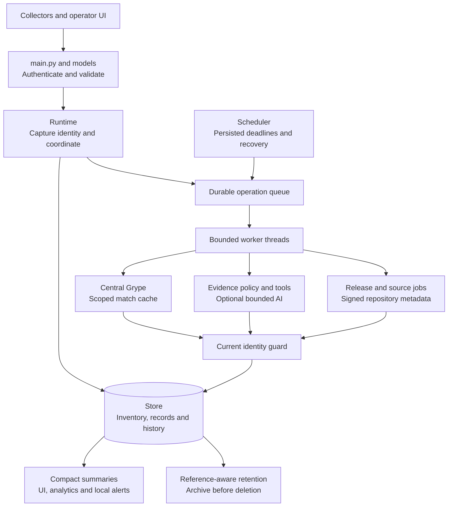
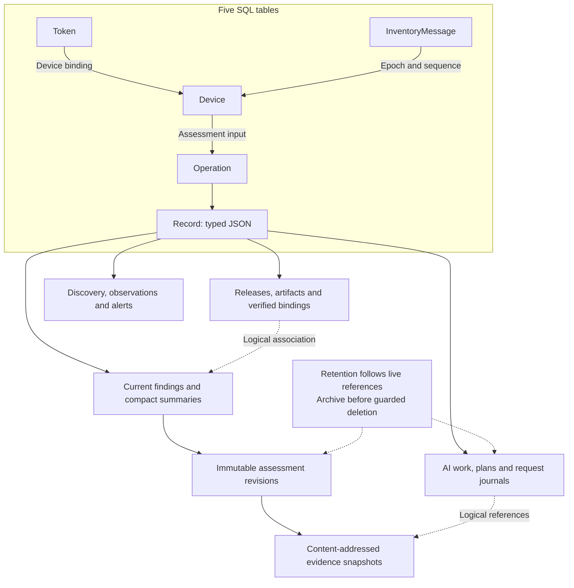
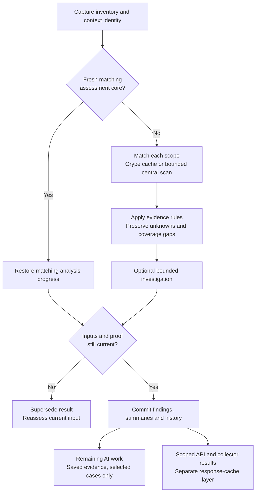
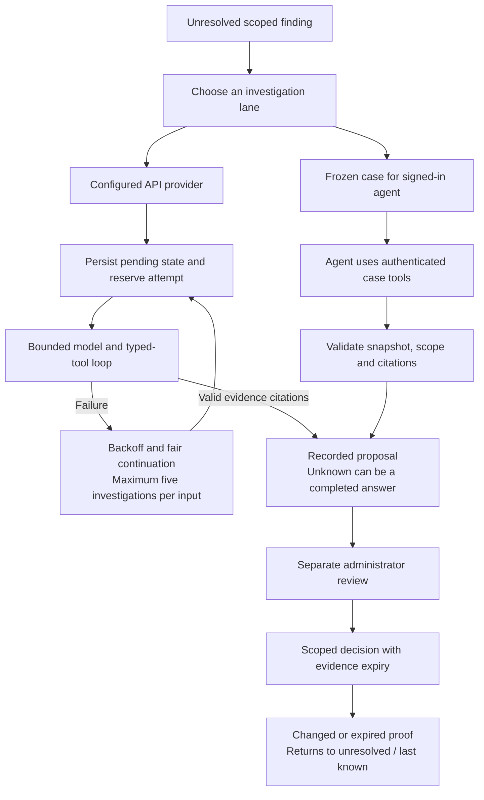
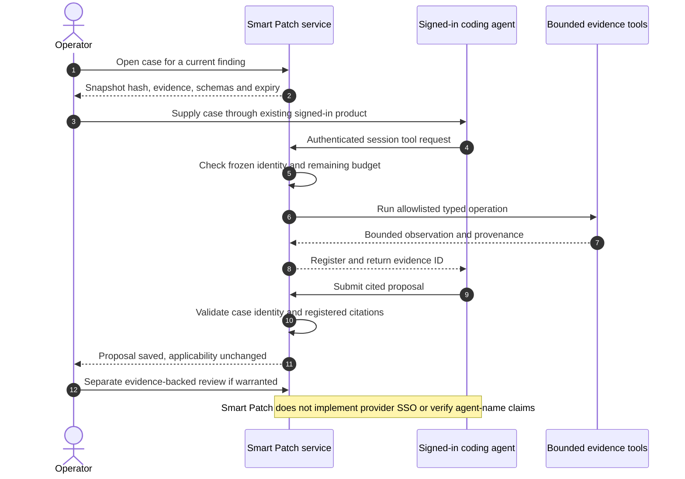
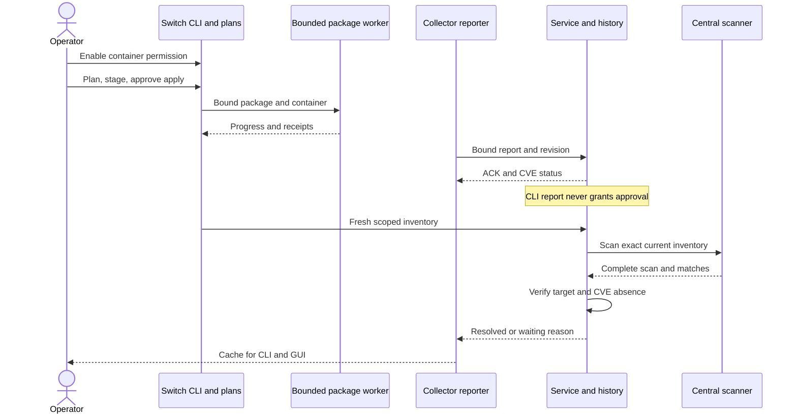
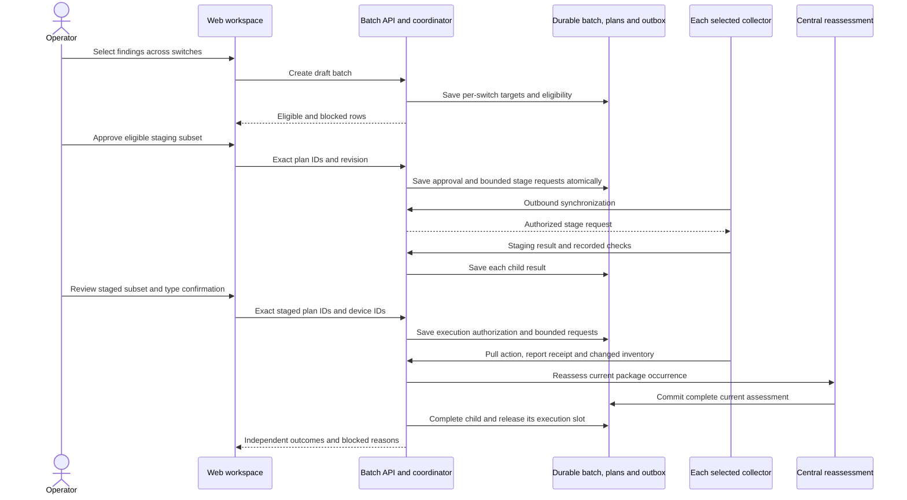

# SONiC Smart Patch Intelligence Service Design

This document describes the implemented intelligence-service enhancements: central matching, durable inventory and analysis state, evidence-bound decisions, release provenance, operator workflows and their limits. It is independently readable; see the [overall design](DETAILED_DESIGN.md) for cross-system interactions and the [community SONiC design](COMMUNITY_SONIC_DESIGN.md) for collector, native CLI/ConfigDB, build hooks and local actuator details.

**Edition:** Smart Patch 3.0 · 1 October 2026. The service is a working-tree enhancement of prototype commit `74a531c`, not a claim of an upstream merge or production qualification. Repository links are relative. Deployment addresses and checkout locations are intentionally unspecified; use your service host, configured `STATE_DIR` and approved source directories. Operational instructions are in the [user guide](USER_GUIDE.md) and [deployment guide](DEPLOYMENT.md).

## Contents

1. [Purpose and changes](#1-purpose-and-changes)
2. [Runtime and active modules](#2-runtime-and-active-modules)
3. [Inventory ingestion and durable state](#3-inventory-ingestion-and-durable-state)
4. [Evidence, matching and cache layers](#4-evidence-matching-and-cache-layers)
5. [Provider and external-agent investigation](#5-provider-and-external-agent-investigation)
6. [Release, source and signed baseline workflows](#6-release-source-and-signed-baseline-workflows)
7. [Maintenance boundaries and future qualification](#7-maintenance-boundaries-and-future-qualification)
8. [Scheduling, history and retention](#8-scheduling-history-and-retention)
9. [Authentication, UI and observability](#9-authentication-ui-and-observability)
10. [Validation and remaining gates](#10-validation-and-remaining-gates)

## 1 Purpose and changes

Grype OOM was reported on a switch with 8 GB RAM. Package differences reduce matching input, but running Grype locally still requires its advisory database and scanner working set. The service therefore owns heavyweight matching and optional AI. Community SONiC retains lightweight scoped collection, reliable outbound synchronization, local status and final action policy.

The service receives host/container package metadata, builds or loads scoped SBOMs, matches centrally, then combines advisory, source, artifact and runtime evidence. It distinguishes a scanner candidate from a confirmed applicability decision. Unknown evidence remains unknown; a high severity score or successful job does not authorize a package change.

| Prototype behavior at `74a531c` | Implemented change | Why it matters |
| --- | --- | --- |
| Bearer header parsing with a verification TODO. | Hashed tokens, revocation, operator/admin authorization and device-bound agent synchronization. | A header or caller-provided device/trust claim cannot establish authority. |
| In-memory cache keyed by sorted CVE IDs. | Separate scoped match, assessment and response caches with evidence/identity expiry. | Equal CVE names on different builds/scopes do not imply equal safe verdicts. |
| CVSS-derived actions and fixed confidence/downtime/duration values. | Deterministic evidence rules, separate applicability/exposure, explicit null unknown estimates and reviewed exemptions. | Severity alone cannot establish a fix or automatic-healing eligibility. |
| Simulated AI responses. | Bounded provider adapters plus a distinct external signed-in-agent case workflow. | Unconfigured AI produces no simulated model result. |
| Placeholder scheduled sync/health/retry job bodies. | Durable operations, persisted deadlines, recovery and fair saved-evidence continuation. | Restarts do not reset daily/six-hour schedules or per-case attempt budgets. |
| Separate prototype dashboard/persistence paths. | One active Runtime/Store with shared versioned APIs, evidence history and operational UI. | UI and API callers observe the same current state and provenance checks. |

The active entry point is [app/main.py](../app/main.py), using [Runtime](../app/runtime.py) and [Store](../app/db/store.py). Legacy `app/jobs/scheduler.py`, `app/services/cache.py` and old DB modules remaining in the repository are not the active scheduler/cache/persistence path described here.

## 2 Runtime and active modules

The implemented deployment uses one FastAPI/Uvicorn process, SQLAlchemy with default SQLite WAL storage, 1–4 background worker threads (default one), and one scheduler thread. A venv/TLS deployment and an optional non-root Docker image package the same application. Process-local locks coordinate work; this is not a distributed broker or a qualified multi-process HA design. Run one service process per state directory.

[SVG fallback](design/diagrams/04-service-internals.svg) · [Editable source](design/diagrams/04-service-internals.mmd)

| Active module | Responsibility and boundary |
| --- | --- |
| [main.py](../app/main.py), [api/models.py](../app/api/models.py) | HTTP schemas, request bounds, roles, sync/result delivery and explicit operator actions. Input claims do not establish artifact trust. |
| [runtime.py](../app/runtime.py) | Configuration, secrets, Store/pipeline construction, job dispatch, periodic work, identity guards and summaries. |
| [db/store.py](../app/db/store.py) | Inventory reconstruction/ACK transactions, credentials, durable operations, current findings and compact summary projections. |
| [sbom_parser.py](../app/services/sbom_parser.py), [json_source.py](../app/services/json_source.py) | Offline schema validation, scope containment, raw-byte hashes and original JSON error locations. |
| [baseline.py](../app/services/baseline.py), [provenance.py](../app/services/provenance.py) | Trusted baseline pedigree and approved-key verification of exact manifest/SBOM/image associations. No runtime attestation. |
| [scanner.py](../app/services/scanner.py), [process.py](../app/services/process.py) | Central Grype, scoped match cache and bounded subprocess output/time. |
| [pipeline.py](../app/services/pipeline.py), [assessment.py](../app/services/assessment.py), [applicability_context.py](../app/services/applicability_context.py) | Coverage checks, candidate merge, deterministic decisions and relevant fact projection. |
| [analysis_lifecycle.py](../app/services/analysis_lifecycle.py) | Durable per-CVE state, fair continuation and accepted-identity work reuse. |
| [ai_client.py](../app/services/ai_client.py), [source_tools.py](../app/services/source_tools.py), [external_agent.py](../app/services/external_agent.py) | Provider tool loop, typed evidence reads, or an operator-frozen external-agent case. Proposals remain separate from reviews. |
| [release_service.py](../app/services/release_service.py), [release_history.py](../app/services/release_history.py), [package_metadata.py](../app/services/package_metadata.py) | Release jobs, package projections and atomic current/history commits with scan/assessment revisions. |
| [repository_catalog.py](../app/services/repository_catalog.py), [github_sync.py](../app/services/github_sync.py) | Configured signed APT metadata and pinned source preparation. Available versions are not proven compatible updates. |
| [request_assessment.py](../app/services/request_assessment.py), [request_lifecycle.py](../app/services/request_lifecycle.py) | Registered-evidence batch lookup, scoped response caching and asynchronous request reconciliation. |
| [maintenance_policy.py](../app/services/maintenance_policy.py), [maintenance_jobs.py](../app/services/maintenance_jobs.py) | Target selection and central candidate-metadata recheck. No custom package compilation or staging-VM testing. |
| [analytics.py](../app/analytics.py), [observability/state.py](../app/observability/state.py), [retention.py](../app/services/retention.py) | Actual trends, bounded measurement windows, local alerts and archive-before-delete retention. |
| [ui/routes.py](../app/ui/routes.py), [ui/static/js/app.js](../app/ui/static/js/app.js) | Local application shell, authenticated data views, evidence inspection and explicitly gated actions. |

## 3 Inventory ingestion and durable state

### Three different inventory concepts

| Concept | Meaning | What it does not prove |
| --- | --- | --- |
| Runtime delta baseline | Last server-acknowledged component set used for checkpoint/delta reporting. | That the components came from an approved SONiC build. |
| Current reported inventory | Collector-observed host/container package metadata and scoped collection quality. | Complete firmware/filesystem coverage or that a compromised switch is truthful. |
| Signed build baseline | Original release SBOM, embedded manifest and external artifact index associated by an approved signature. | Which bytes are currently executing or whether runtime conditions expose a CVE. |

The service reconstructs the runtime inventory and checks its full digest. `baseline_digest` is reported but is not independently enforced as a separate wire-baseline check; sequence plus the reconstructed digest provide the implemented consistency guard. Trusted build metadata is applied separately by `bound_inventory`/`baseline.py`. A Debian-looking package name/PURL is not sufficient to prove stock-package lineage.

### Checkpoint, delta and heartbeat flow

1. `/api/v1/agents/sync` validates the bounded `SyncEnvelope` and authenticates the device-bound agent or authorized administrator.
2. `Store.sync` checks epoch/sequence and previously committed envelope digest. An identical replay returns the committed acknowledgement; conflicting content at the same sequence is rejected. Gaps/unknown epochs request resynchronization, and retired epochs cannot replay stale checkpoints.
3. In one transaction, reconstruct checkpoint or delta upserts/removals, verify the resulting inventory hash, and persist device state, the inventory-message tombstone, pending-scan marker and actual package-change event.
4. After commit, match reported build/manifest data to the server's trusted binding registry. Client `artifact_verified` is only a recorded claim. Both the raw manifest digest and parsed signed manifest content must match before the service associates the device with a verified baseline.
5. Changed inventory or relevant facts queue central work. Enqueue is after the inventory transaction; a crash in that gap leaves a durable pending marker recovered by the scheduler.
6. The response returns ACK/service time, bounded findings and typed evidence/action requests. Heavy work is asynchronous. An ACK means inventory accepted, not scanning or remediation completed.

Relevant heartbeat facts and manifest changes invalidate stale summaries; liveness/resource updates and operational receipts do not automatically become vulnerability evidence. Unknown/inaccessible scopes must preserve uncertainty. The service-to-switch path is a response to an outbound poll, not a central SSH connection.

### Store and identity hierarchy

[SVG fallback](design/diagrams/09-data-and-history.svg) · [Editable source](design/diagrams/09-data-and-history.mmd)

The five tables are `smart-patch_devices`, `smart-patch_inventory_messages`, `smart-patch_tokens`, `smart-patch_operations` and `smart-patch_records`. Record-family arrows above are logical JSON references, not additional SQL foreign-key constraints. Generic records use `(kind, id)` plus owner/timestamps; finding summaries support SQL counts/filtering without loading every evidence body.

| Entity | Key or important identity |
| --- | --- |
| Device and accepted message | Stable device ID; unique message `(device_id, epoch, sequence)` with committed envelope digest. Replay tombstones are retained. |
| Operation | UUID, type, durable status/result/logs; dedup keys share active queued/in-progress work. |
| Artifact | Canonical document hash plus separate `source_sha256` of original bytes. Formatting changes can preserve canonical identity but invalidate an old signed-byte binding. |
| Build binding | Build ID, verified manifest, signed index revision, image/SBOM/manifest digests, key and verification/revocation status. |
| Device finding | `H(device_id, component_id, scope, cve_id)`, plus current inventory/build/context/binding/review and assessment metadata. |
| Release finding | `H(release_id, artifact_id, scope, component_id, cve_id)`; separate `scan_revision` and `assessment_revision`. |
| History and evidence | Immutable device/release assessment revisions reference content-addressed evidence snapshots. Stable finding identity does not make an old decision current. |
| Analysis and requests | Separate lifecycle/work/backlog records; per-request UUID, canonical input fingerprint, selected operations and immutable terminal outcome. |
| Operational records | Reviews, plans, action/evidence requests, scheduler cadence, observations, discovery ledger and alerts. |

`H` means SHA-256 over the application's canonical JSON. `inventory_hash` sorts components by ID first. Original-file byte hashes are distinct from those object hashes. Assessment commits compare captured identity under lock/transaction; stale results are superseded rather than written over the latest inventory. Subset AI commits update only selected cases/history and preserve actual scan timestamps.

Source/tests: [Store.sync/store_findings](../app/db/store.py), [control-plane invariants](../tests/unit/test_control_plane_invariants.py), [baseline binding](../tests/unit/test_baseline_binding.py), [release history](../tests/unit/test_release_history.py).

## 4 Evidence, matching and cache layers

The pipeline constructs one CycloneDX input per host/container distro scope and runs central Grype. Scanner artifacts must map uniquely to declared components. Original `matches` and `ignoredMatches` are retained as scoped scanner evidence; duplicate advisory matches for the same occurrence/CVE merge without losing evidence references. Failed collection or incomplete scope metadata cannot become complete coverage merely because Grype exits successfully.

| Dimension | States | Interpretation |
| --- | --- | --- |
| Applicability | `affected`, `fixed`, `not_affected`, `under_investigation` | Whether evidence establishes the installed occurrence's relationship to the CVE. |
| Exposure | `reachable`, `constrained`, `unknown` | Separate scoped runtime evidence with its own freshness. |
| Processing | `pending_analysis`, `analyzing`, `analyzed`, `retry_needed` | Work state and success/attempt metadata. A successful unknown answer can be completed processing. |

The administrator setting `build_evidence_policy` defaults to `required`: an exact distribution advisory match becomes affected only with a verified build association, no known custom/patch-bearing package and no Debian cross-release lineage, or a matching accepted review supplies the conclusion. Optional mode (`optional`) removes only the verified-build prerequisite for such exact inventory matches. These results remain `artifact_binding=unverified` and record `decision_basis=inventory_advisory_match` and the policy used. Known custom/patch-bearing and cross-release candidates remain under investigation. This is a reported-package-metadata assessment, not signature verification or proof of installed binary contents.

Runtime exposure still requires matching scope/component/inventory, status, time and TTL. Fixed/not-affected exemptions require reviewed or verified supporting evidence; a model proposal does not directly create them. Confidence/downtime remain unknown where no validated estimate exists. Inventory-only affected results use `action_type=defer` and `remediation_eligible=false`; a scoped accepted operator review is required before maintenance approval.

The **Settings & providers → Build evidence for applicability** selector updates this central policy. Switching policy marks existing assessments stale and schedules reassessment when workers are enabled. Operators can queue fresh device scans explicitly; current views remain under investigation until reassessed, while history retains the original policy. The UI labels inventory-only affected rows and shows assessment basis separately from build provenance. The optional-policy source change is pending deployment; previously recorded live validation and screenshots predate it.

The recorded `lldpd` / `CVE-2023-41910` example illustrates why source lineage matters: version `1.0.16-1+deb12u1` carries a Debian backport lineage while a Debian 13 scope can produce a different advisory threshold. Source recipe, version ordering, patch semantics, installed-artifact identity and runtime reachability remain separate questions. This example does not establish that any DUT is fixed or vulnerable.

[SVG fallback](design/diagrams/05-analysis-and-cache.svg) · [Editable source](design/diagrams/05-analysis-and-cache.mmd)

| Reuse layer | Required identity/freshness | Avoided work and bound |
| --- | --- | --- |
| Grype match baseline | Scope/distro/image context, exact package/SBOM metadata, scanner version, advisory identity and effective configuration digest; checked before and after matching/reuse. | Eligible Debian scopes match only changed/new packages, retaining validated positive and zero-match results for unchanged packages. Safe unsupported inputs retain exact whole-scope reuse. Default 256 entries/256 MiB, bounded lock stripes, atomic replacement and pruning. Missing/inconsistent coverage or changing database identity cannot be reused. |
| Runtime assessment cache | Inventory/build/baseline/manifest/artifact trust, facts, source, ruleset/reviews, scanner version/database identity/effective configuration and applicable provider inputs. | Repeated whole assessment with a maximum 24-hour TTL, further capped by proof/fact validity. Explicit investigation bypasses normal reuse. |
| Batch response cache | Canonical package/version/CVE/scope/component query, principal/role/device, release/artifact/binding, current security/source/policy/advisory/provider identity. | Exact repeated lookup/projection work. Singleflight shares work, but every request gets its own ID/audit. Final guards apply to hits. |
| Saved per-CVE work | Exact analysis/occurrence/version and original scanner evidence. | Continues remaining cases or reuses completed processing without rerunning Grype. It is not a context-free cross-device safety cache. |

`Runtime._job_scan` captures current inventory and full analysis context before work, then rechecks generation, provider/source/review identity and current scanner revision before `Store.store_findings`. Changed identity rejects the result. A cache hit reconciles completed per-CVE progress so an old cached pending tail cannot overwrite finished work. Binding revocation, advisory changes, reviewed-policy changes and expiry can invalidate reuse; TTL is never permission to ignore them.

Format-2 baselines need one initial complete scan. Package-level reuse is limited
to supported Debian matching and records exact fingerprints and verified coverage
for every component, even when no CVE matched. New/changed packages are matched in
one batch per scope; removed packages' findings/evidence are excluded. Scanner,
database or effective configuration changes invalidate the baseline. Matching
counts distinguish current covered components from packages checked now and
results reused; evidence/policy assessment still uses current context.

Post-install reports wait for the exact target inventory before creating scan
demand. CLI and service-origin execution records retain separate authorization
semantics and current complete-scan closure requirements. Durable dispatch records
coalesce replays/restarts; queued ordinary scans can adopt the latest device input,
while running jobs keep their existing acceptance guard. Progress is emitted at
scope/phase boundaries and throttled during findings processing, exposing a
weighted workflow percentage, matching/reuse counts and explicit persistence work.

`POST /api/v1/assess-vulnerabilities` accepts 1–1000 queries and answers from registered current findings or a verified exact artifact catalog. Ambiguous, stale and release-label-only inputs remain unknown. Duplicate queries retain requested output ordering while sharing canonical work. Optional `request_ai` queues targeted work; HTTP lookup completion is not model completion. Requests reconcile referenced jobs without rewriting terminal history.

Source/tests: [pipeline](../app/services/pipeline.py), [assessment rules](../app/services/assessment.py), [scanner cache](../tests/unit/test_scanner_cache.py), [decision expiry](../tests/unit/test_decision_expiry.py), [request assessment](../tests/unit/test_request_assessment.py), [Debian lineage](../tests/unit/test_debian_lineage.py).

## 5 Provider and external-agent investigation

[SVG fallback](design/diagrams/06-ai-evidence.svg) · [Editable source](design/diagrams/06-ai-evidence.mmd)

### Configured provider lane

The optional API-provider lane supports an OpenAI-compatible HTTP tool loop or Anthropic Messages. It requires an enabled/configured provider and valid model; no credentials/configuration means no simulated response. Defaults are ten CVEs per batch, four model requests per investigation, six tool calls, 24,000 cumulative input characters, 1,200 output tokens per request and a 30-second investigation budget. Zero call/batch budget pauses provider work. Five consecutive failures open a 300-second client breaker; breaker counters are process-local, while per-CVE attempts are durable.

The model receives compact evidence summaries and schemas for typed operations. It can request pinned source snippets/patches/ancestry, stored advisory/component/build/runtime evidence, Debian version comparison or named scoped observations. It cannot issue arbitrary shell commands. Source tools enforce approved roots, full commit IDs, bounded paths/files/output; advisory/source/tool text is untrusted data. Responses must match CVE/component/scope and cite known evidence IDs. Truncation, failures and unsupported citations cannot become a safe verdict.

The lifecycle persists initial pending states before provider I/O and reserves attempts before each investigation. A valid response records analyzed success; transient failure records retry-needed/backoff. Least-attempted cases progress before repeatedly failing cases, with a maximum of five investigations per exact input. Successful unknown answers complete instead of looping forever. Backlog scheduling is bounded and uses saved scanner evidence, not another Grype pass.

Work is seeded only from an accepted current assessment revision under a captured identity guard. This closes the commit-to-seed race and excludes old rows retained after partial scans. Restart recovery preserves attempts; obsolete provider/source/review/advisory/ruleset inputs are superseded. Selected-case commits avoid full-fleet evidence hydration and quadratic history writes. `analysis_lifecycle`, `analysis_work` and `analysis_backlog` represent audit, saved evidence/progress and target dispatch respectively; none independently grants a vulnerability verdict.

### Already signed-in external agent lane

[SVG fallback](design/diagrams/10-external-agent-sequence.svg) · [Editable source](design/diagrams/10-external-agent-sequence.mmd)

This lane is operator-led and independent of an API-provider key. Smart Patch does not embed enterprise SSO, obtain a hosted-provider credential from a coding-agent login, or automatically invoke the signed-in product.

1. `POST /api/v1/findings/{id}/agent-session` freezes a current evidence-backed case with snapshot hash, identity, tool schemas and a 20-minute expiry.
2. The operator supplies the bundle through the existing signed-in coding agent. Initial context is bounded to 16,000 characters, full bundle to 32,000, with compact starting evidence.
3. Authenticated `/agent-sessions/{id}/tools/{name}` calls recheck owner/role, scope/source/snapshot and budget. Defaults permit 12 tool calls, 48,000 evidence-response characters and four runtime requests. A session-specific official-advisory fetch is restricted to the selected CVE and approved HTTPS source.
4. Submission validates exact identity and registered citations, saves the proposal and closes the session. Generic console output is not automatically session evidence. Source labels/agent names are self-reported, explicitly not provider-verified identity.
5. Applicability remains unchanged until a separate authorized review adopts evidence. Stale sessions/results are rejected or projected as historical; archived explanation is not current proof.

Administrator reviews bind device/inventory/build/context, component/scope/version and cited evidence. Fixed/not-affected require an HTTPS supporting reference; not-affected also requires an OpenVEX justification. Review records expire after 30 days, while effective decision validity is shortened by earlier runtime-evidence deadlines. A review reference is an administrator attestation, not automatic verification of patch semantics.

Source/tests: [analysis lifecycle](../app/services/analysis_lifecycle.py), [provider client](../app/services/ai_client.py), [source tools](../app/services/source_tools.py), [external-agent API](../app/services/external_agent.py), [lifecycle regressions](../tests/unit/test_analysis_lifecycle_backlog.py), [external-agent tests](../tests/unit/test_external_agent.py).

## 6 Release, source and signed baseline workflows

Release registration stores source URL/revision, primary flag, SBOM source/artifact and explicit repositories. Source preparation and SBOM ingestion are separate jobs. The pinned Git helper uses HTTPS, public-address validation, disabled inherited credentials/hooks and no-checkout cloning; evidence tools read immutable Git objects. The repository is not the SBOM, and source retrieval does not prove a running image was built from it.

SBOM upload validates bundled CycloneDX 1.4–1.6/SPDX 2.3 schemas and preserves original byte hashes; SPDX 2.2 uses a narrower inventory profile. Nested scope containment is retained. Errors identify JSON paths and original source line/column when raw JSON exists; dictionary-only validation cannot invent source positions.

`release_sync` parses scopes, reads configured signature/checksum-verified APT metadata, centrally matches and commits current package/finding projections plus immutable history. Package type/source repository come only from supported explicit metadata; unknown fields carry reasons. Installed/source versions, candidate advisory fixes, available repository versions and evidence-backed `cves_fixed` are separate data. Repository availability does not prove compatibility.

Release commit guards cover artifact/SBOM source, source revision, repositories, prior assessment revision and Runtime advisory/analysis state. A full scan advances `scan_revision`; subset AI work advances `assessment_revision` without invalidating untouched current scan rows. Complete disappearance means no longer reported, not fixed. Partial omissions remain historical/uncertain.

The builder emits a pre-seal manifest and, after final artifacts exist, an external index linking exact manifest, image and SBOM digests. Signing occurs outside this service. Verification accepts only approved public keys under `STATE_DIR/trusted-build-keys`, validates the signature over original index bytes, and checks the registered original SBOM digest. Different raw SBOM bytes invalidate old bindings; a build ID referring to another image is a collision. Matching collector build ID, raw manifest digest and parsed manifest content associates a reported baseline; the result remains `runtime_attestation=not_available`.

This verification consumes real build outputs. It does not itself build an installer, enforce a clean source tree, attest running bytes, or replace CI source/material provenance.

Source/tests: [release service](../app/services/release_service.py), [release history](../app/services/release_history.py), [metadata](../app/services/package_metadata.py), [signed repository catalog](../app/services/repository_catalog.py), [provenance API tests](../tests/integration/test_provenance_api.py), [release history tests](../tests/unit/test_release_history.py), [SBOM error locations](../tests/unit/test_sbom_source_locations.py).

## 7 Maintenance boundaries and future qualification

A service plan selects one device/package/installed-version/scope and captures current inventory/build/binding/review/policy identity with a 24-hour expiry. Target candidates follow Debian binary/source ordering and available evidence. Creating or analyzing a proposal does not approve a plan. Inventory-only affected findings from optional build-evidence mode require a current scoped operator review before approval; selecting optional mode does not bypass maintenance safeguards.

| Phase implemented today | What happens | What it does not establish |
| --- | --- | --- |
| Central target recheck | Replace candidate version/source metadata in a scoped SBOM and run bounded central Grype matching; require current complete matcher evidence for the selected CVEs/aliases. | No custom patch is applied or compiled. No candidate package is installed, booted or exercised in a staging VM. |
| Review approval | Administrator approves the current plan; target recheck/change clears prior approval. | Approval alone does not permit immediate execution. |
| On-target stage | Collector resolves/downloads the target through APT. `maintenance_checks_enabled` controls local currentness, free-space, dependency-policy, hash and rollback-availability gates; it defaults to false. Native commands use separate bounded maintenance services. | This is preparation on the target, not an isolated staging-VM test or independent `.deb` signature verification. A staged plan can lack recovery artifacts when checks are disabled. |
| Explicit execution | Requires current approved, successfully staged, execution-eligible state and exact device confirmation. Collector mode and exact authorized target remain enforced; optional current-state and pre/post health gates follow the switch setting. | Successful execution receipt alone does not establish healthy operation or a fixed CVE; skipped health checks are recorded as skipped. |
| Recovery and reassessment | Installation failure, or an enabled post-health failure, attempts rollback only when all recovery artifacts were retained. Missing recovery packages set `rollback_available=false`; no partial automatic rollback is attempted. New inventory/central assessment determines vulnerability status. | An attempted rollback is not proof of recovery. With checks enabled, an unhealthy pre-install baseline denies installation without needing rollback. |

Action requests return through outbound sync. Current stage request IDs/phases and one-time result consumption prevent late/replayed stage acknowledgements from re-enabling an executing plan. Protected core packages and unsupported container environments generate manual maintenance runbooks. Ordinary package updates in supported containers are eligible only with explicit switch maintenance mode and the captured container identity described below. Generic plans do not activate SONiC images, reboot, or restart routing as an automatic core-update workflow.

The service sends the approved plan rather than relaying a `.deb`. The collector downloads the exact target and available recovery packages from configured APT repositories, with exact previous Debian versions recoverable through the isolated snapshot fallback during staging. DNS resolves repository names; HTTP(S) transfers the archives. Installation uses the per-plan staged archive cache with `--no-download`.

A successful execution receipt enters `pending_reassessment`. Completion additionally requires fresh inventory showing the exact target for the selected component and scope, and an accepted complete central scan bound to that inventory and security context that no longer matches the selected CVEs for that occurrence. Reconciliation handles either receipt/scan arrival order and records the observed version, inventory and assessment proof. Incomplete, stale, failed or still-matching assessments leave an explicit waiting reason. A completed plan preserves its original receipts and skipped health checks; it does not change other scopes or publish a blanket fixed verdict.

Maintenance policy belongs to the switch's ConfigDB and CLI, not the service webpage. `config security setting maintenance_checks_enabled false` is the default; `true` enables all local preflight and health gates. The toggle does not remove service-side plan binding/review, authentication, mode, exact device/package/target authorization, explicit phase approval or the supported-scope and container-identity boundaries. Actual APT simulation/download/install must still succeed. `config security setting maintenance_min_free_mib 500` sets the free-space threshold enforced when checks are enabled; allowed values are 1–65536 MiB. `config security setting maintenance_cpu_quota_percent 0` disables the maintenance CPU quota by default; 1–100 sets a percentage of one CPU. On native systemd, each command runs separately from the 128 MiB/10% CPU collector with its own 512 MiB memory limit, 128-task limit and deadline, regardless of the check toggle. Changing policy does not approve or retry an action.

With checks enabled, whole-switch pre/post health thresholds remain CPU≤80%, memory≤90% and disk≤85% by default. Passing 500 MiB free does not establish acceptable disk utilization. With checks disabled, these observations are skipped and unavailable exact rollback packages are permitted and reported; failed installation can require manual recovery. Results must preserve this reduced validation instead of displaying a health pass or implying rollback protection. These are implementation settings, not a claim that the latest package has passed deployment acceptance.

**Future capabilities—not implemented:** automatic custom-patch editing, a controlled package/image build-worker service, isolated staging-VM provisioning and qualification, and artifact promotion based on those results. No current service job implements that end-to-end build/test/promote pipeline. A future design would need pinned source/material inputs, isolated builds, signed outputs, representative staging images, functional/security/regression and recovery evidence, and an explicit promotion decision. Those are proposed requirements, not capabilities established by target recheck or on-target staging.

Source/tests: [maintenance target worker](../app/services/maintenance_jobs.py), [target policy](../app/services/maintenance_policy.py), [plan/action API](../app/main.py), [staged-maintenance API tests](../tests/integration/test_staged_maintenance_api.py). Local staging/application details belong to the [community SONiC design](COMMUNITY_SONIC_DESIGN.md).

### Container eligibility and independently reported progress

Container package workers allow only the basic character devices needed for noninteractive package tools. Hardware device access and device creation remain denied. The Docker path verifies the original basic-device permissions and rejects additional cgroup security policies it cannot preserve; SONiC additive device rules do not grant those devices to the package worker.

The service accepts ordinary package maintenance in a supported running container only after a fresh authenticated report confirms `maintenance_mode=true`, the `container_package_update` capability and the selected container's full Docker ID, image ID and name. The report is limited to 128 container identities; the permission expires from eligibility when its freshness window elapses. The service cannot remotely enable maintenance mode. It binds `container_identity`, `component_id`, architecture and all selected CVEs into the reviewed plan and the batch authorization snapshot. Replacement or loss of permission blocks approval/queueing/delivery; PID changes from restarting the same container do not change its immutable identity.

The native worker establishes the package process's actual resource boundary. On unified cgroup v2, Docker starts an exec with the container's original security profile and a Python gate waits for verified attachment to the worker unit before executing the command. On cgroup v1, the pinned-namespace fallback requires an unconfined, non-remapped compatible container. Seccomp-filtered containers can use the cgroup v2 path when its prerequisites are present; unsupported setups fail closed. The worker does not recreate containers or disable security profiles. Protected kernel/routing/core packages remain manual. A permitted operation restarts only the selected container, and a writable-layer package change does not persist across recreation. Central completion also verifies that current container identity and inventory image digest still match the executed plan.

`POST /api/v1/agents/remediation` is a separate device-token endpoint for compact progress and maintenance metadata. Tokens must be bound to the exact enrolled device. The envelope carries its known inventory identity, epoch/build, maintenance flag, capabilities, container identities and at most 64 reports. Reports bind a local plan UUID to immutable package/scope/architecture, original inventory, selected findings/CVEs and a monotonically increasing revision. Same-revision retries are acknowledged; conflicting, older or identity-changing reports are rejected. Service-origin reports must match their existing approved plan and current action request; they can describe progress but never grant authorization, staging eligibility or completion.

CLI-origin reports use separate `local_remediation` records. The service retains original scoped findings or their immutable assessment history even when a later scan overwrites a stable finding ID. A reported installation starts `pending_reassessment`; closure requires an accepted complete scan after the server received that report, changed inventory with the exact target, current evidence/advisory identity and absence of the selected scoped CVEs. Partial, failed, stale or unverifiable evidence leaves a waiting reason. No phantom service-approved plan is created. A later rollback/failure invalidates current resolution while retaining its prior proof as history; a returning current match is `reopened`.

`GET /api/v1/remediation-status` is operator read-only. Filters are `device_id`, `cve_id`, `scope`, `status`, and stable `record_id`, with `limit`/`offset` pagination. Rows distinguish operation phase from applicability and central resolution, show CLI/service/inventory origin, and preserve progress/check/recovery evidence. Complete-scan disappearance without a verified remediation record is `no_longer_reported`, not `resolved`. The agent response includes only compact plan lifecycle rows, with revision, total and truncation indicators; the switch merges its existing findings cache for `no_plan` display. An idle device without plans does not repeat its full findings payload or load that projection. Detailed receipts and unplanned finding rows remain available through the operator API. A valid report updates connectivity time, not inventory-collection freshness or scan coverage. Operational metadata is excluded from applicability/cache identities.

[Rendered interaction diagram](design/diagrams/12-cli-remediation-status.svg) · [Editable Mermaid source](design/diagrams/12-cli-remediation-status.mmd)

Implementation: [status/report projection](../app/services/remediation_status.py), [maintenance capabilities](../app/services/maintenance_capability.py), [shared plan commands](../app/services/maintenance_commands.py), [scoped reassessment](../app/services/maintenance_reassessment.py). Synthetic [status/container API tests](../tests/integration/test_remediation_status_api.py) cover revision, authorization, rollback history and exact occurrence behavior; they are not hardware acceptance.

### Exact rollback archives and bounded SBOM upload

The switch owns archive staging. If normal APT sources lack an exact previous Debian package, its default-enabled snapshot fallback looks up that binary/version/architecture through the official snapshot API, uses the target scope's Debian release, and downloads through private signed APT repository configuration. Normal sources, host APT hooks and forward-version choice remain unchanged. Archive/suite/timestamp/checksum evidence is reported to the service. Unpublished vendor/custom versions, unavailable signatures or exhausted bounded candidates remain missing recovery artifacts; the service does not manufacture rollback eligibility.

SBOM file uploads accept 52,428,800 bytes (50 MiB), using `MAX_SBOM_UPLOAD_BYTES`. Only `/api/v1/sbom-upload` and `/admin/sbom-upload` receive a bounded 64 KiB multipart allowance. Other routes keep the default 16 MiB request budget. Content-Length, streaming body accounting and bounded file/parser reads all enforce the relevant limit; excess files return HTTP 413. The UI reads `/api/v1/upload-limits` and validates file size before upload. [Boundary tests](../tests/integration/test_sbom_upload_limits.py) include a real 50 MiB synthetic file and a one-byte-over-budget rejection.

### Multi-switch remediation coordinator

`Remediate selected switches` creates a durable `remediation_batch` record and
independent child plans. The service groups selected finding IDs by device,
package/version, scope and occurrence. Each switch can have a different exact
target. A draft keeps manual, no-fix, offline, stale and review-required entries
with reasons; it does not queue maintenance. The initial rollout supports one
eligible host or supported container package occurrence per switch, because installing it changes the
inventory identity bound to any other plan on that switch.

The API is rooted at `/api/v1/remediation-batches`. Create accepts `name`,
`finding_ids` (maximum 200), `max_concurrent_switches` (1–10, default 1),
`pause_on_failure` (default true) and an optional `idempotency_key`. At most 50
devices may be selected. GET list/detail are read-only. PATCH edits a draft,
including `target_versions` keyed by stable entry ID; refresh rebuilds draft
plans from current evidence and supersedes the old draft children. Every control
includes `expected_revision`; conflicts return 409 so a stale review cannot
authorize changed targets.

Existing target resolution allows at most 100 findings per package occurrence.
Advisory-supported eligible targets can be staged in a batch. Repository targets
requiring a central recheck remain blocked with an explicit prerequisite; that
recheck and subsequent remediation currently use the single-switch plan workflow.

`approve-and-stage` freezes the explicitly confirmed eligible child plan IDs.
`execute` separately requires successfully staged, current child plans and the
exact corresponding device IDs. It freezes their staging receipts and targets;
later staging successes cannot join that execution authorization. Both controls
and pause/resume/stop require administrator credentials. Operators can prepare
and edit drafts. The shared maintenance commands recheck approval, expiry,
current inventory/context, affected reviews and target policy before dispatch.
Batch-owned plans cannot bypass the coordinator through standalone action routes.

The coordinator advances at startup, during the periodic scheduler, and after
receipts and completed jobs. A transaction saves the child update, action request
and batch together under the process-wide Store lock. A request already queued
is considered dispatched, even before delivery; its ID survives restart and
collector retries. Device-busy checks cover both batch and standalone actions.
Execution slots remain occupied through `pending_reassessment`, and unknown
outcomes retain their reservation. Automatic retries of failed installations are
not performed. Pause/stop prevent new dispatch; they cannot cancel requests
already queued or interrupt APT. Resume continues unstarted authorized children.

Active batches retain their child plans, action requests and referenced evidence
through the retention graph. UI polling displays each receipt, skipped check and
rollback limitation without changing state. This uses the existing community
collector action protocol; it adds no new on-switch scanner or CLI. Run one API
process per state directory with background jobs enabled. Process-local locking
does not provide distributed coordination across multiple API replicas. A batch
is not an atomic fleet transaction and does not offer fleet-wide rollback.

Implementation: [batch coordinator](../app/services/remediation_batches.py),
[shared plan commands](../app/services/maintenance_commands.py),
[synthetic protocol acceptance](../tests/integration/test_remediation_batches_acceptance.py).
Those tests simulate multiple collectors and complete/partial scans; they do not
install packages on real switches or qualify fleet behavior under hardware load.

The progress reporter has its own ConfigDB connection in its own thread. It reads a small root-only identity record published after an acknowledged inventory exchange and writes a separate progress cache. It does not repeatedly parse, fingerprint or lock the complete inventory; idle reporting also avoids duplicate unplanned-finding payloads. Enrollment/build/epoch changes invalidate the identity record until a fresh acknowledgement.

## 8 Scheduling, history and retention

Operations are claimed oldest-first, with durable progress/result/error and bounded logs. Startup requeues interrupted in-progress jobs. If a ruleset changes, current inventories are marked pending. `jobs_enabled=false` recovers operation records but starts no workers/scheduler, supporting isolated fixtures. SQLite/process locks are local coordination, not a claim of exactly-once external side effects or horizontal scaling.

| Work | Schedule and recovery behavior |
| --- | --- |
| Advisory refresh | Daily; unavailable DB requests repair. Successful refresh persists advisory generation and queues reassessment. |
| Release refresh | Daily for configured sources/artifacts; primary releases queue first among newly due releases. No preemption of running work. |
| Device scan | Configured interval, normally six hours. |
| Actual snapshots | Hourly; missed observations are not fabricated after downtime. |
| Retention | Daily bounded archival attempt. |
| Inventory recovery, AI continuation, request reconciliation and alerts | Checked on roughly ten-second ticks with their own state/budget guards. Slow ticks are not a hard real-time guarantee. |

Persisted cadence records keep due times, operation IDs and attempt/success/failure timestamps. Completion schedules the next regular deadline from actual completion time; failures retry after one minute across restarts. Existing successful scan/release/advisory timestamps seed migration. Imported-but-unscanned SBOMs do not count as successful analysis. Advisory generation is restored from durable status.

Current projections and immutable history serve different purposes. Device/release assessment revisions reference content-addressed evidence; current reads still enforce expiry and identity. The permanent discovery ledger counts each strict CVE once at its earliest retained fleet observation across devices/scopes, including unresolved candidates. Disappearance/reappearance does not create a new discovery. Release-catalog-only findings are excluded. Migration reads retained summary/history projections and explicitly marks older gaps partial.

Dashboard reads do not create history. Up to seven days returns recorded hourly observations; longer stock charts use the last actual observation per UTC day with observation counts and observed affected peaks. A 366-day view has at most 366 observed daily points; missing days remain missing. Discovery buckets are first-seen counts, not stock averages/publication dates. Package-update rankings count committed scoped version transitions and flag incomplete/truncated events.

Default 365-day retention archives cold records/terminal jobs before deletion. Each bounded call selects at most 1000 rows/16 MiB by default, writes private immutable gzip JSONL with record hashes and fsync, then rechecks references/content before transactional compare-and-delete. Changed or newly referenced rows remain. Live state, replay tombstones, credentials, current findings/required proof, applicable work budgets and discovery identities are protected. Cursors avoid starvation by protected prefixes. This requires database/archive capacity monitoring and restore qualification; it is not deletion of every expired row in one daily tick.

Source/tests: [persisted scheduler](../tests/unit/test_persisted_scheduler.py), [retention implementation](../app/services/retention.py), [retention tests](../tests/unit/test_retention_archive.py), [analytics observations](../tests/unit/test_analytics_observations.py), [discovery tests](../tests/unit/test_cve_discovery_analytics.py).

## 9 Authentication, UI and observability

Operational APIs enforce roles: agents synchronize/assess only their bound device; operators read operational evidence and request allowed scans/cases/plans; administrators manage credentials/settings/releases, reviewed decisions and maintenance authorization. Minimal `/health`, UI shell/static assets, root redirect and API-documentation surfaces are explicit public exceptions. `/metrics` and `/api/v1/readiness` are protected.

Tokens are high-entropy bearer values hashed in the database, with raw values exposed only at issuance. Revocation is checked on each request; last-used timestamp writes alone are coalesced. Bootstrap token and Fernet settings key are private files, mode 0600, under configured state. Provider keys saved through settings are encrypted and not returned. The UI stores the Smart Patch token in tab-scoped `sessionStorage`; it is distinct from provider credentials or the external agent's sign-in.

The normal launcher requires TLS certificate/key; plaintext is explicitly limited to loopback tests. Operators own certificate trust/rotation and server-state protection. The browser uses local same-origin assets, CSP and text-safe rendering without CDN dependencies. Build-signing private keys never enter the service; approved public-key paths have permission/symlink checks. A compromised switch holding its credential can still lie about observations: there is no hardware-backed runtime attestation.

The 14-view UI consumes `/api/v1` contracts for overview, devices, findings/evidence, operations/logs, releases, tools, plans, settings/tokens and analytics. Compact summaries support counts; UI findings paginate at 50, and evidence is loaded for selected details. Online heartbeat, inventory freshness, signed baseline association, applicability, exposure and processing are presented separately. **External agent review** has no invented SSO button; plan controls reflect recorded eligibility rather than optimistic success.

Observability retains at most 8192 samples per request/cache stream over five minutes. API p95/error rate, assessment cache hit/sample counts and durable queue depth are measured. Provider configured, health-known, actual last-request outcome/time and circuit-open state remain distinct; absent measurements are not fabricated healthy values. Alert thresholds create persisted local UI/API/audit events on transitions, not external paging.

Timing has three boundaries: assessment audit duration uses trusted server entry through audit preparation; middleware includes response construction through response-header readiness; HTTP benchmark client elapsed includes its own completed request. Neither internal timer is claimed as full client body/network delivery. Long-running request records separately reconcile asynchronous jobs into terminal outcomes.

Source/tests: [main API/metrics](../app/main.py), [observed windows](../app/observability/state.py), [UI CSP](../app/ui/routes.py), [workspace API](../tests/integration/test_workspace_api.py), [dashboard tests](../tests/unit/test_dashboard_observability.py), [browser smoke](../tests/browser/workspace_smoke.py).

## 10 Validation and remaining gates

These results apply to their recorded workloads/source snapshots. They do not establish production-wide capacity, broad vulnerability accuracy, a hosted-provider SLO, or newer-package DUT acceptance.

| Recorded validation | Result | Qualification boundary |
| --- | --- | --- |
| Local service suite | 425 passed, zero failures/errors/skips; 101.73 seconds with real-Grype corpus enabled. | Unit/integration coverage; [JUnit](../test-results/service-completion-junit.xml). Wheel/sdist builds also passed. |
| Browser | Mock and live read-only runs each checked 14 views with zero JS errors. | Mocked interaction paths use intercepted responses; live smoke does not submit external-agent/maintenance forms. |
| Provider adapters | Real HTTP against a local scripted fixture; additional direct response mocks. | Exercises tool-loop/format/budget/error logic, not hosted model inference. Fixture token counts are synthetic. |
| Operator-led external agent | Recorded LLDP proposal, seven service tool calls, eight citations; remained unpromoted under investigation. | Real session/evidence/submission path; agent attribution is not verified SSO identity, and provider usage is not measured. |
| Warm batch API | 30 sequential 100-CVE queries: p95 55.323 ms, 100% response-cache hits. | Synthetic registered findings; excludes fresh matching and provider inference. |
| Concurrent batch API | 1000 simultaneous requests succeeded with unique persisted IDs; SQLite integrity OK; wall 43.459 s, p95 41,943.487 ms. | The two-second latency target is not met for this warm burst. |
| Dashboard API | 12 samples/route: overview 220.493 ms p95; devices 203.196; findings page 111.785; 366-day analytics 533.654; operations 8.443; metrics 227.807. | Synthetic two-device/3616-candidate/annual-history fixture. Operations response was only 17 bytes; API timing is not browser-render timing. |
| Annual analytics | 257,511-byte response, p95 533.654 ms after daily aggregation. | Preserves observed values/gaps; not a year of real fleet history. |
| Official source clone | 35.038 s total; 34.976 s clone/pin; 0.020 s bounded source read. | One actual fresh official SONiC no-checkout clone and pinned Git-object read. Not a build or running-image proof. |
| Central release sample | 250 unique package names, 66 candidate findings/history rows, 238 available via actual signed Debian metadata; workflow 18.396 s, overall harness 21.969 s. | Reported-host subset, not full signed release SBOM. Grype 0.112.0/recorded DB; API-provider AI disabled. |
| Release sample memory | Parent peak 430.32 MiB; child peak 104.445 MiB. | Separate process maxima, not concurrent aggregate or switch collector memory. |
| Controlled live alert | Fired after 7.480 s, resolved after 10.171 s; thresholds restored. | Local controlled drill, not universal under-load delivery or external paging. |

Reports: [performance](../test-results/service-performance-acceptance-final.json), [source clone](../test-results/source-clone-acceptance/result.json), [release sample](../test-results/release-acceptance/result.json), [live UI](../test-results/ui-completion-live/result.json), [alert drill](../test-results/live-alert-acceptance.json), [external-agent proposal](../test-results/lldp-external-agent-analysis-current.json). Test-method boundaries are visible in [AIHTTPTests](../tests/unit/test_analysis_services.py) and the [mock/live browser branches](../tests/browser/workspace_smoke.py).

Remaining gates are explicit:

- Full SONiC installer build, signed final artifact export, boot and current runtime-baseline association. A successfully built native collector package does not establish these.
- Latest-package two-DUT/official SpyTest acceptance, real-switch resource behavior under workload and core activation/recovery. Earlier installed collectors do not qualify the latest package.
- Complete representative release SBOM/repository coverage and sync timing. The 250-name sample is not a complete release.
- Real configured API-provider quality, throughput, outage behavior and token/cost measurements; broad reviewed CVE truth data, false-suppression/recall/abstention metrics and calibration.
- Natural fleet cache behavior, sustained cold/concurrent capacity, larger-fleet UI latency, deployed completion-to-log timing and qualified HA/restore operations.
- Custom patch editing, build-worker execution, isolated staging-VM qualification and artifact promotion remain future work as described in section 7. Current target metadata rechecks and on-target artifact staging do not implement those capabilities.

The service's implemented contribution is centralized evidence and guarded durable work that complements the lightweight [community collector](COMMUNITY_SONIC_DESIGN.md). The [overall design](DETAILED_DESIGN.md) connects those boundaries; no single successful scan, model answer or staged package substitutes for the remaining evidence and deployment gates.
