# SONiC Smart Patch User Guide

Configure a SONiC switch, connect it to the intelligence service, investigate findings, and understand which actions are ready to run.

**Edition:** Smart Patch 3.0 hackathon build · 1 October 2026. Screenshots use India Standard Time. Commands and inputs use deployment placeholders defined below.

This guide describes the built collector and implemented service. Screenshots show the current UI with clearly labelled synthetic example data; they do not claim live scan results. Form examples remain unsubmitted. This edition uses the Smart Patch package and configuration names. Treat deployment validation separately from documentation examples. Installation and maintenance commands below are operator procedures, not records of successful execution.

Replace every angle-bracket placeholder with your actual value **before** using a command, URL, or JSON example. Retain shell quotes around substituted paths and arguments. Placeholder values are not valid deployment inputs.

## 1 Choose where to begin

| Placeholder | Replace with |
| --- | --- |
| `<server-ip>` | Management server address reachable from the browser and switches; the TLS certificate must cover it |
| `<sonic-vm-ip>` | Address of the SONiC VM or switch being enrolled; repeat the procedure separately for each device |
| `<path-to-intelligence-service>` | Absolute path to your intelligence-service checkout on the management server |
| `<path-to-sonic-buildimage>` | Absolute path to your sonic-buildimage checkout on the management server |
| `<expected-package-sha256>` | SHA-256 from the trusted build record for the exact collector package you will install |
| `<source-commit>` | Real full commit hash available in the approved source repository, normally 40 hexadecimal characters |
| `<release-id>` | Your registered release identifier, such as `custom:<release-name>` after replacing `<release-name>`; use the same identifier for registration, upload and sync |
| `<device-id>` | Exact Smart Patch enrollment ID returned by the switch; never substitute its IP address |
| `<device-label>` | A descriptive device name used only for the token's description |
| `<path-to-build-signing-key>` | Protected private-key path in the builder environment; never a browser upload |

Standard installed paths such as `/etc/sonic/smart-patch`, `/var/lib/sonic-smart-patch` and `/usr/share/keyrings`, port 8000, and public upstream URLs are intentional defaults or interfaces.

Screenshots use synthetic device/package names and may use `<sonic-build>` or `<digest>` for example identifiers. Use the actual values reported by your installation; do not invent build or inventory digests.

| Your situation | Start here |
| --- | --- |
| You want to inspect the existing deployment | Open the workspace, then follow the finding walkthrough in section 7. |
| You need to enroll a switch | Follow sections 3–5 in order. Keep advisory mode enabled initially. |
| You have only an enterprise coding-agent login | Use External agent review in section 8. No provider API key is needed for that workflow. |
| You are deploying a new management server | Follow section 2, then enroll each switch separately. |
| You need to plan a package change | Read section 11 after reviewing the finding and its evidence. |

**Existing deployment quick start**

1. Open `https://<server-ip>:8000/ui/` after replacing `<server-ip>` and trusting the deployment certificate.
2. Click **Connect securely** and supply your Smart Patch administrator or operator token.
3. Open **Switch fleet** and inspect an enrolled switch.
4. Open **Findings** and search `CVE-2023-41910` or `lldpd`.
5. Inspect the package, container scope, rationale and evidence. Use **External agent review** when you want your signed-in coding agent to investigate.

**What runs where**

| Location | Responsibility | Examples in this guide |
| --- | --- | --- |
| Management server | Grype, advisory database, source repositories, analysis workers, API and UI | Shell commands labelled **Server**; paths under `<path-to-intelligence-service>` |
| SONiC switch | Lightweight package inventory, package-change tracking, bounded runtime observations and policy-controlled actions | Commands labelled **Switch**; `config security`, `show security`, `security` |
| Browser | View evidence, configure the service, issue device credentials and review plans | Named fields and buttons |

The normal flow is **switch inventory → central matching → source/runtime evidence → applicability review → optional staged change → reassessment**. Grype and its vulnerability database stay on the management server.

## 2 Prepare or check the management server

### Existing deployment

**Server — read-only health check**

```bash
cd "<path-to-intelligence-service>"
curl --fail --show-error \
  --cacert .state/tls/service.crt \
  "https://<server-ip>:8000/health"
```

Expect `status: healthy` and `database: healthy`. This checks the API/database, not switch forwarding, scan completeness or AI availability. Use **Analysis jobs**, **Coverage & freshness**, and authenticated readiness for those details.

If the service is already running, do not start another copy against the same state directory. Check the listener and current log when troubleshooting:

```bash
ss -ltnp 'sport = :8000'
tail -n 100 .state/service.log
```

### Fresh deployment

Prerequisites are Linux amd64/arm64, Python 3.10 or newer, `python3-venv`, `curl`, `openssl`, `git`, `gpgv` and Debian `dpkg`. The service account needs a writable state directory and readable source repositories. The server must own the configured bind address and accept management traffic on TCP 8000.

**Server — fresh installation only**

```bash
cd "<path-to-intelligence-service>"
SMART_PATCH_BIND_HOST="<server-ip>" ./scripts/prepare-local.sh
./scripts/start-local.sh
```

Preparation installs dependencies and the pinned central scanner, and creates configuration/TLS files when absent. Existing `.env` and certificate files are preserved. For a fresh configuration, supply your actual management server address:

```bash
SMART_PATCH_BIND_HOST="<server-ip>" ./scripts/prepare-local.sh
```

Replace `<server-ip>` before running the command. Existing `.env` values are not rewritten by that override. `start-local.sh` runs in the foreground; it does not install an operating-system service or arrange startup after reboot. For persistent deployment, use the supervisor example in [DEPLOYMENT.md](DEPLOYMENT.md). Run one service process per state directory; start with one central worker.

### Trust the correct public certificate

| Deployment | Certificate to trust or copy to clients |
| --- | --- |
| Existing deployment with a self-signed server certificate | `.state/tls/service.crt` — verify that this is the deployed trust certificate |
| Fresh installation made by the current preparation script | `.state/tls/ca.crt` — a separate CA signs the server certificate |
| Organization-issued TLS | The approved issuing CA chain provided by your administrator |

Import the public trust certificate into your browser/OS trust store. Configure the switch with the same approved trust material. Copy public certificates only; `service.key` and `ca.key` remain private on the server. Inspect the address and expiry if trust fails:

```bash
openssl x509 -in .state/tls/service.crt -noout \
  -subject -issuer -dates -ext subjectAltName
```

The certificate must cover the IP or hostname used in the URL. Use certificate verification for normal operation; do not substitute `curl -k`. Certificate renewal is a deployment task, not something the helper automatically performs.

## 3 Connect to the web workspace

Open `https://<server-ip>:8000/ui/` after replacing `<server-ip>`, and click **Connect securely**. As the service account, open `.state/bootstrap-token` locally and copy its value into **Smart Patch service token**, then click **Connect to workspace**. If your deployment uses a supplied bootstrap credential instead, obtain it from its configured secret store.

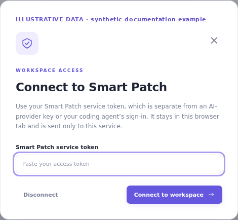

*Figure 1. Connection dialog from the current UI, with no credential entered.*

The header should show **Service connected**. These credentials have different purposes:

| Credential | Used for |
| --- | --- |
| Smart Patch administrator token | Settings, token issuance, release registration, reviewed verdicts and maintenance authorization |
| Smart Patch operator token | Operational reading, scans, evidence requests and investigations within permitted API actions |
| Smart Patch device token | One switch's authenticated synchronization; unsuitable for browser administration |
| Provider API key | Optional automatic API-provider analysis configured in Settings |
| Coding agent's existing sign-in | External agent review through an already signed-in Codex/other coding-agent session |

The UI retains its Smart Patch token in the current browser tab. **Connected → Disconnect** clears the tab credential; it does not revoke the token. Existing raw token values are never listed. Do not put tokens, switch passwords or private keys into screenshots or shared examples.

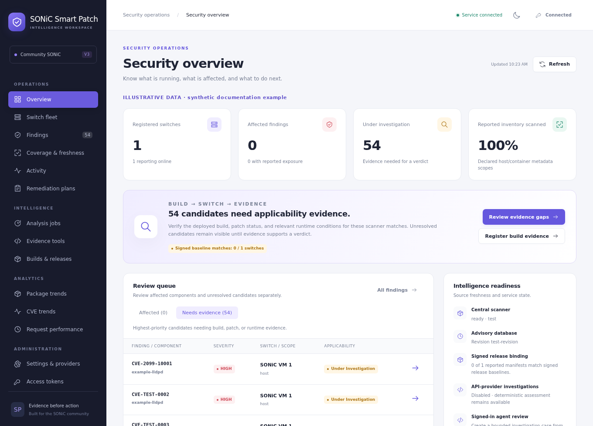

*Figure 2. Overview using synthetic example data in the current UI. Counts change as inventory and evidence change; zero affected findings with unresolved candidates does not mean the switches are vulnerability-free.*

## 4 Install and enroll each SONiC switch

Use a separate enrollment identity and agent token for each switch. The switch's Smart Patch device ID is not its hostname, management IP or `/etc/machine-id`.

### Transfer and identify the package

The package path is `<path-to-sonic-buildimage>/src/sonic-smart-patch_3.1.1-1_all.deb`. Different builds can share a version string. Obtain the trusted checksum for your exact build and compare it with the package before installation:

```text
<expected-package-sha256>
```

**Server — example transfer to the target SONiC VM or switch**

```bash
cd "<path-to-intelligence-service>"
scp "<path-to-sonic-buildimage>/src/sonic-smart-patch_3.1.1-1_all.deb" \
  "admin@<sonic-vm-ip>:/tmp/"
scp .state/tls/service.crt \
  "admin@<sonic-vm-ip>:/tmp/smart-patch-service-ca.pem"
ssh "admin@<sonic-vm-ip>"
```

Use your assigned SSH credentials when prompted. For a newly prepared service, transfer its `ca.crt` instead. Repeat the enrollment procedure with each device's `<sonic-vm-ip>`, generating or preserving its own identity and token.

**Switch — package installation**

```bash
cd /tmp
sha256sum sonic-smart-patch_3.1.1-1_all.deb
dpkg-deb -f sonic-smart-patch_3.1.1-1_all.deb Package Version Depends
```

Compare the output with your trusted `<expected-package-sha256>`. The package requires Python ≥3.9, Click, Requests and PyYAML. Resolve missing dependencies through the approved SONiC image/package workflow; do not assume a general APT upgrade is required.

For an upgrade of an already running Smart Patch, first verify that no package action is active, then stop **Smart Patch only** before replacing its files. Preserve its enrollment, configuration and action journals:

```bash
sudo systemctl stop sonic-smart-patch.service
```

Then install and place the public trust certificate:

```bash
sudo dpkg -i ./sonic-smart-patch_3.1.1-1_all.deb
sudo install -m 0644 /tmp/smart-patch-service-ca.pem \
  /etc/sonic/smart-patch/service-ca.pem
```

A fresh installation does not start the daemon automatically. Native command plugins and the YANG model are registered where the SONiC image supports them.

### Obtain the enrollment identity

**Switch — create or read the stable Smart Patch ID**

```bash
sudo /usr/bin/python3 -c \
  'from smart_patch.collector import enrollment_id; print(enrollment_id())'
```

This creates `/etc/sonic/smart-patch/device-id` only if absent and prints the stable ID. It performs no network request or inventory scan. Preserve this file across upgrades; copying it to a different switch creates an identity collision.

### Issue a device credential

**Browser → Access tokens**

| Field | What to enter |
| --- | --- |
| Description | For example `Smart Patch collector — <device-label>` |
| Role | **Device collector** |
| Device ID | Paste the exact ID printed on that switch |

Click **Create token**. Copy the newly shown value immediately; the plaintext is shown only once. Keep it for the hidden switch prompt in the next step.

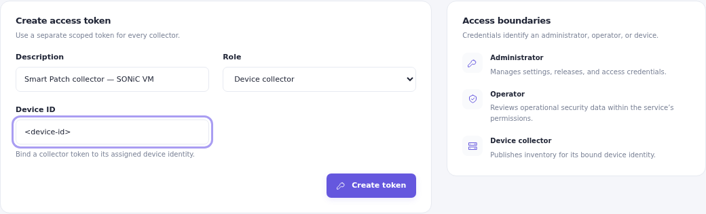

*Figure 3. Unsubmitted token form using synthetic example data in the current UI. Create token was not clicked; enter your switch's printed ID.*

### Configure and enable Smart Patch

**Switch — advisory enrollment**

```bash
sudo config security service-url "https://<server-ip>:8000"
sudo config security setting ca_bundle /etc/sonic/smart-patch/service-ca.pem
sudo config security auth-token
sudo config security smart-patch mode advisory
sudo config security smart-patch enable
sudo config save -y
```

Paste the device token at the hidden `auth-token` prompt. It is stored in `/etc/sonic/smart-patch/credentials.json` with mode 0600, not in ConfigDB. Alternatively, import an already protected file with `sudo config security auth-token --token-file /run/smart-patch-device-token`.

In the current package, native **smart-patch enable** enables and starts `sonic-smart-patch.service`. `config save -y` persists the running SONiC configuration, including other running configuration changes; use it when that complete running configuration is intended to survive reboot.

### Confirm the first exchange

```bash
systemctl is-active sonic-smart-patch.service
systemctl is-enabled sonic-smart-patch.service
show security status --json
show security inventory-drift
show security resource-usage
```

Expect the unit to be active, an acknowledged synchronization after connectivity succeeds, and a device row in **Switch fleet**. A transport acknowledgement is not a completed central assessment. Initial analysis can remain pending until its queued job finishes.

## 5 SONiC command reference

The command family is **security**. There is no top-level `smart-patch` executable in this package.

| Task | Command | What it does |
| --- | --- | --- |
| Native configuration help | `config security --help` | Lists supported configuration commands |
| Smart Patch policy help | `config security smart-patch --help` | Shows enable, disable and mode controls |
| Status | `show security status --json` | Reads cached transport, assessment and inventory state |
| Findings | `show security findings` | Shows the bounded local cache |
| High-severity findings | `show security findings --severity HIGH --json` | Filters the local cache |
| One occurrence or CVE | `show security finding FINDING_ID` | Shows a matching cached record; a CVE may match several occurrences |
| Evidence references | `show security evidence FINDING_ID` | Shows cached evidence IDs; full evidence is in the service |
| Pending inventory changes | `show security inventory-drift` | Shows checkpoint/delta sequence and upsert/removal counts |
| Collector resources | `show security resource-usage` | Shows last collection timing/CPU and peak-process RSS |
| Synchronize | `sudo security sync` | Sends pending inventory or a heartbeat and receives requests/results |
| Force collection and sync | `sudo security sync --force` | Requests fresh collection, unless a durable pending message must first be replayed |
| One-shot scan command | `sudo security scan now --json` | Requests collection/sync; Grype still runs centrally |
| Stop Smart Patch | `sudo config security smart-patch disable` | Disables configuration and stops/disables the Smart Patch unit |

Replace `FINDING_ID` with the ID from the finding list. These commands also accept a CVE for lookup. Native aliases are `show security vulnerabilities` and `show security vulnerability ID`.

**If native plugin discovery is unavailable**, the standalone equivalents are `sudo security config …` and `security show …`. For example:

```bash
security show status --json
sudo security config smart-patch mode advisory
sudo /usr/bin/python3 -m smart_patch.cli show status --json
```

Let the daemon own regular synchronization. A concurrent one-shot sync can report a lock/busy error; allow the active sync to finish. Do not delete durable state or lock files as a recovery shortcut. In assisted/autonomous mode, synchronization can also process authorized queued maintenance actions; use advisory mode for inventory/evidence demonstrations.

### Settings you are likely to change

**Switch — examples**

```bash
sudo config security setting sync_interval 60
sudo config security setting inventory_interval 900
sudo config security setting min_available_mb 256
sudo config security setting maintenance_checks_enabled false
sudo config security setting maintenance_min_free_mib 500
sudo config security setting maintenance_cpu_quota_percent 0
```

| Setting | Default | Meaning |
| --- | --- | --- |
| `sync_interval` | 60 seconds | Collector-to-service exchange interval; allowed 10–86400 |
| `inventory_interval` | 900 seconds | Periodic package inventory reconciliation; allowed 10–86400 |
| `min_available_mb` | 256 MiB | Collection headroom threshold; allowed 64–65536 |
| `maintenance_mode` | `false` | Explicit permission for supported container transactions and restart; use `config security smart-patch maintenance-mode enable` / `disable`. This does not drain traffic. |
| `rollback_snapshot_enabled` | `true` | Try the official exact-version Debian snapshot fallback when normal rollback downloads fail. |
| `rollback_snapshot_timestamp` | Empty | Optional reviewed `YYYYMMDDThhmmssZ` archive date; empty uses bounded automatic discovery. |
| `maintenance_checks_enabled` | `false` | Enable/disable local staging/install preflight and health gates; exact `true` or `false`. Disabled permits unavailable rollback packages and records reduced validation. |
| `maintenance_min_free_mib` | 500 MiB | Minimum free space before staging and forward installation when checks are enabled; allowed 1–65536 |
| `maintenance_cpu_quota_percent` | 0 — disabled | CPU quota for each maintenance command as a percentage of one CPU; allowed 0–100 |
| `mode` | advisory | Local policy for staging/applying changes |
| `autonomous_allowlist` | Empty | Exact comma-separated `scope/package` entries eligible for autonomous policy |
| `max_components` | 20000 | YANG/ConfigDB setting, not a `config security setting` option; requires a new agent process |

The central **Scan interval** in web Settings is a different timer, normally 21600 seconds. Host APT/dpkg hooks mark inventory dirty; they do not run Grype or perform network analysis inside package installation.

The collector daemon has `MemoryHigh=80M`, `MemoryMax=128M`, `CPUQuota=10%`, and `TasksMax=32`. CPUQuota is a fraction of one CPU. On native SONiC/systemd, package-maintenance commands run in separate transient services, so APT does not share the collector's 128 MiB budget. Each maintenance command has a 512 MiB hard memory limit, a 128-task limit and its command deadline; its CPU quota defaults to disabled and can be configured above. These are configured limits, not measured consumption. Manual collection/synchronization processes do not inherit the daemon's cgroup; their native maintenance subprocesses still use the separate maintenance service. Use these commands to inspect the collector rather than equating a cached RSS value with current daemon memory:

```bash
systemctl show sonic-smart-patch.service \
  -p MemoryCurrent -p MemoryPeak -p MemoryHigh -p MemoryMax \
  -p CPUQuotaPerSecUSec -p TasksCurrent -p TasksMax
```

### ConfigDB layout

Smart Patch uses table `SONIC_SMART_PATCH`, entry `GLOBAL`. This is a reference fragment, not a replacement for the complete SONiC configuration:

```json
{
  "SONIC_SMART_PATCH": {
    "GLOBAL": {
      "enabled": "true",
      "mode": "advisory",
      "service_url": "https://<server-ip>:8000",
      "ca_bundle": "/etc/sonic/smart-patch/service-ca.pem",
      "sync_interval": "60",
      "inventory_interval": "900",
      "min_available_mb": "256"
    }
  }
}
```

When ConfigDB is available it is authoritative, including removal of the entry during reload. `/etc/sonic/smart-patch/config.json` is a fallback for unavailable ConfigDB or standalone use. Operational status is projected into `SONIC_SMART_PATCH_STATUS|GLOBAL` in STATE_DB. Credentials remain separate.

## 6 Check the fleet and request runtime evidence

Open **Switch fleet**, search by hostname/address/build, and click **Inspect**. Review inventory freshness, scope count, build provenance and collection resources before interpreting finding counts.

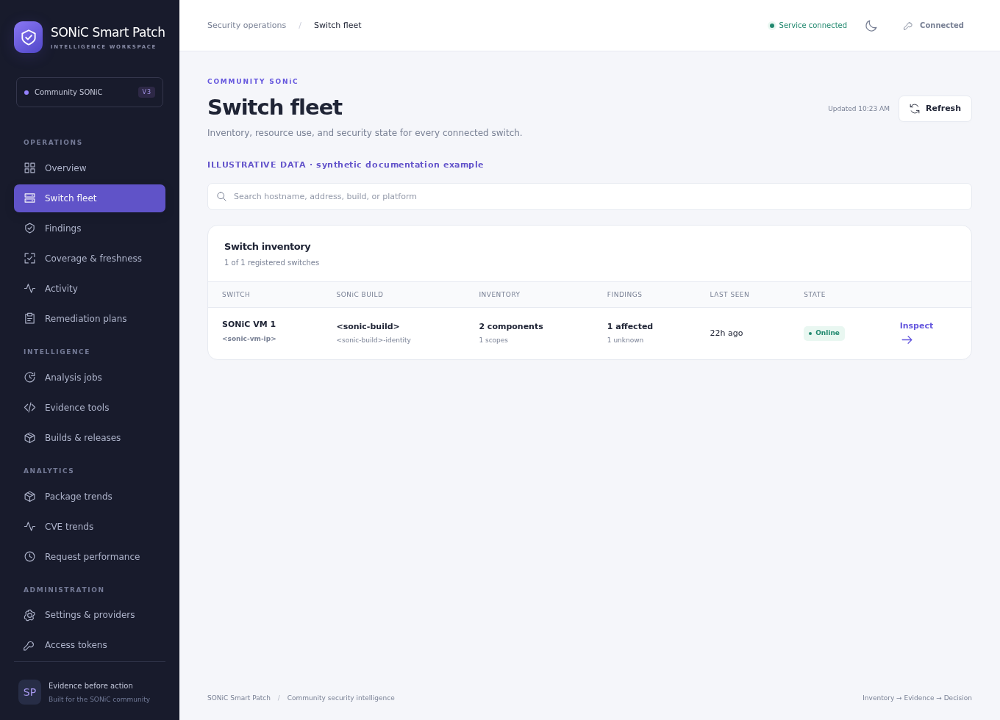

*Figure 4. Fleet view using synthetic example data in the current UI. Online means a recent heartbeat; it does not independently prove forwarding health.*

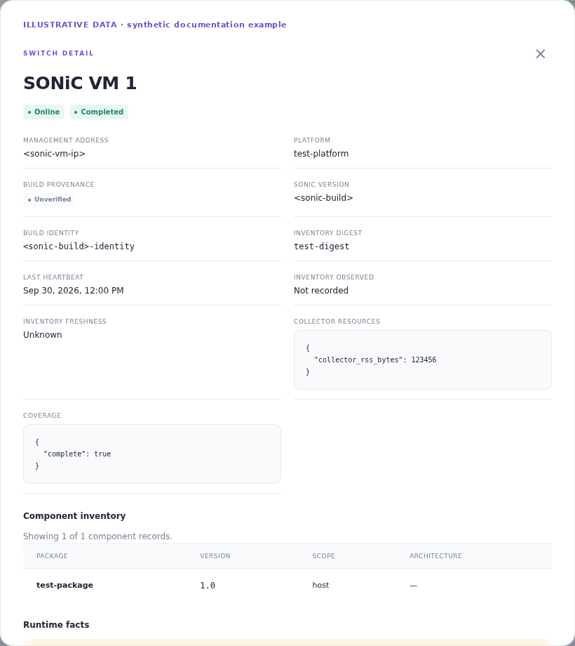

*Figure 5. Device details using synthetic example data in the current UI. The example collector state does not establish acceptance of an installed package.*

**Queue central scan** analyzes the inventory already recorded by the service. To request a new package inventory, use `sudo security sync --force` on the switch. An **inventory** observation returns existing collection status, digest and timestamp; it does not itself force package recollection.

Under **Request runtime evidence**, enter:

| Field | Example | Expected behavior |
| --- | --- | --- |
| Runtime evidence collector | `services` | Collect service/process status supported by the selected scope |
| Runtime evidence scope | `host` or `container:lldp` | Must be an exact scope present in that switch's inventory |
| Request observation | Click once | Creates a queued request returned on a later collector sync |

For BGP, use **routing** with the actual BGP container scope, often `container:bgp`. Reopen the device after the next synchronization round trip and inspect **Runtime facts**, including status, timestamp, scope and inventory digest. `unknown` is a missing or unsupported observation, not a healthy result.

The UI exposes services, listeners, features, interfaces, routing, resources and inventory. Additional typed API collectors include kernel, processes, BGP and package-version availability. For example, the API body for package availability is:

```json
{
  "collector": "package_versions",
  "scope": "host",
  "args": {"packages": ["lldpd"]}
}
```

This runs bounded `apt-cache policy` for 1–10 named packages; it does not refresh APT or install anything. Choose the scope where the package exists. Evidence normally needs one exchange to receive the request and a later exchange to return its result.

## 7 Investigate a finding

In **Findings**, search `CVE-2023-41910` or `lldpd`. Use applicability/severity filters and inspect each matching scope separately. A finding is one package occurrence on one device; the same CVE may generate multiple rows.

**Fix availability** defaults to **Fix recorded**, so findings labelled **No fix recorded** are hidden initially. Select **No fix recorded** to investigate only those findings, or **All findings** to include both. Filtering applies before pagination and combines with search/device/severity/applicability; the displayed count describes the filtered result. It does not delete findings, change overview totals or suppress findings delivered to switches. A recorded fix version is an advisory candidate, not proof that it is available or appropriate for installation.

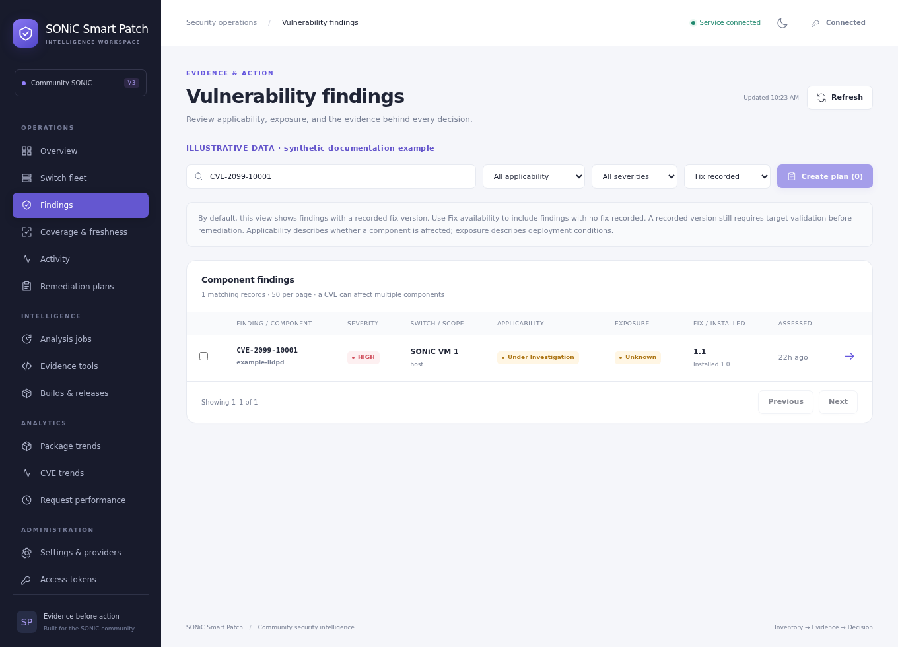

*Figure 6. Findings using synthetic example data in the current UI. The displayed CVE and package are synthetic; your results depend on current inventory.*

Open **Inspect CVE…** and read the installed version, scope, advisory source, rationale and supporting evidence.

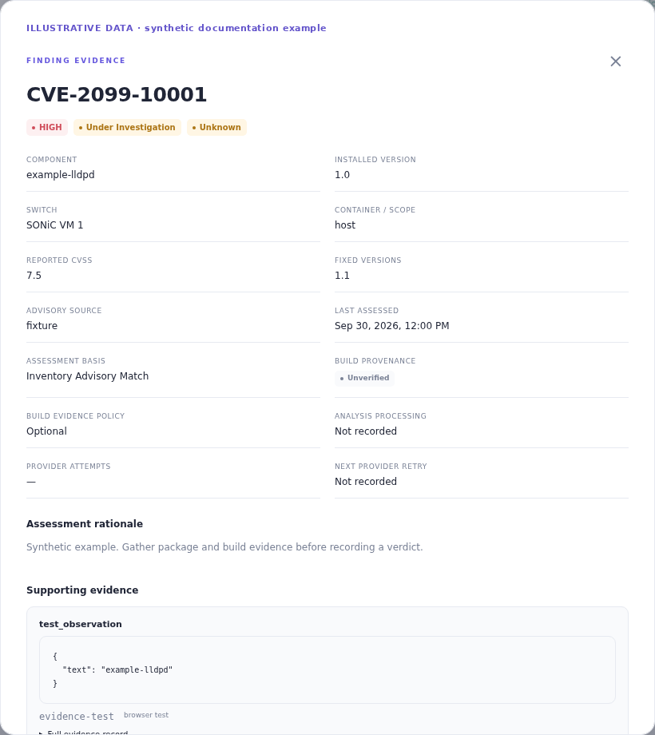

*Figure 7. Finding detail using synthetic example data in the current UI. Candidate fix versions are not proof of operational compatibility or an installed fix.*

| Label | How to interpret it |
| --- | --- |
| `under_investigation` | Evidence is insufficient for a conclusive applicability decision |
| `affected` | Read **Assessment basis**: a verified/reviewed conclusion or, in optional mode, a reported-inventory advisory match |
| **Inventory advisory match · build unverified** | Optional-mode match against reported package metadata; not proof of how the installed binaries were built |
| `fixed` | Recorded evidence supports a fix in the assessed occurrence |
| `not_affected` | Recorded evidence supports a scoped non-applicability decision |
| Exposure `unknown` | Deployment reachability or runtime conditions remain unresolved |
| **No fix recorded** | Advisory data has no recorded fixed package version. It does not establish that no fix exists elsewhere; choose **All findings** or **No fix recorded** in Fix availability to see these rows. |
| Analysis `pending_analysis`, `analyzing`, `analyzed`, `retry_needed` | Processing state, separate from the applicability verdict |
| `last_known`, stale or partial indicators | Data is retained for visibility; inspect its age, scope and completeness |

**Worked LLDP example.** The recorded component version is `1.0.16-1+deb12u1`, while the scanner matched a Debian 13 advisory range. The pinned SONiC recipe selects that Debian backport version. This motivates checking source lineage and patch evidence; matching a version string does not establish what code is in the running binary. The saved investigation remains under investigation because shipped-artifact proof and runtime evidence are incomplete. See the [recorded investigation](../test-results/lldp-external-agent-analysis-current.json).

Choose **Investigate with evidence** for targeted central work when an API provider is configured. Without an API key, use the external-agent workflow below. Neither action by itself promotes a proposal to a reviewed verdict.

### Record an administrator review

Click **Record reviewed verdict** only after inspecting the supporting records.

| Input | What is required |
| --- | --- |
| Reviewed applicability | Choose the supported outcome; retain under investigation when proof is missing |
| Evidence-based justification | 20–4000 characters describing the component-specific evidence |
| Supporting reference | HTTPS reference required for fixed/not affected |
| OpenVEX justification | Required for not affected; choose the reason actually supported by evidence |
| Existing evidence checkboxes | Select at least one recorded evidence ID |

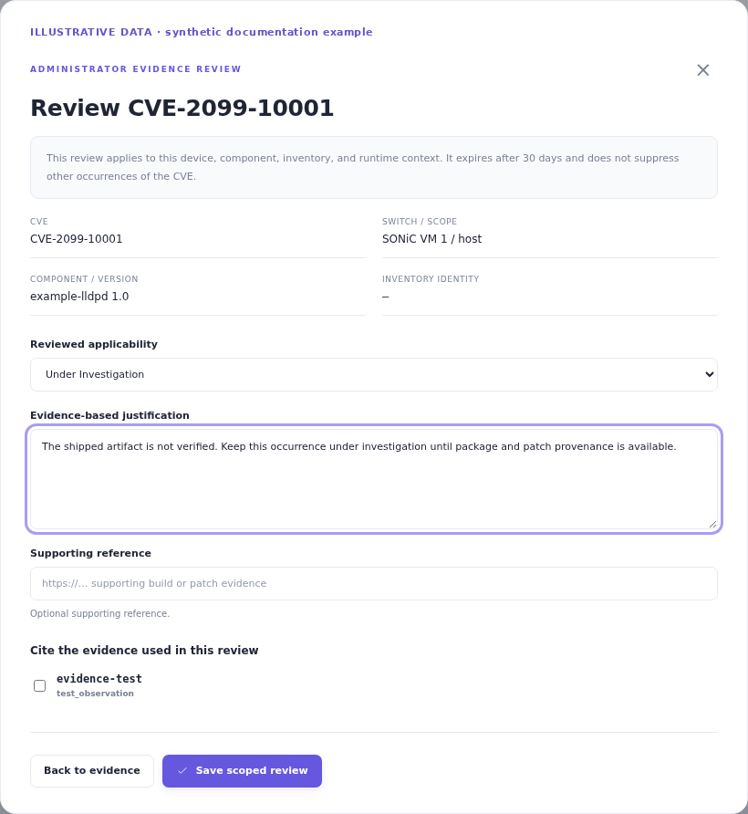

*Figure 8. Unsubmitted review form using synthetic example data in the current UI. The example rationale did not submit or change a verdict.*

A review is scoped to the occurrence and its input identity. Its maximum lifetime is 30 days, further limited by supporting evidence freshness. Changed inventory, build, runtime context or expired evidence can require a new review. Do not use a bare advisory URL as a substitute for shipped-artifact proof.

## 8 Use your signed-in coding agent

This is the available workflow for an existing Codex/Claude/Devin-style sign-in when no provider API key is configured in Smart Patch. Smart Patch does not embed a provider SSO login button or automatically invoke that signed-in product.

1. Open a current finding and click **External agent review**.
2. In **Use your signed-in agent**, choose **Download case bundle** or **Copy case bundle**.
3. Give the bundle to your authorized coding agent. If it will call Smart Patch directly, provide a protected Smart Patch operator/admin credential through your approved local workflow—not inside the case JSON or prompt.
4. Ask the agent to use the case's allowlisted tools and cite the evidence recorded in that session.
5. Under **Return an agent proposal**, choose **Agent result JSON file** or paste the result into **Agent proposal JSON**.
6. Click **Submit agent proposal**. Inspect the resulting proposal, then use the separate administrator review action if the evidence warrants adoption.

Suggested prompt:

> Investigate this exact Smart Patch case using its recorded evidence and allowlisted session tools. Separate package-source lineage, proof of the shipped artifact, and runtime exposure. Keep missing facts explicit. Return JSON matching the bundle's submission_schema with existing session evidence IDs. Do not perform remediation or invent a fixed verdict.

**Proposal template for the web form.** Replace the evidence placeholder with an ID actually present in the current session and write the rationale from that session's evidence. The UI supplies the case identity fields when omitted.

```json
{
  "proposed_applicability": "under_investigation",
  "rationale": "The source recipe identifies a backport revision, but the recorded evidence does not verify the installed artifact. Keep this occurrence under investigation until package provenance is confirmed.",
  "evidence_ids": ["REPLACE_WITH_CURRENT_SESSION_EVIDENCE_ID"],
  "unknowns": ["Verified association of the installed binary with the patched source"],
  "recommended_action": "collect_evidence",
  "agent_name": "My signed-in coding agent"
}
```

Sessions currently last 20 minutes and allow at most 12 tool calls, a 16000-character case context and 48000 response characters. Use the actual bundle's schema and limits. An expired session, changed evidence context or unrecognized citation is rejected; open a new case rather than changing the snapshot fields yourself.

For direct integration, the agent uses `POST /api/v1/agent-sessions/SESSION_ID/tools/TOOL_NAME` with `{"arguments": {...}}`, then submits the full schema to `/api/v1/agent-sessions/SESSION_ID/analysis`. The generic Evidence tools console does not attach its results to this session. Provider names are self-reported attribution; a proposal does not verify SSO identity, authorize remediation or automatically change VEX.

## 9 Run evidence tools and configure source access

### Choose whether build evidence is required for applicability

In **Settings & providers → Build evidence for applicability**, select:

| Choice | Effect on an exact distribution advisory/package-version match |
| --- | --- |
| **Required (default)** | Without a verified build association, the match stays `under_investigation` unless a scoped accepted review supplies a verdict. |
| **Optional for inventory advisory matches** | A match can become `affected` based on reported installed-package metadata even when the build is unverified. Known custom/patch-bearing packages and Debian cross-release candidates remain `under_investigation`. |

Click **Save configuration**. Changing this policy marks existing assessments stale and schedules reassessment when workers are enabled; current views remain under investigation until reassessed. To request it explicitly, open **Switch fleet** and **Queue central scan** for each switch. Historical records retain their original policy. The setting applies centrally, so it does not require regenerating a SONiC image or changing the switch's ConfigDB.

In the API the setting is `build_evidence_policy` with value `required` or `optional`. An inventory-only affected result records `decision_basis=inventory_advisory_match`, `build_evidence_policy=optional` and `artifact_binding=unverified`. Findings label these rows **Inventory advisory match · build unverified**; details show **Assessment basis**, **Build provenance** and **Build evidence policy**.

Optional assessment does not verify a signature, invent build evidence, or declare a package fixed/not affected. It also does not prove that every installed binary matches its reported package version. AI proposals remain separate. Before approving a maintenance plan based on an inventory-only finding, record a scoped operator review. Service target checks, explicit authorization and staging still apply; local preflight, health and rollback-availability requirements follow the switch's separate `maintenance_checks_enabled` policy in section 11.

To restore the stricter assessment, select **Required (default)**, save and queue fresh scans. This policy control applies to new assessments; existing findings must be reassessed.

### Configure source access

**Browser → Settings & providers → Source roots · JSON**

```json
["<path-to-sonic-buildimage>"]
```

The directory must already exist on the management server and be readable by its service account. This field does not clone it. **Source revision** can hold the exact global tool-context commit:

```text
<source-commit>
```

Click **Save configuration** after editing source roots or revision. Device investigations resolve their build source separately; setting this value does not verify a switch's build identity.

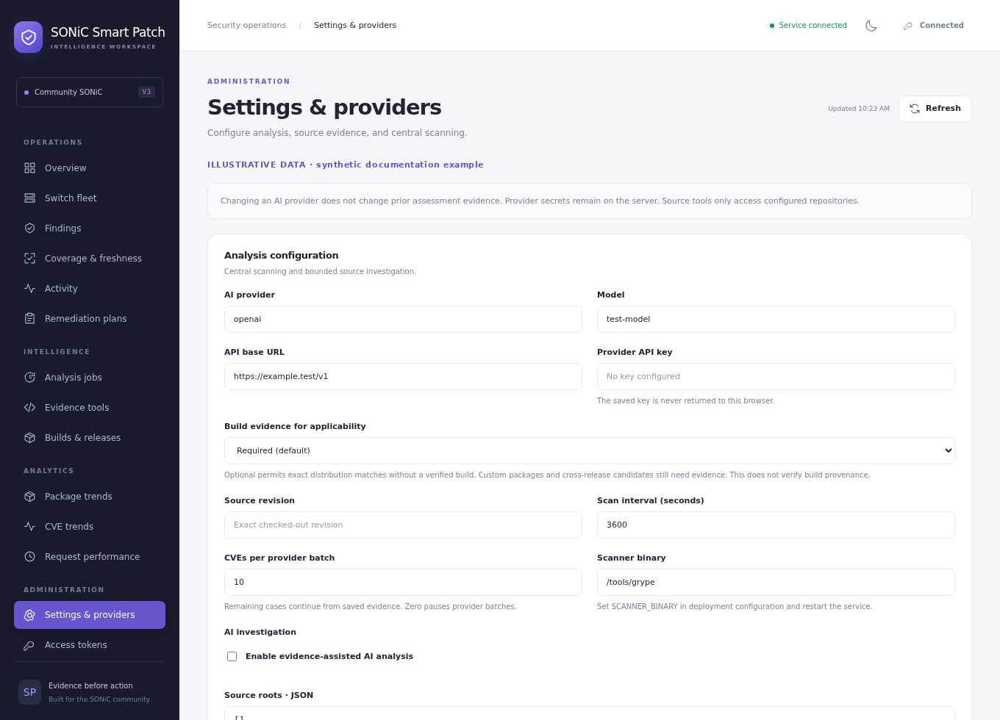

*Figure 9. Settings using synthetic example data in the current UI. With no API credential, leave Enable evidence-assisted AI analysis unchecked and use External agent review.*

In **Evidence tools**, select a tool, inspect **Input schema**, paste only its argument object into **Arguments · JSON**, and click **Run evidence tool**.

For **compare_versions**:

```json
{
  "ecosystem": "deb",
  "installed": "1.0.16-1+deb12u1",
  "other": "1.0.16-1+deb12u1"
}
```

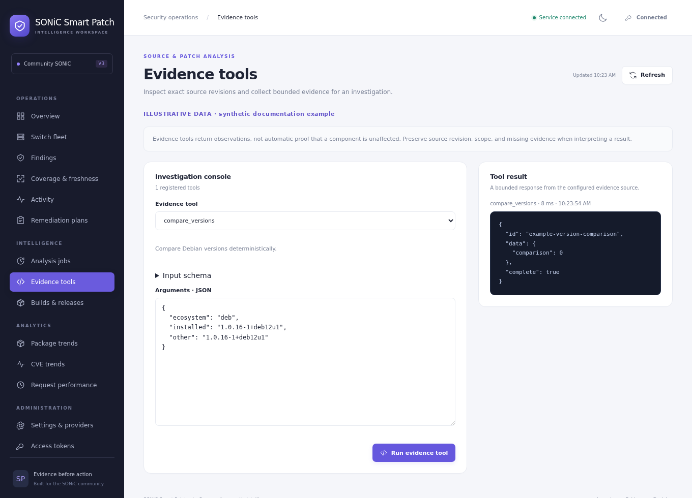

*Figure 10. Read-only tool output using synthetic example data in the current UI. Comparison 0 means equal; negative means installed is older, positive means installed is newer. Debian epochs and backport revisions matter.*

For **get_source**:

```json
{
  "root": "sonic-buildimage",
  "revision": "<source-commit>",
  "path": "rules/lldpd.mk",
  "start_line": 1,
  "line_count": 40
}
```

`root` is a repository name from the tool schema's allowed choices, not a filesystem path or GitHub URL. This is an illustrative source-read request: replace `<source-commit>` with a real commit present in the approved repository. In the recorded public LLDP recipe example, the inspected file contained 29 lines and selected `1.0.16-1+deb12u1`; your result depends on the commit you supply. If the root/commit is absent, configure or clone the source before retrying. Tool observations support analysis; they do not independently prove runtime reachability or binary patch contents.

### Optional API-provider settings

| Field | Example or instruction |
| --- | --- |
| AI provider | `openai` for its compatible adapter, or `anthropic` for the Messages adapter |
| Model | Enter the real identifier enabled for your provider account |
| API base URL | Enter the provider-compatible base URL; non-local endpoints use HTTPS |
| Provider API key | Enter the actual API credential; blank retains an existing key |
| Enable evidence-assisted AI analysis | Enable only after configuring a working provider/model |
| CVEs per provider batch | Start at `10`; valid range 0–100; zero pauses provider batches |
| Scan interval | `21600` seconds is six hours; distinct from the switch's synchronization/inventory intervals |

After saving provider/source changes with **Save configuration**, explicitly start **Queue central scan**, **Investigate with evidence**, or a release sync. Old work remains bound to its original inputs. Saved-evidence batches keep attempt counts and avoid repeating Grype solely for AI continuation. A successful response that remains unknown is not retried indefinitely.

Operational alert defaults are 20 measured samples, 2-second API p95, 70% minimum cache hit rate, 5% maximum API error rate and queue depth 100. These are configurable thresholds, not performance guarantees. Notifications are local UI/API/audit events; this screen does not configure email or external paging.

## 10 Register builds and upload their SBOMs

In **Builds & releases**, the left form registers source/build information; the right form uploads a local SBOM. Uploading a file does not establish a signed association with a running switch.

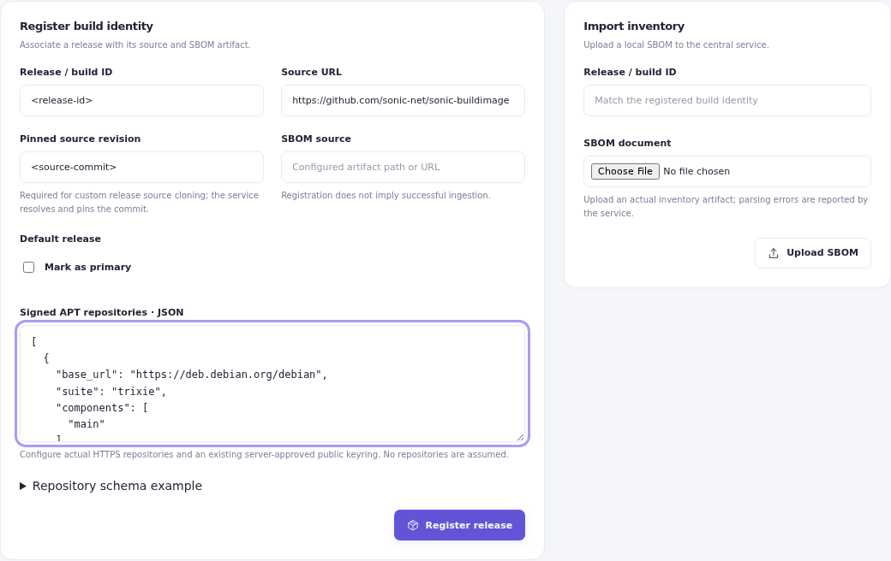

*Figure 11. Unsubmitted release form using synthetic example data in the current UI. Registration and upload were not submitted; provision the keyring on the server before use.*

| Field | Example |
| --- | --- |
| Release / build ID | `<release-id>` — use the same ID in the upload form |
| Source URL | `https://github.com/sonic-net/sonic-buildimage` |
| Pinned source revision | `<source-commit>` — replace with your real build's full commit hash |
| SBOM source | Leave blank if uploading through the right form, or provide a service-accessible source path/URL |
| Mark as primary | Select only if this is the intended primary release |
| Signed APT repositories · JSON | `[]` when none are configured, or an approved configuration such as the example below |

The repository keyring path is on the **service host**, not your browser machine. It must already contain the approved public Debian archive keys. Match suite/architecture to the intended package source lineage; do not copy this Trixie example onto a Bookworm-only release.

```json
[
  {
    "base_url": "https://deb.debian.org/debian",
    "suite": "trixie",
    "components": ["main"],
    "architectures": ["amd64"],
    "keyring": "/usr/share/keyrings/debian-archive-keyring.gpg"
  }
]
```

An administrator must provision that public keyring before registration, or use an existing approved file under `STATE_DIR/keyrings`. Only `/usr/share/keyrings` and `STATE_DIR/keyrings` are allowed keyring directories. At most eight repository entries are accepted by the backend. Without repositories, matching can still run but latest package availability remains unknown. Repository availability is not proof of safe deployment compatibility.

Click **Register release**. A source URL can queue source preparation; inspect **Analysis jobs** for the exact pinned result. Then, in **Import inventory**, enter the same release ID, select the original SBOM JSON (up to **50 MiB / 52,428,800 bytes**) and click **Upload SBOM**. Expect an artifact ID and queued release analysis. Inspect jobs and errors rather than treating a successful upload as completed analysis.

Supported full-schema imports are CycloneDX 1.4–1.6 and SPDX 2.3; legacy SPDX 2.2 has a narrower inventory profile. Scope containment, distribution/version, package identities and original byte digests matter. Validation errors include JSON paths and source line/column; a missing property points to its containing object. Correct the actual producer/file instead of fabricating provenance to silence warnings.

The current release table has no dedicated Sync button. Upload queues analysis, the scheduler refreshes releases daily, or an administrator can use `POST /api/v1/sync-now` with `{"release_id":"<release-id>"}`. The command helper in section 13 provides this alternative.

### Verify a signed build association

After an original SBOM is registered, click **Verify binding** on that release row.

| Dialog field | Supply |
| --- | --- |
| Approved public-key ID | For example `community-builder-2026`, after its public PEM is provisioned in `STATE_DIR/trusted-build-keys/community-builder-2026.pem` |
| Embedded manifest | The exact build-generated JSON embedded at `/etc/sonic/smart-patch/manifest.json` |
| Signed external release index | The original `<image>.smart-patch.json` binding the manifest, SBOM and image digests |
| Detached signature | Binary `<image>.smart-patch.json.sig` signed over the exact external-index bytes |

Manifest/index files must each be at most 1 MiB; the signature is 1–1024 bytes. The UI base64-encodes the signature for the API. Upload no private key and do not reformat signed JSON. RSA PKCS#1 v1.5/SHA-256 and Ed25519 are supported.

**Builder environment — RSA example, with real CI outputs and an approved private key**

```bash
openssl dgst -sha256 -sign "<path-to-build-signing-key>" \
  -out sonic-image.bin.smart-patch.json.sig sonic-image.bin.smart-patch.json
openssl pkey -in "<path-to-build-signing-key>" -pubout \
  -out community-builder-2026.pem
```

Provision only the public PEM on the service. Successful verification establishes a signed release baseline. A switch must report matching manifest/build information to associate with it. This is not TPM/runtime attestation; an old image without an embedded matching manifest remains unverified. Full image-build/boot acceptance is still separate from the native collector package build.

## 11 Review and stage a maintenance plan

Use this workflow only for a reviewed change in the intended scope. Inventory and AI demonstrations do not require assisted/autonomous mode.

| Collector mode | Behavior |
| --- | --- |
| advisory | Inventory/evidence and assessment; staging/apply are denied |
| assisted | Staging is permitted; application needs explicit approval; local preflight/health checks follow the switch setting below |
| autonomous | Only eligible low-impact transactions with an exact allowlist entry and current affected assessment; an empty allowlist permits no automatic change |

**Switch — deliberate policy change when preparing an authorized transaction**

```bash
sudo config security smart-patch mode assisted
```

**Switch — optional maintenance checks and resources**

```bash
# Default: local preflight and health checks disabled.
sudo config security setting maintenance_checks_enabled false
# Enable all local preflight and health checks when required:
sudo config security setting maintenance_checks_enabled true
# Threshold when checks are enabled; no maintenance CPU quota by default.
sudo config security setting maintenance_min_free_mib 500
sudo config security setting maintenance_cpu_quota_percent 0
# Optional example: cap each maintenance command at 50% of one CPU.
sudo config security setting maintenance_cpu_quota_percent 50
```

These are switch ConfigDB settings, not webpage inputs. Set the CPU value back to `0` to disable Smart Patch's maintenance quota; any platform or parent-slice limits still apply. One MiB is 1048576 bytes. The collector's normal 10% CPU quota remains in place. Settings are read when maintenance runs; changing them does not approve or retry an earlier failed plan. Use the normal SONiC `config save` workflow when you want running configuration to survive a configuration reload/reboot.

`maintenance_checks_enabled` accepts `true` or `false` and defaults to `false`. Use `show security status --json` (standalone: `security show status --json`) to see it. Choose one setting; the two commands above demonstrate both options. **Disabled checks permit installation without proof of current switch health or a complete rollback package set.** Smart Patch records skipped checks and missing rollback artifacts explicitly; it does not call those checks passed.

If the vendor image does not expose the native `config security` plugin, use the standalone command instead:

```bash
sudo security config setting maintenance_checks_enabled false
# Or enable the checks:
sudo security config setting maintenance_checks_enabled true
```

| Setting | Staging and installation behavior |
| --- | --- |
| `false` — default | Skip local inventory/version/freshness, free-space, dependency-policy, artifact-hash and pre/post health gates. Still run the package manager to resolve, download and install the target. Attempt rollback downloads, but continue if an exact previous package is unavailable. |
| `true` | Require local currentness, free space, dependency policy, unchanged staged transaction/hashes and the complete rollback package set. Apply requires healthy pre/post observations. |

With checks enabled, default whole-switch health limits are CPU≤80%, memory≤90% and disk≤85%. These percentages are separate from the 500 MiB free-byte minimum and the command CPU quota. With checks disabled, both free-space and health gates are skipped; command memory/task/deadline bounds and the configured CPU quota still apply. Authentication, operating mode, explicit approval, exact authorized device/package/target, supported scope and service plan authorization remain required. Container maintenance additionally requires the explicit switch maintenance mode and captured container identity described below. Changing optional checks does not enable advisory-mode installation or protected core updates.

The native Smart Patch daemon and its systemd maintenance workers run as root and invoke package commands directly; the daemon does not call `sudo`. The `sudo` commands in this guide are for interactive administration. Systemd still provides the separate maintenance command resource limits described above.

The collector's action-result details include `maintenance_checks_enabled`, `checks_skipped`, `rollback_available` and `rollback_missing`. Inspect those fields in the plan result to distinguish an executed check from skipped validation and to know whether the complete recovery package set was retained. `rollback_available=false` means a failed installation can need manual recovery; it never means rollback succeeded.

`rollback_available=true` means the complete staged recovery artifact set was retained. It does not guarantee successful restoration, especially when dependency checks are disabled and the installed transaction can differ from the staged one.

The intelligence service sends the approved plan and exact target version to the collector. During staging, the **switch** runs `apt-get download <package>=<exact-version>` against its configured APT repositories and retains the files locally. DNS resolves repository hostnames; HTTP(S) carries the package data. The intelligence service does not relay the package to the collector in this workflow. The switch needs working repository connectivity while staging.

Installation and rollback use the retained package archives with APT `--no-download`. Smart Patch sets `Dir::Cache::archives` to that plan's forward or rollback artifact directory so APT uses the staged copy even if the repository lists the same version. Missing required archives, unresolved dependencies and package-manager failures still stop the operation; disabling optional checks does not supply a missing package or permit downloads during installation.

In **Findings**, select CVEs belonging to one device, package, installed version and scope, then click **Create plan (N)**. A single finding also offers **Create review plan**.

For an **Inventory advisory match · build unverified**, first open the finding and use **Record reviewed verdict** to record the occurrence-specific evidence and justification. Then create a fresh plan from the reviewed finding. **Approve review** approves that maintenance plan; it does not perform the separate applicability review. A blocked plan shows its prerequisite and an **Inspect finding for scoped review** button. Record a verdict only when the available evidence supports it.

1. Inspect the target version, repository proof, required checks and expiry. **Recheck selected target** queues central validation and clears prior approval.
2. Click **2 · Approve review** on the eligible draft. This records review; it does not install anything.
3. Click **3 · Stage packages** when offered. The collector resolves the package transaction and downloads the target through configured APT sources. Its optional checks follow `maintenance_checks_enabled`; if checks are disabled, unavailable exact rollback packages are recorded without blocking staging. Inspect `rollback_available` and missing-artifact details before execution. APT retrieval is not independent `.deb` signature verification.
4. Use **Refresh plan** until the latest collector result is available. Failed or unknown staging leaves execution unavailable.
5. When the current plan is staged and execution-eligible, click **4 · Review execution**. Type the exact device ID shown in **Confirm target switch identity**, then request execution. Apply enforces the selected local check policy. With checks disabled, absent health validation is recorded as skipped; a successful package-manager exit is not a health pass.
6. Inspect the resulting inventory and central reassessment. `pending_reassessment` means the collector reported a successful package action and the service still needs to verify its outcome. The plan becomes **Completed** only after fresh inventory reports the exact target package in the same scope and a complete, current central scan no longer matches the selected CVEs for that occurrence. The plan records its observed version and assessment evidence. Partial, stale or failed scans, a different installed version, or a remaining selected CVE keep the plan pending with a reason.

Completion applies to the selected package occurrence and CVEs. Updating a host package does not update copies inside containers. Checks recorded as **SKIPPED** remain skipped after reassessment; a completed plan does not claim that switch health passed or that every vulnerability was removed. The plan's original version is historical **Before** information, not a live reading of the installed package.

Plans expire after 24 hours and are bound to inventory/build/security context. A higher available version is only a candidate until the required checks pass. Core packages—including kernel, FRR, OpenSSL and SONiC components—and unsupported container environments produce maintenance runbooks with automatic execution unavailable. Automatic image activation, reboot and routing restart are not implemented by those runbooks.

**An approved manual-maintenance plan is not a running staging job.** Core packages and unsupported containers display operator steps; approval does not queue an install. For an ordinary package in a supported container, enable the explicit maintenance mode below, wait for its capability/identity report and create a fresh eligible plan. Eligible host and container plans still need a separate **Stage packages** request.

**Standalone local maintenance commands** use a local plan UUID, which is different from a web-service plan ID:

```bash
sudo security maintenance plan FINDING_ID EXACT_FIXED_VERSION
sudo security maintenance stage LOCAL_PLAN_UUID
sudo security maintenance apply LOCAL_PLAN_UUID --approve
```

Plan creation prints the local UUID. Automatic package maintenance supports eligible host packages and supported container packages when explicit switch maintenance mode is enabled; protected core/image changes remain manual. Stage resolves dependencies and downloads forward artifacts; its free-space, rollback-availability, dependency-policy and verification gates follow the setting above. Apply always requires authorization and a successful package-manager operation; current-state and health checks run only when enabled. If installation fails, automatic rollback is attempted only with a complete retained recovery set. With `rollback_available=false`, the result requires manual recovery and no partial automatic rollback is attempted. A successful install still needs fresh inventory and central reassessment. If an eligible applied/failed local plan has complete recovery artifacts and needs explicit rollback, the command is:

```bash
sudo security maintenance rollback LOCAL_PLAN_UUID --approve
```

Rollback is a separate decision, not an unconditional step after every successful change. Restore advisory mode when that is your intended policy:

```bash
sudo config security smart-patch mode advisory
```

### Install an eligible package inside a container

Smart Patch can update an ordinary Debian package in a supported running SONiC container and restart **only that container**. The switch must explicitly permit container maintenance. This flag does **not** drain traffic, withdraw routes, disable ports or arrange a maintenance window. Arrange any needed traffic handling through your normal SONiC procedures before enabling it.

```bash
# On the selected switch, permit reviewed package changes and container restarts.
sudo config security smart-patch mode assisted
sudo config security smart-patch maintenance-mode enable
show security status --json
```

If the native plugins are unavailable:

```bash
sudo security config smart-patch mode assisted
sudo security config smart-patch maintenance-mode enable
security show status --json
```

Wait for the collector report, then open **Switch fleet → Inspect**. Check its reported maintenance mode, capability and freshness. In **Findings**, choose the exact `container:<name>` occurrence, for example `container:pmon`, and create a fresh review plan. Approve, stage and explicitly execute it using the same workflow above. Maintenance mode alone does not approve a package or start a restart. Plans created while container maintenance was unavailable remain manual; create a new plan after enabling the mode.

The collector captures the full Docker container ID, image ID and name before staging; the service binds that identity to approval. Replacement of a container under the same name invalidates the plan. The actual package process must join a separate bounded host systemd maintenance service before it is allowed to execute; limiting only a `docker exec` client would not provide that guarantee. After installation, Smart Patch restarts the captured container and checks its running identity and installed package version before requesting reassessment.

Supported targets are running Debian-based SONiC containers compatible with one of the two execution paths below. Smart Patch selects the supported path without recreating the container or disabling its security profile. Missing prerequisites, user remapping, stopped/replaced containers, or an inability to establish the resource boundary stop the operation before package execution.

| Switch environment | How the package command runs |
| --- | --- |
| Unified cgroup v2 | Docker creates an exec process with the container's original seccomp, security profile and capabilities. A small Python 3 gate inside the container waits until the host verifies that it belongs to the bounded maintenance service. Only then does the package command start. Python 3 in the container, a supported Docker Engine and the required host process controls are prerequisites. Seccomp-filtered containers can use this path. |
| Older cgroup v1 | The existing worker pins the approved container's namespaces and root, then runs the command within the host maintenance service's limits. This fallback requires an unconfined, non-remapped container with compatible security settings, as in supported privileged SONiC service containers. It refuses confined targets instead of bypassing their profile. |

Kernel, FRR/routing, OpenSSL/libc and protected SONiC/core targets remain operator image maintenance in both host and container scopes.

**Persistence:** this updates the container's writable layer. Recreating the container or replacing its image can remove the update. A rebuilt, qualified SONiC/service image is the durable fix; fresh inventory can report the CVE again after recreation. Smart Patch does not implement an image rebuild/promotion pipeline.

After the planned work finishes, remove container-maintenance permission when it is no longer needed:

```bash
sudo config security smart-patch maintenance-mode disable
# Standalone equivalent:
# sudo security config smart-patch maintenance-mode disable
```

The mode is checked during stage, apply, restart and rollback even when optional maintenance checks are disabled. Disabling it during an active change can prevent a later restart or recovery step; inspect the recorded result before starting another operation.

### Retain an old Debian version for rollback

Debian's current mirrors can stop publishing an older version. Smart Patch first attempts the exact previous package through configured APT sources. When that fails, the default-enabled fallback searches the [official Debian snapshot archive](https://snapshot.debian.org/) for the **exact binary package, version and architecture**, using the Debian distribution of the target host or container. It never substitutes the newest package, another release or a different architecture.

```bash
# Default: allow the official snapshot fallback for missing rollback archives.
sudo config security setting rollback_snapshot_enabled true
# Disable the fallback if your environment cannot access the archive:
# sudo config security setting rollback_snapshot_enabled false
# Optional: pin a reviewed snapshot date, format YYYYMMDDThhmmssZ.
# sudo config security setting rollback_snapshot_timestamp '<snapshot-timestamp>'
# Clear a prior date override to use bounded automatic discovery:
# sudo config security setting rollback_snapshot_timestamp ''
```

Standalone commands start with `sudo security config setting` instead. The switch needs HTTPS connectivity to `snapshot.debian.org`, its CA trust, and the Debian archive keyring. The downloader uses a private APT configuration, lists/cache and signed repository metadata. It does not change normal sources or run the host's APT update hooks. Historical `Valid-Until` expiry is disabled only inside this isolated snapshot operation; repository signature and exact package identity checks remain required.

Inspect **Recorded checks and rollback** in the plan or remediation-status details for the archive, suite, timestamp, version and retained SHA-256. Vendor/private/custom builds might never have existed in Debian's archive, and bounded discovery may find no usable snapshot. In that case the exact recovery package remains unavailable. With optional checks disabled, staging can continue with `rollback_available=false`; enabled checks require the complete recovery set. Snapshot retrieval improves recovery availability; it does not guarantee a successful rollback.

### Follow current CVEs and remediation history

Open **Remediation status** in the sidebar. Filter by switch, CVE ID/prefix, exact scope (`host` or `container:pmon`) and lifecycle state. The table retains separate attempts and shows the target and observed version, operation origin, collector phase and central reassessment. Choose **Inspect status** for the progress timeline, skipped checks, container restart, rollback source and waiting/failure reason. Active visible rows refresh every five seconds; polling never approves or executes an action.

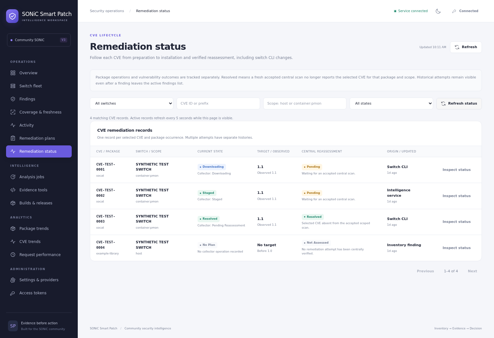

*Figure 16. Synthetic records illustrate downloads, staging, resolved history and findings without a plan. They are UI test examples, not live vulnerability or installation results.*

```bash
# All cached current CVEs and local/service remediation attempts.
show security remediation
show security cves
# Focus on one occurrence or on independently reassessed results.
show security remediation --cve CVE-2023-41910 --scope container:pmon
show security remediation --status pending_reassessment
show security remediation --status resolved --json
# Standalone equivalent when native show plugins are unavailable:
security show remediation --scope host --json
```

| State | Meaning |
| --- | --- |
| `no_plan` | A current finding has no recorded maintenance attempt. |
| `planned` / `approved` | A target is recorded or reviewed; nothing has been installed yet. |
| `staging` / `downloading` / `downloaded` / `staged` | Package preparation is in progress or staged archives are available. |
| `installing` / `installed` / `restarting` | The package command or selected-container restart is in progress or reported complete. These are collector observations. |
| `pending_reassessment` | Installation has been reported, but the service has not yet established the scoped CVE outcome. Inspect its waiting reason. |
| `resolved` | Changed inventory reports the exact target occurrence and an accepted complete current scan no longer reports the selected CVE there. |
| `reopened` | The same CVE has been reported again for the previously resolved occurrence. |
| `no_longer_reported` | A full scan stopped reporting a finding without a verified maintenance completion record. This is distinct from `resolved`. |
| Failed / denied / rollback states | Inspect the recorded command, restart, checks and recovery outcome; no successful resolution is implied. |

CLI-created plans are now reported to the service by the authenticated collector, including their local UUID and monotonically increasing revision. They appear with origin **Switch CLI** and remain read-only in the GUI; uploading them does not manufacture service approval. Progress uses a separate lightweight reporting path so a long APT command need not hide all intermediate states. Local newer phases remain visible while disconnected. The CLI reports cache truncation and connection state; the service provides the fuller retained history.

For a CLI installation, the service requires a complete scan accepted **after receipt of the installation report**, changed inventory containing the exact target and original scoped selection evidence. A report arriving after installation can use retained original inventory/assessment history; unverifiable old plans stay unresolved. `resolved` applies to that switch, component and scope only. Neither AI prose nor a package-manager success alone closes the record.

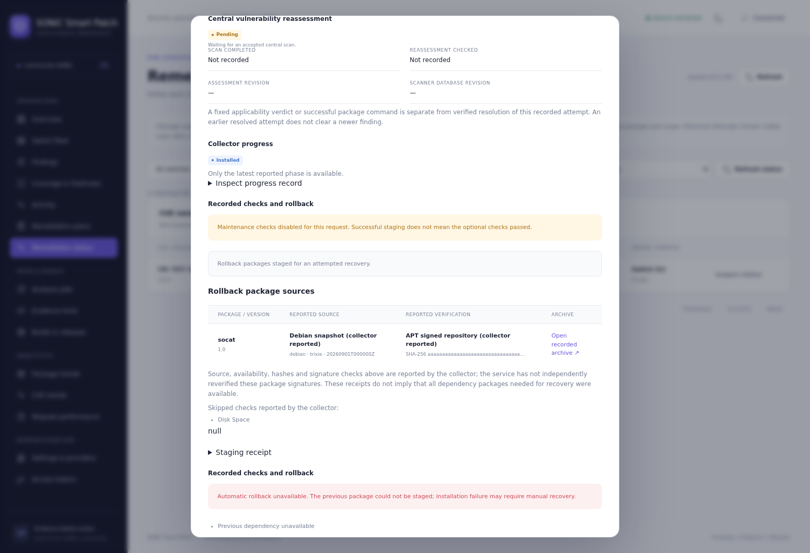

*Figure 17. Synthetic CLI-origin container evidence distinguishes an installed package from a centrally resolved CVE. Its local approval and collector receipts are shown read-only.*

A historical successful plan remains part of the audit record. The **Remediation status** page and CLI show **Pending reassessment** if the latest inventory, policy, advisory database or scan coverage no longer supports a current resolution. A fresh matching scan shows **Reopened**; a fresh complete scan confirming absence shows **Resolved**. Downloaded package files alone do not count as successful staging.

An installation report can arrive before the changed inventory. Smart Patch now
waits for the exact target version in the original package scope before requesting
post-install reassessment. A queued scan can be updated to cover the latest
inventory; an already running scan retains its identity and cannot commit an
outdated result. Repeated reports and restarts do not continually retry the same
failed reassessment attempt. Inspect a failed job and request a fresh scan after
correcting the failure.

For eligible Debian host/container inventories, the service retains verified
package-level matching results. After the first complete baseline, only changed
or newly observed packages are sent to Grype; unchanged positive and zero-match
results are reused, and removed packages are dropped. For example, changing only
`socat` can require one new package match while preserving complete coverage of
the remaining inventory. A new advisory database, incompatible scanner settings,
missing baseline or unsupported input can require a full scan. Evidence analysis
and current-context validation still apply to the assembled result; a partial
scan or an AI opinion alone cannot close the plan.

### Remediate selected switches together

For example, the same reviewed vulnerability in a host package may affect three switches. You can prepare and authorize their plans together, while keeping a separate target, collector result and reassessment for each switch.

1. Open **Findings**, filter by the package or CVE, and select its rows on the intended switches. Click **Remediate selected switches**. This creates a draft; it sends no package action to a switch.
2. Inspect each switch, scope, installed version, proposed target and eligibility reason. Expand **Evidence & recorded checks** or open the child plan to inspect its evidence. A missing fix, missing applicability review, offline switch, stale finding or manual image change remains visible as a blocked row.
3. In the draft, set **Batch name**, **Switches at a time** and **Pause new dispatch after a failure**, then save. The defaults are **1** switch at a time and pause enabled; concurrency accepts 1–10. Where more than one target is offered, select the exact version, click **Save target selections**, and review the refreshed plans.
4. Select eligible rows and click **Approve and stage selected switches** using an administrator token. Each collector downloads and stages its own packages using its configured APT repositories. This action does not authorize installation. The batch respects each switch's existing maintenance-check policy.
5. After staging succeeds, select the staged rows and click **Review execution for selected switches**. Inspect their exact targets, skipped checks and rollback availability. Type the displayed phrase, for example `EXECUTE 3 SWITCHES`, and click **Request execution on selected switches**. Only the displayed plans and switches are authorized; switches that finish staging later need another confirmation.
6. Follow per-switch progress in the batch dialog, which refreshes automatically every five seconds. Reopen it later from **Maintenance plans → Switch remediation batches → Review batch**. Installation remains pending until that switch's fresh inventory and complete central reassessment confirm the selected change. At concurrency 1, the next installation waits for that reassessment too.

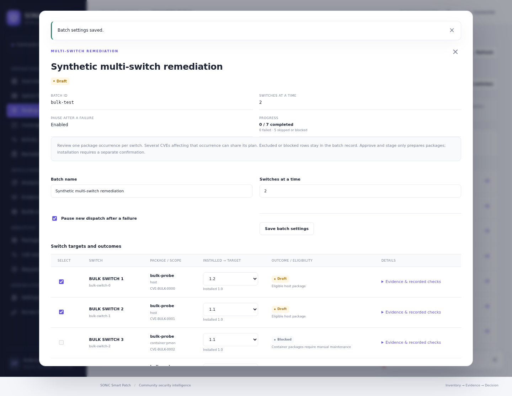

*Batch example. Synthetic switches and package data illustrate eligible targets alongside manual maintenance, missing-review, missing-fix, stale and offline entries. This screenshot does not show live package installations.*

**Pause new dispatch** and **Stop remaining dispatch** prevent further requests from being queued. Work already queued may still finish; these controls cannot interrupt APT or undo an installation. **Resume new dispatch** continues remaining authorized work without retrying failed or denied operations. Investigate failed or unknown outcomes and create a fresh plan after resolving them. There is no fleet-wide rollback.

A batch supports up to 50 switches and 200 selected findings (at most 100 per package occurrence), with **one eligible host or supported container package occurrence per switch**. Several CVEs affecting that same occurrence may share a plan. To update another package on that switch, wait for reassessment and create a fresh batch: the first installation changes the inventory identity used to authorize the next plan. Targets requiring a central repository recheck currently use the single-switch plan workflow; the batch reports that prerequisite. Protected kernel/routing/core packages, unsupported containers, image activation and reboots retain their manual maintenance path. Supported container entries also need fresh maintenance-mode permission and their exact container identity. Batch controls do not change those boundaries.

Operators may prepare draft batches; administrators approve staging, authorize execution and control dispatch. Batch coordination uses the existing plan/action protocol; container eligibility and CLI-origin status additionally require the updated collector reports. The intelligence service must run as one API process with background jobs enabled for ongoing batch coordination.

## 12 Understand coverage, jobs and trends

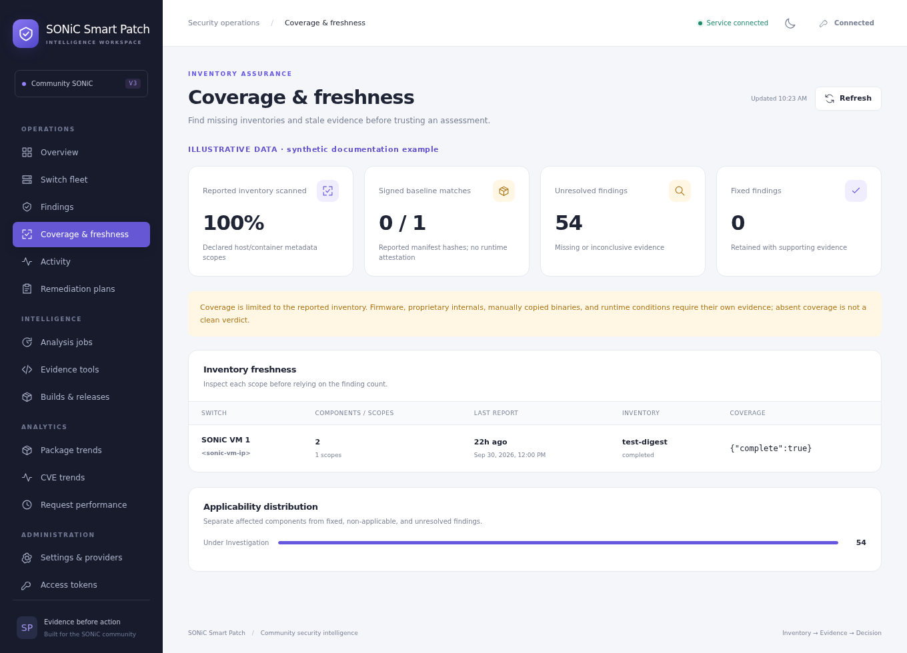

*Figure 12. Coverage view using synthetic example data in the current UI. Reported metadata coverage, signed build association and evidence completeness are different questions.*

| Screen | Useful question |
| --- | --- |
| Coverage & freshness | Which reported scopes were scanned, what is stale, and which builds have verified associations? |
| Analysis jobs | Did the scan, source clone, target check or investigation finish, and was its result accepted? |
| Activity | What inventory, assessment, configuration or alert event was actually recorded? |
| Package trends | How have observed component counts and actual version changes evolved? |
| CVE trends | Which CVEs were first observed, and how does that differ from current finding counts? |
| Request performance | How long did assessment API requests take, and was their context cache reused? |

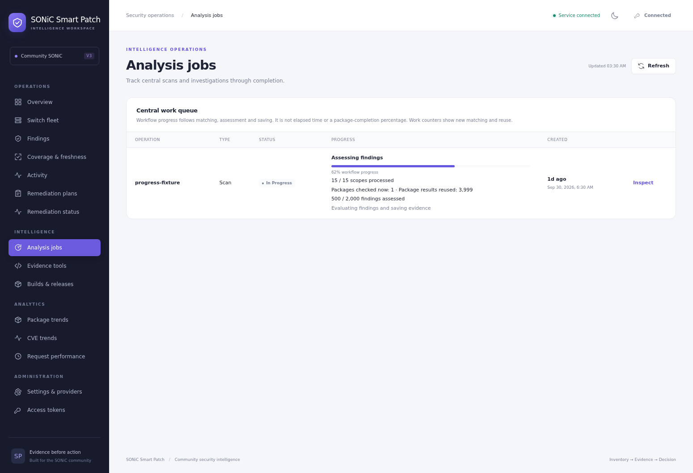

*Figure 13. Jobs using synthetic example data in the current UI. Open Inspect for logs and result; completed processing does not by itself prove vulnerability resolution.*

Scan jobs display **workflow progress**, with explicit preparing, matching,
finding-assessment, evidence-review and saving phases. The percentage is a
weighted workflow indicator, not elapsed time or a percentage of vulnerable
packages. Inspect shows scopes processed, packages checked now, reused package
results and findings assessed. Counts update during work; a failed job keeps its
last progress, and an outdated completed result is labelled superseded. Inspect
refreshes read-only while the job is active.

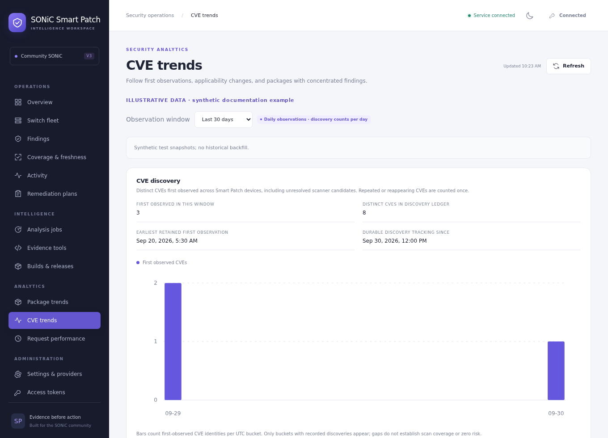

*Figure 14. Discovery chart using synthetic example data in the current UI. Each CVE counts once at its earliest retained fleet observation, including unresolved candidates; this is not a publication-date or confirmed-exploit chart.*

Choose 7, 30, 90 or 366 days where offered. Up to seven days uses hourly observations; longer stock views use the last observed value per UTC day, retaining sample counts and observed peaks. Missing history is not reconstructed as zero. Reappearing CVEs do not become new discoveries. Browser date displays use local time; chart aggregation is labelled in UTC.

For exports, **Switch fleet → Inspect → Export scoped VEX** downloads service OpenVEX for the device. The local command below instead creates CycloneDX 1.5 VEX from the bounded switch cache:

```bash
sudo security export-vex --output smart-patch-vex.json
```

It writes `/var/lib/sonic-smart-patch/vex/smart-patch-vex.json`; `--output` is a basename, not an arbitrary path. The local cache is capped at 1000 rows and exposes truncation/last-known indicators. Use the service to inspect the full finding set.

## 13 API examples for administrators

The included `user-guide/smart_patch_api.py` helper reads its token from a protected file and verifies TLS. It keeps credentials out of command arguments. Run it on the management server; the UI is sufficient for most daily tasks.

```bash
cd "<path-to-intelligence-service>"
export SMART_PATCH_URL='https://<server-ip>:8000'
export SMART_PATCH_CA_FILE="$PWD/.state/tls/service.crt"
export SMART_PATCH_TOKEN_FILE="$PWD/.state/bootstrap-token"

.venv/bin/python docs/user-guide/smart_patch_api.py GET /api/v1/readiness
.venv/bin/python docs/user-guide/smart_patch_api.py GET /api/v1/devices
.venv/bin/python docs/user-guide/smart_patch_api.py GET \
  '/api/v1/findings?search=CVE-2023-41910&limit=10'
```

Use `ca.crt` instead for a newly prepared deployment, and your issued operator/admin credential file when appropriate. Readiness reports scanner and AI state separately; top-level ready is scanner-driven.

**Action example — queue a registered release sync.** Replace `<release-id>` in `docs/user-guide/examples/sync-release.json` with the identifier of an existing registered release before running this request:

```bash
.venv/bin/python docs/user-guide/smart_patch_api.py POST /api/v1/sync-now \
  --json-file docs/user-guide/examples/sync-release.json
```

`sync-release.json` contains:

```json
{"release_id": "<release-id>"}
```

Other useful reads:

```bash
.venv/bin/python docs/user-guide/smart_patch_api.py GET \
  '/api/v1/operations/OPERATION_ID/logs'
.venv/bin/python docs/user-guide/smart_patch_api.py GET \
  '/api/v1/analysis-lifecycle?target_kind=device&target_id=DEVICE_ID&limit=20'
.venv/bin/python docs/user-guide/smart_patch_api.py GET \
  '/api/v1/events?limit=20'
```

Replace `OPERATION_ID` and `DEVICE_ID` first. GETs inspect recorded data; POST examples create work or records. External-agent API submissions require the full case schema, including snapshot hash, CVE, component and scope identities; the web form can fill these fields for you.

## 14 Troubleshooting and useful paths

| Symptom | Check next |
| --- | --- |
| Browser certificate warning or TLS error | Correct public CA, URL SAN and certificate expiry; distinguish an existing self-signed `service.crt` from a fresh deployment's `ca.crt` |
| Connection refused or address already in use | Server bind IP, listener and current process; avoid starting a duplicate against the same database |
| HTTP 401 | Correct active Smart Patch token and endpoint; a switch password or provider key is not a Smart Patch token |
| HTTP 403 | Correct role and, for collectors, exact device binding |
| Native `config security` or `show security` missing | Package/plugin registration; try the standalone `security config/show` commands |
| Enabled configuration but stopped daemon | Inspect systemd; the current native enable command manages the unit, but older deployed artifacts may differ |
| Sync acknowledged but no final result | Central queue, scanner readiness, collection coverage and subsequent synchronization |
| All findings remain unknown | Check build association, source/backport evidence and runtime facts; do not equate unknown with safe |
| Memory-deferred collection | Available RAM and `min_available_mb`; retained data remains last known |
| Runtime fact unknown | Exact scope, supported collector, available utilities and collection error; BGP usually needs its container scope |
| AI pending without an API key | Use External agent review, or configure a real provider and trigger new-context work |
| Stale external proposal | Open a fresh case for current context; archived explanations remain historical evidence |
| Repository keyring error | Existing approved public keyring on the server, correct suite/architecture and signed metadata availability |
| Plan controls disabled | Mode, current affected evidence, scope, target checks, authorization, staging and expiry. Local rollback-availability and health gates depend on `maintenance_checks_enabled`; service authorization remains required. |
| Staging queued | The service is awaiting the collector's result. The open plan refreshes active requests automatically; receiving a request and reporting its result require separate collector exchanges. The status alone does not prove a download is running. |
| Staging denied: free-space minimum required | Inspect `maintenance_checks_enabled` and `df -h /var/lib/sonic-smart-patch`. With checks enabled, `maintenance_min_free_mib` defaults to 500 MiB and a separate 85% disk-used health limit applies. Free appropriate space/expand the filesystem or explicitly choose disabled local checks, then submit a fresh reviewed request. Changing policy does not retry the old denial. |
| Maintenance command deadline or resource failure | Check the returned action error and systemd journal. Native maintenance commands use separate root-run transient services with 512 MiB memory and 128-task ceilings. `maintenance_cpu_quota_percent=0` disables their CPU quota; a low nonzero quota can lengthen execution. Local transaction/health and rollback-availability gates follow `maintenance_checks_enabled`; actual APT failures and command resource limits still apply. |
| SBOM upload returns HTTP 413 | Files may be at most 50 MiB (52,428,800 bytes) by default. Check `/api/v1/upload-limits`, the server `MAX_SBOM_UPLOAD_BYTES` override and the reverse-proxy body limit; a proxy needs at least 51 MiB for the multipart upload. |
| Container staging downloaded the package but `docker cp` reports a missing `/var/tmp/...` path | This can occur with runtime-mounted tmpfs directories: APT sees the file inside the running container, but Docker's archive view does not. The transfer is fixed in collector **3.1.1-1**. Upgrade while preserving enrollment/history, then create a fresh plan from the current finding and stage it again. This staging failure has not installed the target package; changing `sudo` flags does not correct the mount-view mismatch. The upgrade does not retry or approve an action automatically. |
| Container stage is denied | Check explicit maintenance mode, capability freshness, running container ID/image, supported isolation and protected-package policy. Enabling optional checks or approving an old manual plan does not grant container permission. |
| APT reports “Unable to fetch some archives” despite a staged package | Smart Patch `3.0.0-1` and later point APT's archive cache at the plan's forward/rollback directory while retaining `--no-download`. APT can otherwise prefer a repository copy of the same version. If the problem persists, inspect the exact missing archive/dependency in the action result; missing packages/download failures still block staging or installation even with optional checks disabled. |

**Switch — read-only diagnostic bundle**

```bash
dpkg-query -W -f='${Package} ${Version}\n' sonic-smart-patch
show security status --json
show security inventory-drift
show security resource-usage
sudo systemctl status sonic-smart-patch.service --no-pager
sudo journalctl -u sonic-smart-patch.service -n 100 --no-pager
```

For a private inventory file, `sudo sh -c 'umask 077; security collect > /run/smart-patch-inventory.json'` collects metadata without synchronization or Grype. It does not refresh persisted findings, bypasses the Agent's `min_available_mb` guard, and does not inherit daemon cgroup limits; prefer the daemon for routine use.

| Location | Purpose |
| --- | --- |
| Switch `/etc/sonic/smart-patch/device-id` | Stable enrollment ID; preserve across upgrades |
| Switch `/etc/sonic/smart-patch/credentials.json` | Private device credential; omit from support bundles |
| Switch `/etc/sonic/smart-patch/manifest.json` | Optional build-generated identity/provenance manifest |
| Switch `/var/lib/sonic-smart-patch/state.json` | Private durable inventory, retry and cached-result state |
| Switch `/var/lib/sonic-smart-patch/public.json` | Sanitized native-show snapshot |
| Switch `/etc/apt/apt.conf.d/50sonic-smart-patch-hooks` | Lightweight package-change dirty marker |
| Service `.env` | Private deployment settings; do not dump it into logs |
| Service `.state/smart_patch.db` | Durable database; use a proper online SQLite backup |
| Service `.state/settings.key` | Private key required to recover encrypted provider settings |
| Service `.state/grype-db` | Central advisory cache |
| Service `.state/archive` | Retention archives; monitor disk use and protect backups |

For a reproducible issue, collect the device/finding/operation IDs, installed package checksum, inventory digest, source commit, relevant timestamps, scope and sanitized error. Exclude credentials and private keys. Do not delete enrollment or state files as the first troubleshooting step.

## 15 References and scope of this edition

The source of truth for commands and input schemas is the current checkout. Supporting references:

- [Service deployment details](DEPLOYMENT.md)
- [Detailed UI behavior](../UI_DOCUMENTATION.md)
- [Service implementation summary](../IMPLEMENTATION_SUMMARY.md)
- [Current SONiC CLI source](../../sonic-buildimage/src/sonic-smart-patch/smart_patch/cli.py)
- [System overlay diagram](design/diagrams/01-system-overlay.svg)
- [Event flow diagram](design/diagrams/03-inventory-sync.svg)
- [Screenshot capture manifest](user-guide/screenshot-manifest.json)

Consult the current test reports for service, native package and UI validation. Unit tests and screenshots do not establish DUT/SpyTest acceptance, full installer boot/provenance validation, broad vulnerability accuracy or automatic core-image remediation. Screenshots were rendered from the current UI using synthetic fixtures with networking intercepted. No switch changes, configuration saves, token issuance or maintenance actions were performed. The version-comparison image shows a synthetic equal-version result. Example input files contain placeholders or sample release names and require the corresponding real configuration before use.


Container package workers allow only the basic character devices needed for noninteractive package tools. Hardware device access and device creation remain denied. The Docker path verifies the original basic-device permissions and rejects additional cgroup security policies it cannot preserve; SONiC additive device rules do not grant those devices to the package worker.
